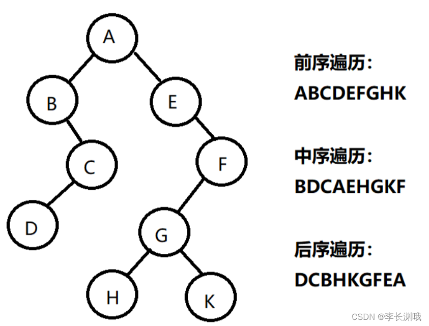
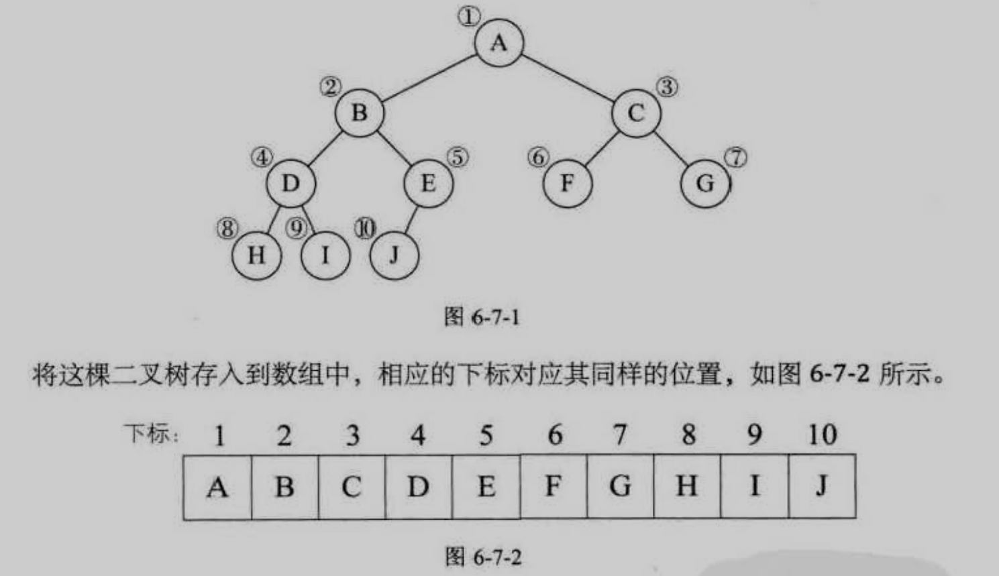
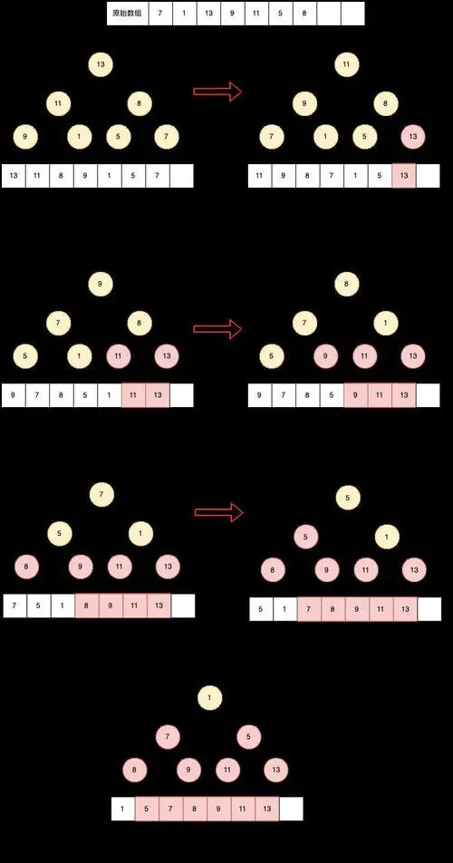
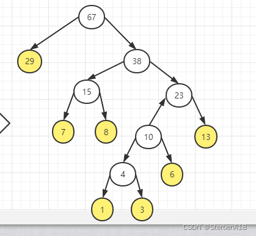
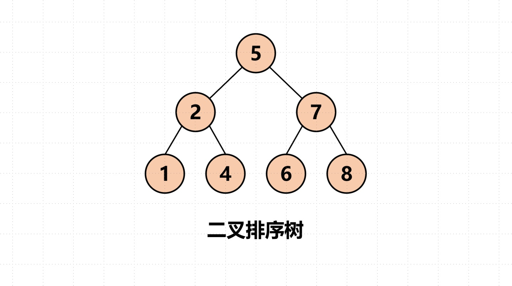

# algorithm

| 项目     | 地址                                                                       |
| :------- | :------------------------------------------------------------------------- |
| 晓智科技 | [晓智科技](https://xiaozhi.shop)                                           |
| 晓智文档 | [晓智文档](https://doc.xiaozhi.shop/backend/algorithm)                     |
| 源码地址 | [源码地址](https://github.com/dezhizhang/java-awesome/tree/main/algorithm) |
| 文档源码 | [文档源码](https://github.com/dezhizhang/doc)                              |

## 数据结构和算法的概述

### 数据结构与算法的关系

- 数据 data 结构(structue)是一门研究组台企数据方式的学科，有了编程语言就有了数据结构，学好数据结构可以编写出更加漂亮高效的代码。
- 要学习好数据结构就要多多考虑如何将生活中遇到的问题用程序去实现解决。
- 程序=数据结构+算法
- 数据结构是算法的基础，换言之想要学好算法，需要把数据结构学好。

### 线性结构与非线性结构

1. ##### 线性结构

- 线性结构作为最常用的数据结构，其特点就是数据元素之前存在一对一的线性关系
- 线性结构有两种不同的存储结构，即顺序存储结构和链式存储结构。 顺序存储的线性表称为顺序表，顺序表中的存储元素是链续的
- 链式存储的线性表称为链表，链表中的存储元不一定的连续的，元素节点中存放数据元素以及相邻元素的地址信息。
- 线性结构常见的有： 数组，队列，链表和栈

2. ##### 非线性结构

- 非线性结构包括： 二维数组，多维数组，广义表，树结构，图结构

## 稀疏数组

1. ### 基本介绍

- 当一个数组中大部分元素为 0,或者为同一个值的数据时,可以使用稀疏数组来保存该数组

2. ### 处理方法

- 记录数组一个有几行几列，有多少个不同的值
- 把具有不同值的元素的行列及值记录在一个小规模的数组中，从而缩小程序的规模
  

3. ### 思路分析

###### 二维数组转稀疏的思路

1. 遍历原始的二维数组得到有效的个数 sum
2. 根据 sum 就可以创建稀疏数组 sparseArr int[sum+1][3]
3. 将二维数组的有效数据存入到稀疏数组

###### 稀疏数组转原始的二维数组思路

1. 先读取稀疏的第一行，根据第一行的数据创建原如的二维数组，比如上面的 cheeArr=int[11][11]
2. 在读取稀疏数组后几行的数据，并赋给原始二维数组即可


4. ### 代码实现

```java
package shop.xiaozhi.sparsearray;
public class SparseArray {
    public static void main(String[] args) {
        // 创建一个原始的二维数组11*11
        //0：表示没有棋子，1：表示黑子，2示不白子
        int chessArr[][] = new int[11][11];
        chessArr[1][2] = 1;
        chessArr[2][3] = 2;

        for(int[] row:chessArr) {
            for(int col:row) {
                System.out.printf("%d\t",col);
            }
            System.out.println();
        }

        //1 将二维数组转换成稀疏数组
        //2 先遍历二维数组，得到非0数据个数
        int sum = 0;
        for(int i =0;i < chessArr.length;i++) {
            for(int j =0;j < chessArr[i].length;j++) {
                if(chessArr[i][j] !=0) {
                    sum++;
                }
            }
        }

        //3 创建对应的稀疏数组
        int spareArr[][] = new int[sum + 1][3];
        //4 给稀疏数赋值
        spareArr[0][0] = chessArr.length;
        spareArr[0][1] = chessArr.length;
        spareArr[0][2] = sum;

        int count = 0;

        for(int i =0;i < chessArr.length;i++) {
            for(int j =0;j < chessArr[i].length;j++) {
                if(chessArr[i][j] !=0) {
                    count++;
                    spareArr[count][0] = i;
                    spareArr[count][1] = j;
                   spareArr[count][2] = chessArr[i][j];
                }
            }
        }

        System.out.println("得到的稀疏数组");
        for(int[] row:spareArr) {
            for(int col:row) {
                System.out.printf("%d\t",col);
            }
            System.out.println();
        }

        // 稀疏数组恢复成原始二维数组
        // 先读取稀疏数组的第一行，概据第一行的数据创建原始的二维数组
        // 在读取稀疏数组后几行的数据，并赋给原始二维数组即可
        int cheeseArr2[][] = new int[spareArr[0][0]][spareArr[0][1]];

        for(int i = 1;i < spareArr.length;i++) {
            cheeseArr2[spareArr[i][0]][spareArr[i][1]] =spareArr[i][2];
        }

        for(int[] row:chessArr) {
            for(int col:row) {
                System.out.printf("%d\t",col);
            }
            System.out.println();
        }
    }
}

```

## 队列

1. ### 基本介绍

- 队列是一个有序列表，可以用数组或链表来实现
- 先入先出的原则，即：先存入队列的数据，要先取出，后存入的数据要后取出
  

2. ### 思路分析

- 将尾指针往后移 near+1 当 front=near 数据为空
- 苦尾指针 near 小于队列的最大下标 maxSize-1,则将数据存入 near 所指的数据元素中，否则无法存入数据，near==maxSize-1 队列满

3. ### 数组实现队列

```java
// 使用数组模拟队列
class ArrayQueue {
    private final int maxSize; //表示数组的最大容量
    private int front; // 队列头
    private int rear; // 队列尾
    private final int[] array; // 用于存放数据
    // 创建隐列构造器
    public ArrayQueue(int maxSize) {
        this.maxSize = maxSize;
        this.front = -1;
        this.rear = -1;
        this.array = new int[maxSize];
    }
    // 判断队列是否满
    public boolean isFull() {
        return rear == maxSize - 1;
    }
    // 判断隐表是否为空
    public boolean isEmpty() {
        return rear == front;
    }
    // 添加数据到队列中
    public void addQueue(int value) {
        if(isFull()) {
            System.out.println("队列满不能加入数据");
            return;
        }
        rear++; // 让rear后移
        array[rear] = value;
    }
    public int getQueue() {
        // 判断队列是否为空
        if(isEmpty()) {
            // 通过出异常
            throw new RuntimeException("队列为空不能取数据");
        }
        front++;
        return array[front];
    }
    // 显示队列所有数据
    public void showQueue() {
        for(int i=0;i < array.length;i++) {
            System.out.printf("arr[%d]=%d\n",i,array[i]);
        }
    }
    // 显示队列的头数据,注意不是取数据
    public int headQueue() {
        if(isEmpty()) {
           throw new RuntimeException("队列为空不能取数据");
        }
        return array[front+1];
    }

}
```

4. ### 数组实现环形队列

- front 指向队列的第一个元素，也就是说 arr[front]就是队列的第一个元素 front 的初始值为 0
- near 指向队列的最后一个元素的后一个位置，因为希望空出一个空间做预留，rear 的初始值为 0
- 当队列满时条件是(near + 1) % maxSize = front
- 当队列为空的条件 near == front
- 队列中有效数据的个数(near + maxSize - front) % maxSize

```java
class CircleArrayQueue {
    private  final int maxSize; // 表示数组的最大容量
    private int front; //指向队列的第一个元素初始值为0
    private int near; // 指向队尾元素初始值为0
    private final int[] arr; // 用于存放数据

    public CircleArrayQueue(int maxSize) {
        this.maxSize = maxSize;
        arr = new int[maxSize];
    }

    // 判断队列是否满
    public boolean isFull() {
        return (near + 1) % maxSize == front;
    }

    // 判断队列是否为空
    public boolean isEmpty() {
        return near == front;
    }

    // 添加数据
    public void addQueue(int n) {
        // 判断队列是否满
        if (isFull()) {
            System.out.println("队列满不能加入数据");
            return;
        }
        // 直接将数据加入
        arr[near] = n;
        near = (near + 1) % maxSize;
    }

    // 获取队列中的数据
    public int getQueue() {
        // 判断队列是否空
        if (isEmpty()) {
            throw new RuntimeException("队列空，不能取数据");
        }
        //1 先把front对应的值保留到一个临时变量
        int value = arr[front];
        front = (front + 1) % maxSize;
        return value;
    }

    // 显示队列
    public void showQueue() {
        if (isEmpty()) {
            System.out.println("队列为空");
            return;
        }
        for (int i = front; i < front + size(); i++) {
            System.out.printf("arr[%d]=%d\n", i % maxSize, arr[i % maxSize]);
        }
    }

    // 显示头元素
    public int headQueue() {
        if (isEmpty()) {
            throw new RuntimeException("队列为空");
        }

        return arr[front];
    }

    // 求出当前队列有效数据个数
    public int size() {
        return (near + maxSize - front) % maxSize;
    }
}
```

## 单向链表

1. ### 基本介绍

- 链表是以节点的方式来存储，每个节点包含 data 域,next 域指向下一个节点
- 链表分为带头节点的链表和没有头节点的链表

2. ### 思路分析


3. ### 代码实现

1. ##### 按顺序添加单项链表

```java
package shop.xiaozhi.linkedlist;

public class SingleLinkedListTest {
    public static void main(String[] args) {
        HeroNode heroNode1 = new HeroNode(1, "宋江", "及时雨");
        HeroNode heroNode2 = new HeroNode(2, "卢俊义", "玉麒麟");
        HeroNode heroNode3 = new HeroNode(3, "吴用", "智多星");
        HeroNode heroNode4 = new HeroNode(4,"林冲","豹子头");
        SingleLinkedList linkedList = new SingleLinkedList();
        linkedList.addByOrder(heroNode4);
        linkedList.addByOrder(heroNode1);
        linkedList.addByOrder(heroNode3);
        linkedList.addByOrder(heroNode2);
        linkedList.addByOrder(heroNode3);
        linkedList.list();
    }
}

class  SingleLinkedList{
    // 先初始化一个头节点
    private  HeroNode head = new HeroNode(0,"","");
    public void add(HeroNode heroNode) {
        HeroNode temp = head;
        // 遍历链表找到最后一个节点
        while (true) {
            if(temp.next == null) {
                break;
            }
            temp = temp.next;
        }
        temp.next = heroNode;
    }
    public void addByOrder(HeroNode heroNode) {
        HeroNode temp = head;
        boolean flag = false;
        while(true) {
            if(temp.next == null) {
                break;
            }
            if(temp.next.no > heroNode.no) {
                break;
            }
            if(temp.next.no == heroNode.no) {
                flag = true;
                break;
            }
            temp = temp.next;
        }
        if(flag) {
            System.out.printf("准备插入的英雄编号%d已经存在了，不能添加\n",heroNode.no);
            return;
        }
        // 插入到链表中
        heroNode.next = temp.next;
        temp.next = heroNode;
    }
    public void list() {
        //判断链表是否为空
        if(head.next == null) {
            System.out.println("链表为空");
            return;
        }

        HeroNode temp = head.next;
        while (true) {
            if(temp == null) {
                break;
            }
            System.out.println(temp);
            temp = temp.next;
        }
    }
}
class  HeroNode{
    public int no;
    public String name;
    public String nickname;
    public HeroNode next;
    // 构造器
    public  HeroNode(int no,String name,String nickname) {
        this.no = no;
        this.name = name;
        this.nickname = nickname;
    }
    @Override
    public String toString() {
        return "HeroNode{" +
                "no=" + no +
                ", name='" + name + '\'' +
                ", nickname='" + nickname + '\'' +
                '}';
    }
}
```

2. ##### 单链表按 no 来修改节点

```java
public void update(HeroNode heroNode) {
    // 判断链表是否为空
    if(head.next == null) {
        System.out.println("链表为空");
        return;
    }

    HeroNode temp = head.next;
    // 表示是否找到该节点
    boolean flag = false;
    while (true) {
        if(temp == null) {
            //已经遍历完链表
            break;
        }
        if(temp.no == heroNode.no) {
            //找到要修改的节点
            flag = true;
            break;
        }
        temp = temp.next;
    }
    // 根据flag判断是否找到要修改的节点
    if(flag) {
        temp.name = heroNode.name;
        temp.nickname = heroNode.nickname;
        return;
    }
    System.out.printf("没有找到编号为%d的节点",heroNode.no);
}
```

3. ##### 单链表按 no 来删除节点

```java
public void del(int no) {
    HeroNode temp = head;
    // 标识是否找到待删除节点
    boolean flag = false;
    while (true) {
        // 已经到链表的最后
        if(temp.next == null) {
            break;
        }
        if(temp.next.no == no) {
            flag = true;
            break;
        }
        temp = temp.next;
    }
    if(flag) {
        temp.next = temp.next.next;
        return;
    }
    System.out.println("删除的节点不存在");
}
```

4. ##### 统计单链中有效节点的个数

```java
 public static  int getLength(HeroNode head) {
    if(head.next == null) {
        return 0;
    }
    int length = 0;
    // 定义一个临时变量
    HeroNode cur = head.next;
    while (cur != null) {
        length++;
        cur = cur.next;
    }
    return  length;
}
```

5. ##### 查找单链表第 k 个节点

- 编写一个方法接收 head 节点同时接收 index
- index 表示倒数第 index 个节点
- 先把链表从头到尾遍历得到链表的总长度 getLength
- 得到 size 后从链表的第一个开始遍历(size - index)个就得到倒数第 k 个节点
- 如果找到则返回该节点，否则返回 null

```java
public static HeroNode findLastIndexNode(HeroNode head,int index) {
    // 判断如果链表为空则返回null
    if(head.next == null) {
        return null;
    }
    // 遍历得到链表的长度
    int size = getLength(head);
    // index超过链界返回null
    if(index < 0 || index > size) {
        return null;
    }
    // 定义一个临时变量 循环定位到倒数的index
    HeroNode cur = head.next;
    for(int i = 0;i < size - index;i++) {
        cur = cur.next;
    }
    return cur;
}
```

6. ##### 单链表反转

- 遍历原来的链表，每遍历一个节点，就将其取出，并放在新的链表 reverseHead 的最前端
  

```java
public static void reverseList(HeroNode head) {
    // 如果当前链表为空或只有一个节点无需反转直接返回
    if(head.next == null || head.next.next == null) {
        return;
    }
    // 定义一个临时变量
    HeroNode cur = head.next;
    HeroNode next = null;
    HeroNode reverseHead = new HeroNode(0,"","");
    // 遍历原来的链表，每遍历一个节点，就将其取出，并放在新的链表reverseHead的最前端
    while (cur != null) {
        next = cur.next; // 先暂时保存当前节点换下一个节点，因为后面需要使用
        cur.next = reverseHead.next; // 将cur的下一个节点指向新的链表的最前端
        reverseHead.next = cur;
        cur = next; // 让cur后移
    }
    // 将head.next指向reverseHead.next实现单链表的反转
    head.next = reverseHead.next;
}
```

## 双向链表

1. ### 基本介绍

- 链表是以节点的方式来存储，每个节点包含 data 域,next 域指向下一个节点
- 链表分为带头节点的链表和没有头节点的链表

2. ### 思路分析


3. ### 代码实现
1. ##### 双向链表增删改查

```java
package shop.xiaozhi.linkedlist;
class  DoubleLinkedListTest{
    public static void main(String[] args) {
        HeroNode2 heroNode1 = new HeroNode2(1, "宋江", "及时雨");
        HeroNode2 heroNode2 = new HeroNode2(2, "卢俊义", "玉麒麟");
        HeroNode2 heroNode3 = new HeroNode2(3, "吴用", "智多星");
        HeroNode2 heroNode4 = new HeroNode2(4,"林冲","豹子头");

        HeroNode2 heroNode5 = new HeroNode2(4,"公孙胜","入云龙");

        //创建双向链表
        DoubleLinkedList doubleLinkedList = new DoubleLinkedList();
        doubleLinkedList.add(heroNode1);
        doubleLinkedList.add(heroNode2);
        doubleLinkedList.add(heroNode3);
        doubleLinkedList.add(heroNode4);

        doubleLinkedList.list();
        doubleLinkedList.update(heroNode5);
        doubleLinkedList.list();

        doubleLinkedList.del(3);
        doubleLinkedList.list();
    }
}

class DoubleLinkedList {
    // 先初始化一个头节点
    private  HeroNode2 head = new HeroNode2(0,"","");
    public void list() {
        // 判断链表是否为空
        if(head.next == null) {
            System.out.println("链表为空");
            return;
        }
        // 创建一个临时变量保存头节点
        HeroNode2 temp = head.next;
        while (true) {
            if(temp == null) {
                break;
            }
            System.out.println(temp);
            temp = temp.next;
        }
    }

    // 对于双向链表，直接找到删除这个节点
    // 找到后自我删除即可
    public void del(int no) {
        // 判断当前链表是否为空
        if(head.next == null) {
            System.out.println("链表为空无法删除");
            return;
        }

        HeroNode2 temp = head.next;
        boolean flag = false;
        while (true) {
            // 已经到链表的最后
            if(temp == null) {
                break;
            }

            if(temp.no == no) {
                flag = true;
                break;
            }
            temp = temp.next;
        }

        if(flag) {
            temp.pre.next = temp.next;
            if(temp.next != null) {
                temp.next.pre = temp.pre;
            }
            return;
        }
        System.out.println("删除的节点不存在");
    }
    // 修改节点内容
    public void update(HeroNode2 heroNode) {
        // 判断是否为空
        if(head.next == null) {
            System.out.println("链表为空");
            return;
        }

        // 找到需要修改的节点
        HeroNode2 temp = head.next;
        // 表示是否找到该节点
        boolean flag = false;
        while (true) {
            if(temp == null) {
                break;
            }

            if(temp.no == heroNode.no) {
                // 找到要修改的节点
                flag = true;
                break;
            }
            temp = temp.next;
        }

        if(flag) {
            temp.name = heroNode.name;
            temp.nickname = heroNode.nickname;
            return;
        }
        System.out.printf("没有找到编号%d的节点",heroNode.no);
    }
    // 双向链表添加最后
    public void add(HeroNode2 heroNode) {
        HeroNode2 temp = head;
        while (true) {
            if(temp.next == null) {
                break;
            }
            // 如果没有找到最后，移动temp
            temp = temp.next;
        }
        temp.next = heroNode;
        heroNode.pre = temp;
    }
}
class  HeroNode2{
    public int no;
    public String name;
    public String nickname;
    public HeroNode2 next; //指向下一个节点
    public HeroNode2 pre; // 指向前一个节点
    // 构造器
    public  HeroNode2(int no,String name,String nickname) {
        this.no = no;
        this.name = name;
        this.nickname = nickname;
    }
    @Override
    public String toString() {
        return "HeroNode{" +
                "no=" + no +
                ", name='" + name + '\'' +
                ", nickname='" + nickname + '\'' +
                '}';
    }
}
```

## 单向环形链表

1. ### 基本介绍

- 约瑟夫问题是个有名的问题：N 个人围成一圈，从第一个开始报数，第 M 个将被杀掉，最后剩下一个，其余人都将被杀掉。例如 N=6，M=5，被杀掉的顺序是：5，4，6，2，3。

2. ### 思路分析

- 先创建第一个节点，让 first 指向该节点并形成环形
- 后面当我们每创建一个新的节点，就把该节点加入到已有的环形链表中即可
- 先让一个辅用力指针 temp 指向 first 节点
- 然后通过 while 循环遍历该环形链表即可 temp.next == first 结束
  

3. ### 代码实现

```java
package shop.xiaozhi.linkedlist;

public class SingleCircleLinkedListTest {
    public static void main(String[] args) {
        SingleCircleLinkedList singleCircleLinkedList = new SingleCircleLinkedList();
        singleCircleLinkedList.addBoy(5);
        singleCircleLinkedList.showBoy();
        singleCircleLinkedList.countBoy(1,2,5);
    }
}

// 创建一个环形链表
class SingleCircleLinkedList {
    // 创建一个first节点当前没有编号
    private Boy first = null;

    public void addBoy(int nums) {
        if (nums < 1) {
            System.out.println("n的值不能小于1");
            return;
        }

        Boy curBoy = null;
        for (int i = 1; i <= nums; i++) {
            Boy boy = new Boy(i);

            if (i == 1) {
                first = boy;
                first.setNext(first);
                curBoy = first;
            } else {
                curBoy.setNext(boy);
                boy.setNext(first);
                curBoy = boy;
            }
        }

    }

    // 遍历当前
    public void showBoy() {
        if (first == null) {
            System.out.println("没有任何小孩~~");
            return;
        }
        // 因为first不能动，因些使用一个临时变量
        Boy curBoy = first;
        while (true) {
            System.out.printf("小孩的编号%d\n", curBoy.getNo());
            if (curBoy.getNext() == first) {
                break;
            }
            curBoy = curBoy.getNext();
        }

    }

    // 根据用户的输入，计算出小孩出圈的顺序
    public void countBoy(int startNo, int countNum, int nums) {
        // 创建一个辅助指针(变量) helper事先应该指向环形链表的最后节点
        // 小孩报数前先让first和helper移动k-1次
        // 当报数时让first和helper指针移动m-1次
        // 这时就可以将first指向小孩出圈节点
        // first=first.next
        // helper.next = first
        // 先对数据进行校验
        if (first == null || startNo < 1 || startNo > nums) {
            System.out.println("参数输入有误");
            return;
        }
        //让helper移动到最后一个节点
        Boy helper = first;
        while (true) {
            if (helper.getNext() == first) {
                break;
            }
            helper = helper.getNext();
        }

        // 小孩报数前先让first和helper移动k - 1次
        for (int j = 0; j < startNo - 1; j++) {
            first = first.getNext();
            helper = helper.getNext();
        }

        while (true) {
            // 说明圈中只有一个节点
            if (helper == first) {
                break;
            }

            for (int j = 0; j < countNum - 1; j++) {
                first = first.getNext();
                helper = helper.getNext();
            }
            // 这里first指向的节点就是要出圈的节点
            System.out.printf("小孩%d出圈\n", first.getNo());
            // 这里将first指向小孩节点出圈
            first = first.getNext();
            helper.setNext(first);
        }

        System.out.printf("取后留在圈中的小孩%d\n",first.getNo());
    }

}

class Boy {
    private int no; // 编号
    private Boy next; // 指向下一个节点默认null

    public Boy(int no) {
        this.no = no;
    }

    public int getNo() {
        return no;
    }

    public Boy getNext() {
        return next;
    }

    public void setNo(int no) {
        this.no = no;
    }

    public void setNext(Boy next) {
        this.next = next;
    }
}
```

## 栈

1. ### 基本介绍

- 栈是一个先入后出的有序列表
- 栈是限制线性表中元素的插入和删除只能在线性表的同一端进行的一种特殊线性表，允许插入和删除的一端为变化的一端，称为栈顶，另一端为固定的一端称为栈底。
  

2. ### 代码实现

```java
class ArrayStack{
    private int maxSize; // 栈的大小
    private int[] stack; // 存放数据
    private int top = -1;
    public ArrayStack(int maxSize) {
        this.maxSize = maxSize;
        stack = new int[this.maxSize];
    }
    // 栈满
    public boolean isFull() {
        return  top == maxSize -1;
    }
    // 栈空
    public boolean isEmpty() {
        return  top == -1;
    }
    // 入栈
    public void push(int value) {
        if(isFull()) {
            System.out.println("栈满");
            return;
        }
        top++;
        stack[top] = value;
    }
    // 出栈
    public int pop() {
        // 判断栈是不为空
        if(isEmpty()) {
            throw new RuntimeException("栈空");
        }
        int value = stack[top];
        top--;
        return value;
    }
    // 显示栈
    public void list() {
        if(isEmpty()) {
            System.out.println("栈空");
            return;
        }
        for(int i=top;i >=0;i--) {
            System.out.printf("stack[%d]=%d\n",i,stack[i]);
        }
    }
}
```

### 栈的后缀表过式(逆波兰表达式)

- 从左至右扫描，遇到数字入栈
- 遇到运算符弹出栈顶元素和次顶元素计算再入栈

```java
package shop.xiaozhi.stack;
import java.util.ArrayList;
import java.util.Collections;
import java.util.List;
import java.util.Stack;

public class PolandNotation {
    public static void main(String[] args) {
        // 先定义波兰表达式
        String suffixExpression = "3 4 + 5 * 6 -";
        List<String> list = getListString(suffixExpression);
        int res = calculate(list);
        System.out.println(res);
    }
    // 将一个波兰表达式，依次将数据和运算符放入到ArrayList中
    public static List<String> getListString(String suffixExpression) {
        // 将suffixExpression分割
        String[] split = suffixExpression.split(" ");
        List<String> list = new ArrayList<String>();
        Collections.addAll(list, split);
        return list;
    }
    // 完成对逆波兰表达式的运算
    public static int calculate(List<String> list) {
        Stack<String> stack = new Stack<String>();
        for (String item : list) {
            //正则表过式来取数
            if (item.matches("\\d+")) {
                stack.push(item);
            } else {
                // pop出两个数并运入再入栈
                int num2 = Integer.parseInt(stack.pop());
                int num1 = Integer.parseInt(stack.pop());

                int result = 0;

                if (item.equals("+")) {
                    result = num1 + num2;
                } else if (item.equals("-")) {
                    result = num1 - num2;
                } else if (item.equals("*")) {
                    result = num1 * num2;
                } else if (item.equals("/")) {
                    result = num1 / num2;
                } else {
                    throw new RuntimeException("运算符有误");
                }
                stack.push(result + "");
            }
        }
        return Integer.parseInt(stack.pop());
    }
}
```

## 递归

1. ### 基本介绍

- 递归算法在计算机科学中是指一种通过重复将问题分解为同类的子问题而解决问题的方法。递归式方法可以被用于解决很多的计算机科学问题，因此它是计算机科学中十分重要的一个概念。绝大多数编程语言支持函数的自调用，在这些语言中函数可以通过调用自身来进行递归。计算理论可以证明递归的作用可以完全取代循环，因此在很多函数编程语言（如 Scheme）中习惯用递归来实现循环。

2. ### 思路图解

   

3. ### 代码实现

```java
package shop.xiaozhi.recursion;
public class RecursionTest {
    public static void main(String[] args) {
        int factorial = factorial(4);

        System.out.println(factorial);
    }
    public static void test(int n) {
        if(n > 2) {
            test(n - 1);
        }
        System.out.println("n=" + n);
    }
    // 阶乘问题
    public static int factorial(int n) {
        if(n == 1) {
            return 1;
        }else {
            return factorial(n - 1) * n;
        }
    }
}
```

## 冒泡排序

1. ### 基本介绍

- 冒泡排序的基本思想是：通过对待排序的序列从前向后（从下标较小的元素开始），依次比较相邻元素的值，若发现逆序则交换使值较大的元素渐从前移向后部，就像水底的气泡一样渐向上冒

2. ### 思路图解


3. ### 代码实现

```java
package shop.xiaozhi.sort;

public class Bubble {
    public static void main(String[] args) {
        int arr[] = {3, 9, -1,10, 20};
        int temp = 0;
        boolean flag = false;
        for (int i = 0; i < arr.length - 1; i++) {
            for (int j = 0; j < arr.length - 1 - i; j++) {
                if (arr[j] > arr[j + 1]) {
                    // 如果发现前面的数大于后面的则交换
                    flag = true;
                    temp = arr[j];
                    arr[j] = arr[j + 1];
                    arr[j + 1] = temp;
                }
            }

            System.out.println("第" + (i + 1) + "轮");
            if(!flag) {
                break;
            }
            flag = false;
        }
    }
}
```

## 选择排序

1. ### 基本介绍

- 选择排序也属于内部排序法，是从欲排序的数据中，按指定的规则选出某一个元素，再依次规定交换位置后达到排序的目的

2. ### 思路图解

   

3. ### 代码实现

```java
package shop.xiaozhi.sort;
import java.util.Arrays;

public class SelectSort {
    public static void main(String[] args) {
        int[] arr = {101, 34, 119, 1};
        selectSort(arr);
    }
    public static void selectSort(int[] arr) {
        for (int i = 0; i < arr.length - 1; i++) {
            // 最小索引
            int minIndex = i;
            // 最小值
            int min = arr[i];
            for (int j = 1 + i; j < arr.length; j++) {
                if (min > arr[j]) {
                    min = arr[j];
                    minIndex = j;
                }
            }
            if (minIndex != i) {
                arr[minIndex] = arr[i];
                arr[i] = min;
            }

        }
    }
}

```

## 插入排序

1. ### 基本介绍

- 插入排序的基本思想是:把 n 个待排序的元素看成为一个有序表和一个无序表，开始时有序表只包含一个元素，无序表中包含 n-1 个元素，排序过程中每次从无序表中取出第一个元素，把它的排序依次与有序列元素排序码进行比较，将它插入到有序表中的适当位置，使之成为新的有序表

2. ### 思路图解

   

3. ### 代码实现

```java
package shop.xiaozhi.sort;

import java.util.Arrays;

public class InsertSort {
    public static void main(String[] args) {
        int[] arr = {101,34,119,1};
        insetSort(arr);

        System.out.println(Arrays.toString(arr));
    }

    public static void insetSort(int[] arr) {

        for(int i=1;i < arr.length;i++) {
            // 待插入的值
            int insetValue = arr[i];
            // 待插入的索引
            int insetIndex = i - 1;
            //1. insetIndex>0保证在给insetValue 找位置不越界
            //2. insetValue < arr[insetIndex]待插入的数，还没有找到插入位置
            //3. 需要将arr[insetIndex]后移
            while (insetIndex >=0 && insetValue < arr[insetIndex]) {
                arr[insetIndex + 1] = arr[insetIndex];
                insetIndex--;
            }

            arr[insetIndex + 1] = insetValue;
        }
    }
}
```

## 希尔排序

1. ### 基本介绍

- 希尔排序是希尔于 1959 年提出的一种排序算法，希尔排序也是一种插入排序，它是简单插入排序经过改进之后的一个更高效版本，也称为缩小增量排序
- 希尔排序是把记录按下标的一定增量分组，对每组使用直接插入排序算法排序，随着增量逐渐减少，每组包含的关键词越来越多，当增量减至 1 时，整个文件恰被分成一组，算法便终止

2. ### 思路图解


3. ### 代码实现

```java
package shop.xiaozhi.sort;
import java.util.Arrays;

public class ShellSort {
    public static void main(String[] args) {
        int[] arr = {8, 9, 1, 7, 2, 3, 5, 4, 6, 0};
        shellSort(arr);

        System.out.println(Arrays.toString(arr));
    }

    public static void shellSort(int[] arr) {
        for(int gap = arr.length / 2;gap > 0;gap /=2) {
            int temp = 0;
            for(int i=gap;i < arr.length;i++) {
                for(int j=i - gap;j >=0;j-=gap) {
                    if(arr[j] > arr[j + gap]) {
                        temp = arr[j];
                        arr[j] = arr[j + gap];
                        arr[j + gap] = temp;
                    }
                }
            }
        }
    }
}
```

## 快速排序

1. ### 基本介绍

- 快速排序是对冒沟排序的一种改进，基本思路是：通过一趟排序将要排序的数据分割成独立的两部份，其中一部分的所有数据都比另外一部分的所有数据都要小，然后再此方法对两部分数据分别进行快速排序，整个排序过程可以递归进行，以此达到整个数据变得有序序列

2. ### 思路图解


3. ### 代码实现

```java
package shop.xiaozhi.sort;
import java.util.Arrays;

public class QuickSort {
    public static void main(String[] args) {
        int[] arr = {-9, 78, 0, 23, -567, 70};
        quickSort(arr, 0, arr.length - 1);
        System.out.println(Arrays.toString(arr));
    }

    public static void quickSort(int[] arr, int left, int right) {
        int l = left;
        int r = right;
        int temp = 0;
        int pivot = arr[(left + right) / 2];

        while (l < r) {
            while (arr[l] < pivot) {
                l += 1;
            }
            while (arr[r] > pivot) {
                r -= 1;
            }

            if (l >= r) {
                break;
            }

            temp = arr[l];
            arr[l] = arr[r];
            arr[r] = temp;

            if (arr[l] == pivot) {
                r -= 1;
            }

            if (arr[r] == pivot) {
                l += 1;
            }
        }

        // 如果l==r 必须l++,r--
        if (l == r) {
            l += 1;
            r -= 1;
        }

        // 向左递归
        if(left < r) {
            quickSort(arr,left,r);
        }

        // 向左递当
        if(right > l) {
            quickSort(arr,l,right);
        }
    }
}
```

## 归并排序

1. ### 基本介绍

- 归并排序（Merge sort）是建立在归并操作上的一种有效的排序算法。该算法是采用分治法（Divide and Conquer）的一个非常典型的应用。

2. ### 思路图解

   

3. ### 代码实现

```java
package shop.xiaozhi.sort;
import java.util.Arrays;
public class MergeSort {
    public static void main(String[] args) {
        int arr[] = {8, 4, 5, 7, 1, 3, 6, 2};
        int temp[] = new int[arr.length];
        mergeSort(arr, 0, arr.length - 1, temp);

        System.out.println(Arrays.toString(arr));
    }

    // 分方法
    public static void mergeSort(int[] arr, int left, int right, int[] temp) {
        if (left < right) {
            int mid = (left + right) / 2;
            // 向左递归进行分解
            mergeSort(arr, left, mid, temp);
            // 向右递归分进行分解
            mergeSort(arr, mid + 1, right, temp);
            //到合并时
            merge(arr, left, mid, right, temp);
        }
    }

    // 合并方法
    public static void merge(int[] arr, int left, int mid, int right, int[] temp) {
        int i = left;
        int j = mid + 1;
        int t = 0;

        // 先把左右两边（有序）的数据按照规则填充到temp数组
        // 直到左右两边的有序序列有一边处理完毕为止
        while (i <= mid && j <= right) {
            if (arr[i] < arr[j]) {
                temp[t] = arr[i];
                t += 1;
                i += 1;
            } else {
                temp[t] = arr[j];
                t += 1;
                j += 1;
            }
        }
        // 把余下的数据依次全部填充到temp
        while (i <= mid) {
            temp[t] = arr[i];
            t += 1;
            i += 1;
        }

        while (j <= right) {
            temp[t] = arr[j];
            t += 1;
            j += 1;
        }
        // 将temp数据的无素拷贝到arr
        t = 0;
        int tempLeft = left;
        while (tempLeft <= right) {
            arr[tempLeft] = temp[t];
            t += 1;
            tempLeft += 1;
        }
    }
}

```

## 基数排序

1. ### 基本介绍

- 基数排序(Radix Sort)是桶排序的扩展，它的基本思想是：将整数按位数切割成不同的数字，然后按每个位数分别比较。
- 具体做法是：将所有待比较数值统一为同样的数位长度，数位较短的数前面补零。然后，从最低位开始，依次进行一次排序。这样从最低位排序一直到最高位排序完成以后, 数列就变成一个有序序列

2. ### 思路图解


3. ### 代码实现

```java
package shop.xiaozhi.sort;
import java.util.Arrays;
public class RadixSort {
    public static void main(String[] args) {
        int arr[] = {53, 3, 542, 748, 14, 214};
        radixSort(arr);
        System.out.println(Arrays.toString(arr));
    }

    public static int getMax(int[] arr) {
        int max = arr[0];
        for (int i = 1; i < arr.length; i++) {
            if (arr[i] > max) {
                max = arr[i];
            }
        }
        return max;
    }

    // 得到最大数的位数
    public static int getMaxLeft(int max) {
        return (max + "").length();
    }

    public static void radixSort(int[] arr) {
        int max = getMax(arr);

        int maxLength = getMaxLeft(max);

        int[][] bucket = new int[10][arr.length];
        // 创建一个一维数据存放每个数据
        int[] bucketElementCounts = new int[10];
        for (int i = 0, n = 1; i < maxLength; i++, n *= 10) {

            for (int j = 0; j < arr.length; j++) {
                // 取出每个元数的个位数的值
                int digitOfElement = (arr[j] / n) % 10;
                // 放入到对应的桶中
                bucket[digitOfElement][bucketElementCounts[digitOfElement]] = arr[j];
                bucketElementCounts[digitOfElement]++;
            }
            // 按照这个桶的顺序放入原来的数组
            int index = 0;
            for (int k = 0; k < bucketElementCounts.length; k++) {
                // 如果桶中有数据才放入到原数组
                if (bucketElementCounts[k] != 0) {
                    for (int l = 0; l < bucketElementCounts[k]; l++) {
                        // 取出元素放入到arr
                        arr[index++] = bucket[k][l];
                    }
                }
                bucketElementCounts[k] = 0;
            }
        }

    }
}

```

## 二分查找

1. ### 基本介绍

- 二分查找也称折半查找（Binary Search），它是一种效率较高的查找方法。但是，折半查找要求线性表必须采用顺序存储结构，而且表中元素按关键字有序排列。

2. ### 思路图解


3. ### 代码实现

```java
package shop.xiaozhi.search;

import java.util.ArrayList;
import java.util.Arrays;
import java.util.List;

public class BinarySearch {
    public static void main(String[] args) {
        int arr[] = {1, 8, 10, 89,89, 1000, 1234};
        ArrayList<Integer> integers = binarySearch1(arr, 0, arr.length - 1, 89);

        System.out.println(integers.size());
    }

    public static int binarySearch(int[] arr, int left, int right, int findValue) {
        int mid = (left + right) / 2;
        int midValue = arr[mid];
        if (left > right) {
            return -1;
        }

        if (findValue > midValue) {
            return binarySearch(arr, mid + 1, right, findValue);
        } else if (findValue < midValue) {
            return binarySearch(arr, left, mid - 1, findValue);
        } else {
            return mid;
        }

    }

    public static ArrayList<Integer> binarySearch1(int[] arr, int left, int right, int findValue) {
        ArrayList<Integer> indexList = new ArrayList<>();
        int mid = (left + right) / 2;
        int midValue = arr[mid];
        if (left > right) {
            return  indexList;
        }

        if (findValue > midValue) {
            return binarySearch1(arr, mid + 1, right, findValue);
        } else if (findValue < midValue) {
            return binarySearch1(arr, left, mid - 1, findValue);
        } else {
            // 向左查找
            int temp = mid - 1;
            while (true) {
                if (temp < 0 || arr[temp] != findValue) {
                    break;
                }

                indexList.add(temp);
                temp -= 1;

            }

            indexList.add(temp);
            // 向右查找
            temp = mid + 1;
            while (true) {
                if (temp > arr.length - 1 || arr[temp] != findValue) {
                    break;
                }

                indexList.add(temp);
                temp += 1;
            }
            return indexList;

        }

    }
}

```

## 插值查找

1. ### 基本介绍

- 插值查找，有序表的一种查找方式。插值查找是根据查找关键字与查找表中最大最小记录关键字比较后的查找方法。插值查找基于二分查找，将查找点的选择改进为自适应选择，提高查找效率。

2. ### 思路图解

   

3. ### 代码实现

```java
package shop.xiaozhi.search;

import java.util.Arrays;

public class DifferenceSearch {
    public static void main(String[] args) {
        int[] arr = new int[100];
        for (int i = 0; i < arr.length; i++) {
            arr[i] = i + 1;
        }
        int index = differenceSearch(arr, 0, arr.length - 1, 10);

        System.out.println(index);
    }

    public static int differenceSearch(int[] arr, int left, int right, int findValue) {
        if (left > right || findValue < arr[0] || findValue > arr[arr.length - 1]) {
            return -1;
        }

        // 求出mid
        int mid = left + (right - left) * (findValue - arr[left]) / (arr[right] - arr[left]);
        int midValue = arr[mid];
        if (findValue > midValue) {
            return differenceSearch(arr, mid + 1, right, findValue);
        } else if (findValue < midValue) {
            return differenceSearch(arr, left, mid - 1, findValue);
        } else {
            return mid;
        }
    }
}
```

## 斐波那契搜索

1. ### 基本介绍

- 斐波那契搜索就是在二分查找的基础上根据斐波那契数列进行分割的。在斐波那契数列找一个等于略大于查找表中元素个数的数 F[n]，将原查找表扩展为长度为 F[n](如果要补充元素，则补充重复最后一个元素，直到满足F[n]个元素)，完成后进行斐波那契分割，即 F[n]个元素分割为前半部分 F[n-1]个元素，后半部分 F[n-2]个元素，找出要查找的元素在那一部分并递归，直到找到。

2. ### 思路图解

   

3. ### 代码实现

```java
package shop.xiaozhi.search;
import java.util.Arrays;

public class FibSearch {
    public static int maxSize = 20;

    public static void main(String[] args) {
        int[] arr = {1, 8, 10, 89, 1000, 1234};
        int i = fibSearch(arr, 10);
        System.out.println(i);

    }

    public static int[] fib() {
        int[] f = new int[maxSize];

        f[0] = 1;
        f[1] = 1;

        for (int i = 2; i < maxSize; i++) {
            f[i] = f[i - 1] + f[i - 2];
        }
        return f;
    }

    public static int fibSearch(int[] a, int key) {
        int low = 0;
        int high = a.length - 1;
        int k = 0;
        int mid = 0;
        int[] f = fib();
        while (high > f[k] - 1) {
            k++;
        }

        int[] temp = Arrays.copyOf(a, f[k]);

        for (int i = high + 1; i < temp.length; i++) {
            temp[i] = a[high];
        }
        //使用while来循环处理找到key
        while (low <= high) {
            mid = low + f[k - 1] - 1;
            if (key < temp[mid]) {
                high = mid - 1;
                k--;
            } else if (key > temp[mid]) {
                low = mid + 1;
                k -= 2;
            } else {
                return Math.min(mid, high);
            }
        }
        return -1;
    }
}
```

## 哈希表

1. ### 基本介绍

- 哈希表（Hash table，也叫散列表）是根据 ‌ 关键码值（Key value）直接进行访问的数据结构。它通过把关键码值映射到表中一个位置来访问记录，以加快查找的速度。这个映射函数叫做 ‌ 散列函数，存放记录的数组叫做散列表。‌1

2. ### 思路图解

   

3. ### 代码实现

```java
// 创建hashTab 管理多条链表
class HashTab {
    public int size;
    private final EmpLinkedList[] empLinkedList;
    // 构造器
    public HashTab(int size) {
        this.size = size;
        // 初妈化
        empLinkedList = new EmpLinkedList[size];
        // 初始化每个链表
        for (int i = 0; i < size; i++) {
            empLinkedList[i] = new EmpLinkedList();
        }
    }
    // 添加雇员
    public void add(Emp emp) {
        int empLinkedListNo = hashFun(emp.id);
        empLinkedList[empLinkedListNo].add(emp);
    }
    // 创建散列函数使用取模法
    public int hashFun(int id) {
        return id % size;
    }
    // 遍历所有链表
    public void list() {
        for (int i = 0; i < size; i++) {
            empLinkedList[i].list(i);
        }
    }
    // 根据输入id查找雇员
    public void findEmpById(int id) {
        // 使用散列函数
        int empLinkedListNo = hashFun(id);
        Emp emp = empLinkedList[empLinkedListNo].findEmpById(id);
        if (emp == null) {
            System.out.println("在哈希表中没有找到散列表");
            return;
        }

        System.out.printf("第%d条链表中找到雇员id = %d\n", empLinkedListNo + 1, id);
    }
}
class Emp {
    public int id;
    public String name;
    public Emp next;

    public Emp(int id, String name) {
        super();
        this.id = id;
        this.name = name;
    }
}
class EmpLinkedList {
    // 头指针，指向第一个emp
    private Emp head;

    // 添加雇员添加到链表
    public void add(Emp emp) {
        // 如果是添加第一个雇员
        if (head == null) {
            head = emp;
            return;
        }

        Emp temp = head;
        while (temp.next != null) {
            temp = temp.next;
        }
        // 加入链表
        temp.next = emp;
    }
    // 显示链表信息
    public void list(int no) {
        if (head == null) {
            System.out.println("第" + no + "链表为空");
            return;
        }
        System.out.println("第" + no + "链表信息");
        Emp temp = head;

        while (true) {
            System.out.printf("=>id=%d name=%s\t", temp.id, temp.name);
            if (temp.next == null) {
                break;
            }
            temp = temp.next;
        }
    }
    // 根据id查找雇员
    public Emp findEmpById(int id) {
        if (head == null) {
            System.out.println("链表为空");
            return null;
        }

        Emp temp = head;
        while (true) {
            if (temp.id == id) {
                break;
            }
            if (temp.next == null) {
                temp = null;
                break;
            }
            temp = temp.next;
        }
        return temp;
    }
}
```

## 二叉树前序中序后序遍历

1. ### 基本介绍

- 访问根节点；② 先序遍历左子树；③ 先序遍历右子树。
- 二叉树的子节点分为左节和右节点

2. ### 思路图解

   

3. ### 代码实现

```java
package shop.xiaozhi.tree;

public class BinaryTreeTest {
    public static void main(String[] args) {
        // 创建二叉树
        BinaryTree binaryTree = new BinaryTree();

        HeroNode root = new HeroNode(1, "宋江");
        HeroNode node2 = new HeroNode(2, "吴用");
        HeroNode node3 = new HeroNode(3, "卢俊义");
        HeroNode node4 = new HeroNode(4, "宋江");

        root.left = node2;
        root.right = node3;
        node3.right = node4;

        binaryTree.setRoot(root);
//        binaryTree.infixOrder();

        System.out.println(binaryTree.postOrderSearch(3));

    }
}

class BinaryTree {
    private HeroNode root;

    public void setRoot(HeroNode root) {
        this.root = root;
    }

    // 前序遍历
    public void preOrder() {
        if (this.root != null) {
            this.root.preOrder();
        }
    }

    // 中序遍历
    public void infixOrder() {
        if (this.root != null) {
            this.root.infixOrder();
        }
    }

    // 后序遍历
    public void postOrder() {
        if (this.root != null) {
            this.root.postOrder();
        }
    }

    // 前序查找
    public HeroNode preOrderSearch(int no) {
        if (root != null) {
            return root.preOrderSearch(no);
        }
        return null;
    }

    // 中序查找
    public HeroNode infixOrderSearch(int no) {
        if (root != null) {
            return root.infixOrderSearch(no);
        }
        return null;
    }

    // 后序查找
    public HeroNode postOrderSearch(int no) {
        if (root != null) {
            return root.postOrderSearch(no);
        }
        return null;
    }
}

class HeroNode {
    public int no;
    public String name;
    public HeroNode left;
    public HeroNode right;

    public HeroNode(int no, String name) {
        this.no = no;
        this.name = name;
    }

    // 前序遍历
    public void preOrder() {
        // 先输出根节点
        System.out.println(this);
        // 递归左子树前序遍历
        if (this.left != null) {
            this.left.preOrder();
        }
        // 递归向右子树遍历
        if (this.right != null) {
            this.right.preOrder();
        }
    }

    // 中序遍历
    public void infixOrder() {
        // 递归向左子树遍历
        if (this.left != null) {
            this.left.infixOrder();
        }
        // 输入父节点
        System.out.println(this);
        // 递归向右子树遍历
        if (this.right != null) {
            this.right.infixOrder();
        }
    }

    // 后序遍历
    public void postOrder() {
        // 递归向左子树遍历
        if (this.left != null) {
            this.left.postOrder();
        }
        // 递归向右子树遍历
        if (this.right != null) {
            this.right.postOrder();
        }
        System.out.println(this);
    }

    // 前序遍历查找
    public HeroNode preOrderSearch(int no) {
        if (this.no == no) {
            return this;
        }
        // 判断当前节点的左子树是否为空，如果不为空，则递归前序查找
        HeroNode resNode = null;
        if (this.left != null) {
            resNode = this.left.preOrderSearch(no);
        }
        if (resNode != null) {
            // 左子树找到节点
            return resNode;
        }
        // 当前节点右子树是为空为，如果不为空则向右递归查找
        if (this.right != null) {
            resNode = this.right.preOrderSearch(no);
        }

        return resNode;
    }

    // 中序遍历查找
    public HeroNode infixOrderSearch(int no) {
        HeroNode resNode = null;
        // 判断当前左子节点是否为空，如果不为空，则递归中序查找
        if (this.left != null) {
            resNode = this.left.infixOrderSearch(no);
        }
        // 如果找到就直接返回没有找到比较当前节点
        if (resNode != null) {
            return resNode;
        }

        if (this.no == no) {
            return this;
        }

        if (this.right != null) {
            resNode = this.right.infixOrderSearch(no);
        }

        return resNode;
    }

    // 后序遍历查找
    public HeroNode postOrderSearch(int no) {
        HeroNode resNode = null;
        // 判断当前左子树是否为空，如果不为空，则递归后序查找
        if (this.left != null) {
            resNode = this.left.postOrderSearch(no);
        }
        // 找到就返回
        if (resNode != null) {
            return resNode;
        }
        // 判断右子杩是否为空
        if (this.right != null) {
            resNode = this.right.postOrderSearch(no);
        }

        if (resNode != null) {
            return resNode;
        }

        // 左右子树都没有找到比较当前节点
        if (this.no == no) {
            return this;
        }

        return null;
    }


    @Override
    public String toString() {
        return "HeroNode{" + "no=" + no + ", name='" + name + '\'' + '}';
    }
}

```

## 顺序存储二叉树

1. ### 基本介绍

- 从数据存储来看，数据存储方式和树的存储方式可以相互转换，即数组可以转换成树，树也可以转换数据

2. ### 思路图解

   

3. ### 代码实现

```java
package shop.xiaozhi.tree;

public class ArrayBinaryTreeTest {
    public static void main(String[] args) {
        int[] arr = {1,2,3,4,5,6,7};
        ArrayBinaryTree arrayBinaryTree = new ArrayBinaryTree(arr);
        arrayBinaryTree.preOrder();
    }
}

class ArrayBinaryTree {
    private final int[] arr;

    public ArrayBinaryTree(int[] arr) {
        this.arr = arr;
    }

    public void preOrder() {
        this.preOrder(0);
    }
    public void preOrder(int index) {
        if (arr == null || arr.length == 0) {
            System.out.println("数组为空不能遍历");
            return;
        }
        // 输出当前这个元素
        System.out.println(arr[index]);
        // 向左递归遍历
        if ((index * 2 + 1) < arr.length) {
            preOrder(2 * index + 1);
        }
        // 向右递归遍历
        if ((index * 2 + 2) < arr.length) {
            preOrder(2 * index + 2);
        }

    }
}
```

## 线索化二叉树

1. ### 基本介绍

- n 个结点的二叉链表中含有 n+1 [公式 2n-(n-1)=n+1]个空指针域，利用二叉链表中空指针域，存放指向该节点在某种遍历次序下的前驱和后继结点的指针

2. ### 思路图解

## 堆排序

1. ### 基本介绍

- 堆排序（英语:Heapsort）是指利用堆这种数据结构所设计的一种排序算法。堆是一个近似完全二叉树的结构，并同时满足堆积的性质：即子结点的键值或索引总是小于（或者大于）它的父节点

2. ### 思路图解



3. ### 代码实现

```java
package shop.xiaozhi.tree;

import java.util.Arrays;

public class HeapSort {
    public static void main(String[] args) {
        int arr[] = {4, 6, 8, 5, 9};
        heapSort(arr);
        System.out.println(Arrays.toString(arr));
    }

    // 堆排序
    public static void heapSort(int[] arr) {
        int temp = 0;
        // 将元序序列构建成一个大顶堆
        for (int i = arr.length / 2 - 1; i >= 0; i--) {
            adjustHeap(arr, i, arr.length);
        }

        for (int j = arr.length - 1; j > 0; j--) {
            temp = arr[j];
            arr[j] = arr[0];
            arr[0] = temp;
            adjustHeap(arr, 0, j);
        }
    }

    // 将数组调整成大顶堆
    public static void adjustHeap(int[] arr, int i, int length) {
        // 取出当前元素的值，存在在临时变量
        int temp = arr[i];

        for (int k = i * 2 + 1; k < length; k = k * 2 + 1) {
            // 左子节点的值小于右子节点的值
            if (k + 1 < length && arr[k] < arr[k + 1]) {
                k++;
            }

            if (arr[k] < temp) {
                break;
            }

            arr[i] = arr[k];
            i = k;

        }
        arr[i] = temp;
    }
}

```

## 赫夫曼树

1. ### 基本介绍

- 给定 N 个权值作为 N 个叶子结点，构造一棵二叉树，若该树的带权路径长度达到最小，称这样的二叉树为最优二叉树，也称为哈夫曼树(Huffman Tree)。哈夫曼树是带权路径长度最短的树，权值较大的结点离根较近。

2. ### 思路图解

   

3. ### 代码实现

```java
package shop.xiaozhi.tree;
import java.util.ArrayList;
import java.util.Collections;
import java.util.List;

public class HuffmanTree {
    public static void main(String[] args) {
        int[] arr = {13, 7, 8, 3, 29, 6, 1};
        Node huffmanTree = createHuffmanTree(arr);
        preOrder(huffmanTree);

    }

    public static void preOrder(Node root) {
        if (root == null) {
            System.out.println("树为空不能遍历");
            return;
        }

        root.preOrder();
    }

    // 创建赫夫曼树
    public static Node createHuffmanTree(int[] arr) {
        // 1遍历array数组
        // 2将array每个元素构成一个node
        // 3将node放入到arrayList

        List<Node> nodes = new ArrayList<Node>();
        for (int value : arr) {
            nodes.add(new Node(value));
        }


        while (nodes.size() > 1) {
            // 从小到大排序
            Collections.sort(nodes);

            // 取出权值最小的节点(二叉树)
            Node leftNode = nodes.get(0);
            // 取出权限第二小的节点
            Node rightNode = nodes.get(1);

            // 构建一颗新的二叉树
            Node parent = new Node(leftNode.value + rightNode.value);
            parent.left = leftNode;
            parent.right = rightNode;

            // 从ArrayList删除处理过的二叉树
            nodes.remove(leftNode);
            nodes.remove(rightNode);

            nodes.add(parent);
        }
        // 返回赫夫曼树根节点
        return nodes.get(0);


    }

}

class Node implements Comparable<Node> {
    int value;
    Node left;
    Node right;


    public Node(int value) {
        this.value = value;
    }

    public void preOrder() {
        System.out.println(this);
        if (this.left != null) {
            this.left.preOrder();
        }
        if (this.right != null) {
            this.right.preOrder();
        }
    }

    @Override
    public int compareTo(Node o) {
        return this.value - o.value;
    }

    @Override
    public String toString() {
        return "Node{" + "value=" + value + '}';
    }
}

```

## 二叉排序数

1. ### 基本介绍

- 二叉排序数：BST(Binary Sort Tree) 对于二叉排序树的任何一个非叶子节点，要求左子节点的值比当前节点的值小，右子节点的值比当前节点的值大

2. ### 思路图解

   

3. ### 代码实现

```java
package shop.xiaozhi.binary;

public class BinarySortTreeTest {
    public static void main(String[] args) {
        int[] arr = {7, 3, 10, 12, 5, 1, 9};

        BinarySortTree binarySortTree = new BinarySortTree();

        for (int j : arr) {
            binarySortTree.add(new Node(j));
        }

        binarySortTree.infixOrder();
    }
}

// 创建二叉排序树
class BinarySortTree {
    private Node root;

    public void add(Node node) {

        if (root != null) {
            root.add(node);
            return;
        }
        root = node;
    }

    // 中序遍历
    public void infixOrder() {
        if (root == null) {
            System.out.println("树为空");
            return;
        }
        root.infixOrder();
    }
}


class Node {
    public int value;
    public Node left;
    public Node right;

    public Node(int value) {
        this.value = value;
    }

    // 添加节点
    public void add(Node node) {
        if (node == null) {
            return;
        }

        // 判断当前传入的值和当前树节点的值关系
        if (node.value < this.value) {
            // 当前节点不为空递归添加
            if (this.left != null) {
                this.left.add(node);
                return;
            }
            this.left = node;
        } else {
            // 左子树不为空递归添加
            if (this.right != null) {
                this.right.add(node);
                return;
            }
            this.right = node;
        }
    }

    // 中序遍历二叉树
    public void infixOrder() {
        if (this.left != null) {
            this.left.infixOrder();
        }
        System.out.println(this);
        if (this.right != null) {
            this.right.infixOrder();
        }
    }

    @Override
    public String toString() {
        return "Node{" + "value=" + value + '}';
    }
}
```

## 平衡二叉树

1. ### 基本介绍

- 深度为 n 的均衡二叉树是指：如果去掉叶结点及相应的树枝，它应该是深度为 n-1 的完全二叉树。在这里，树高等于叶节点的最大深度，根节点的深度为 0。

## 图

1. ### 基本介绍

- 图 G 是一个有序二元组(V,E)，其中 V 称为顶集(Vertices Set)，E 称为边集(Edges set)，E 与 V 不相交。它们亦可写成 V(G)和 E(G)。其中，顶集的元素被称为顶点(Vertex)，边集的元素被称为边(edge)。

3. ### 代码实现
```java
package shop.xiaozhi.graph;

import java.util.ArrayList;
import java.util.Arrays;

public class Graph {
    public static void main(String[] args) {
        int n = 5;
        String[] vertexs = {"A", "B", "C", "D"};
        Graph graph = new Graph(n);

        for(String value:vertexs) {
            graph.insertVertex(value);
        }

        // 添加边
        //A-B A-C B-C B-D B-E
        graph.insertEdge(0,1,1);
        graph.insertEdge(0,2,1);
        graph.insertEdge(1,2,1);
        graph.insertEdge(1,3,1);
        graph.insertEdge(1,4,1);

        graph.showGraph();


    }

    private ArrayList<String> vertexList; // 存储顶点集合
    private int[][] edges; // 存储图对应的邻结矩阵
    private int numOfEdges; // 表示边的数目


    public Graph(int n) {
        edges = new int[n][n];
        vertexList = new ArrayList<String>(n);
        numOfEdges = 0;
    }

    // 插入结点
    public void insertVertex(String vertex) {
        vertexList.add(vertex);
    }

    // 添加边
    public void insertEdge(int v1, int v2, int weight) {
        edges[v1][v2] = weight;
        edges[v2][v1] = weight;
        numOfEdges++;
    }

    // 返回节点的个数
    public int getNumOfVertex() {
        return vertexList.size();
    }

    // 获取边的数目
    public int getNumOfEdges() {
        return numOfEdges;
    }

    // 返回节点对应的数据
    public String getValueByIndex(int i) {
        return vertexList.get(i);
    }

    // 返回v1和v2的权值
    public int getWeight(int v1, int v2) {
        return edges[v1][v2];
    }

    // 显示图对应的矩阵
    public void showGraph() {
        for (int[] link : edges) {
            System.out.println(Arrays.toString(link));
        }
    }
}
```

## 动态归化

```java
package shop.xiaozhi.dynamic;
import java.util.Arrays;

public class Knapsack {
    public static void main(String[] args) {
        int[] w = {1, 4, 3}; // 物品的重量
        int[] val = {1500, 3000, 2000}; // 物品的价质
        int m = 4; // 背包的容量
        int n = val.length; // 物品的个数


        // 创建二维数组
        int[][] v = new int[n + 1][m + 1];
        // 为了记录放入商品的情况，定义一个二维数组
        int[][] path = new int[n + 1][m + 1];

        // 初始化第一行和第一列
        for (int i = 0; i < v.length; i++) {
            v[i][0] = 0;
        }

        Arrays.fill(v[0], 0);

        for (int i = 1; i < v.length; i++) {
            for (int j = 1; j < v[0].length; j++) {
                // 公式
                if (w[i - 1] > j) {
                    v[i][j] = v[i - 1][j];
                } else {
                    if (v[i - 1][j] < val[i - 1] + v[i - 1][j - w[i - 1]]) {
                        v[i][j] = Math.max(v[i - 1][j], val[i - 1] + v[i - 1][j - w[i - 1]]);
                        path[i][j] = 1;
                    } else {
                        v[i][j] = v[i - 1][j];
                    }
                }
            }
        }

        // 输出放入的那些商品
        int i = path.length - 1;
        int j = path[0].length - 1;
        while (i > 0 && j > 0) {
            if(path[i][j] == 1) {
                System.out.printf("装入的商品最大值%d",v[i][j]);
                j -= w[i - 1];
                break;
            }
            i--;

        }
        

    }
}
```


<div align="center">晓智科技公众号</div>
<div align="center">  </div>

<!-- [https://www.bilibili.com/video/BV1E4411H73v?p=115&spm_id_from=pageDriver&vd_source=10257e657caa8b54111087a9329462e8] -->
