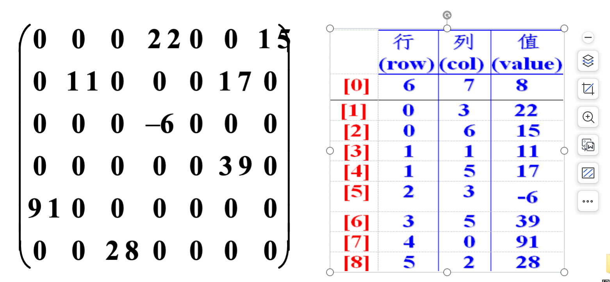
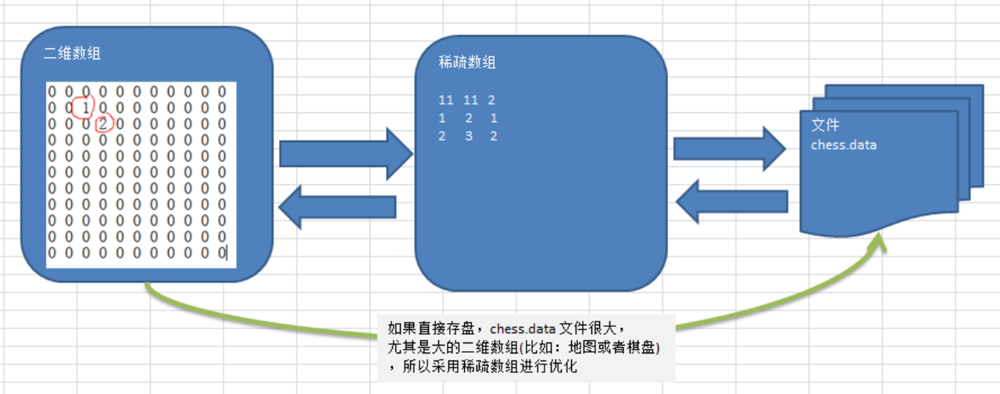
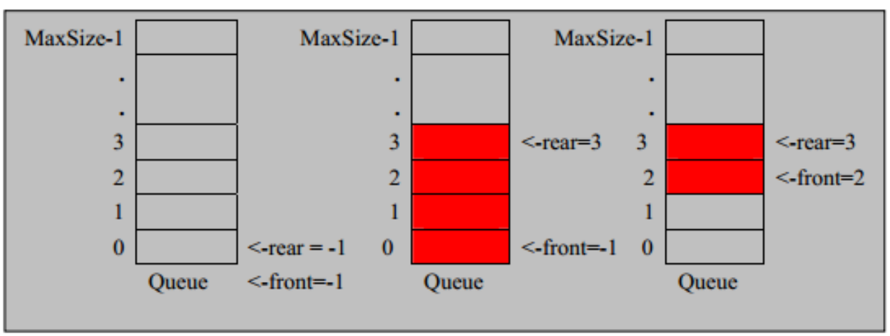
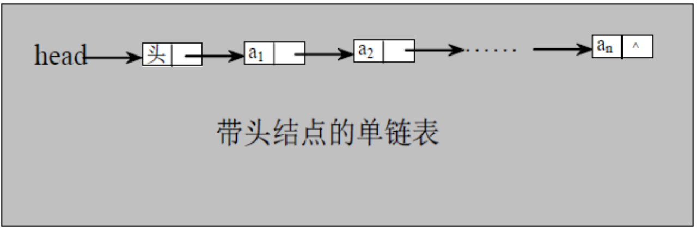
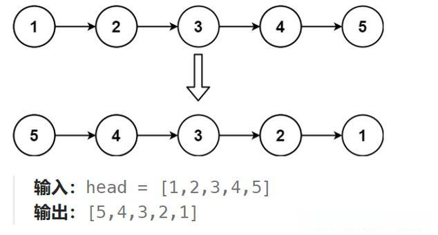
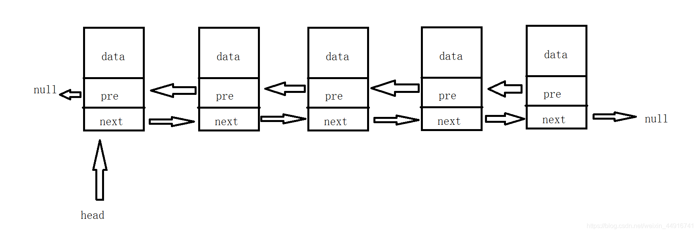
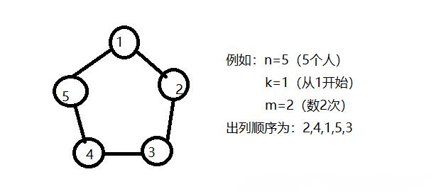
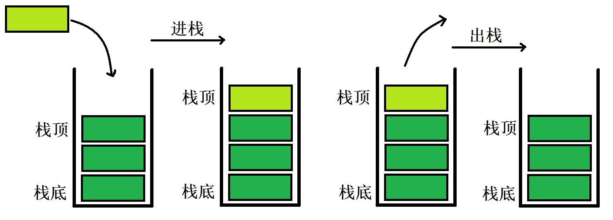
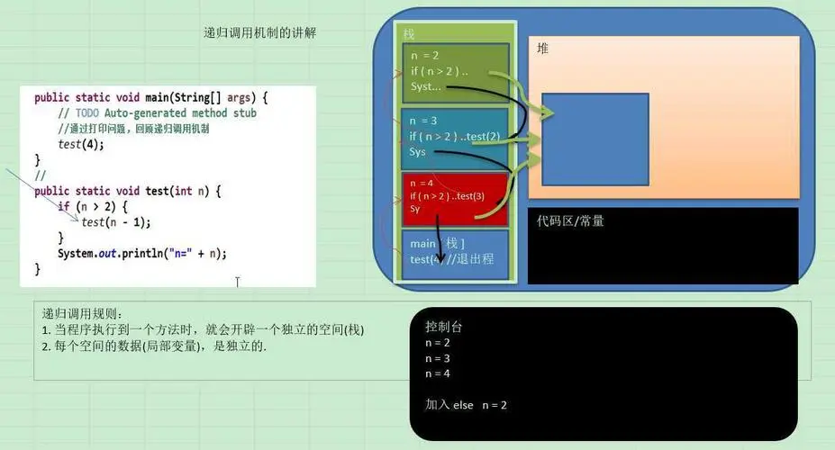
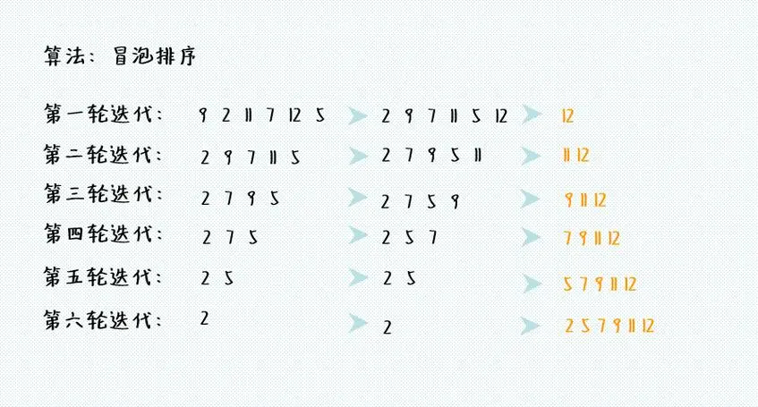

# algorithm

| 项目     | 地址                                                                       |
| :------- | :------------------------------------------------------------------------- |
| 晓智科技 | [晓智科技](https://xiaozhi.shop)                                           |
| 晓智文档 | [晓智文档](http://localhost:8000/backend/algorithm)                        |
| 源码地址 | [源码地址](https://github.com/dezhizhang/java-awesome/tree/main/algorithm) |
| 文档源码 | [文档源码](https://github.com/dezhizhang/doc)                              |

## 数据结构和算法的概述

### 数据结构与算法的关系

- 数据 data 结构(structue)是一门研究组台企数据方式的学科，有了编程语言就有了数据结构，学好数据结构可以编写出更加漂亮高效的代码。
- 要学习好数据结构就要多多考虑如何将生活中遇到的问题用程序去实现解决。
- 程序=数据结构+算法
- 数据结构是算法的基础，换言之想要学好算法，需要把数据结构学好。

### 线性结构与非线性结构

1. ##### 线性结构

- 线性结构作为最常用的数据结构，其特点就是数据元素之前存在一对一的线性关系
- 线性结构有两种不同的存储结构，即顺序存储结构和链式存储结构。 顺序存储的线性表称为顺序表，顺序表中的存储元素是链续的
- 链式存储的线性表称为链表，链表中的存储元不一定的连续的，元素节点中存放数据元素以及相邻元素的地址信息。
- 线性结构常见的有： 数组，队列，链表和栈

2. ##### 非线性结构

- 非线性结构包括： 二维数组，多维数组，广义表，树结构，图结构

## 稀疏数组

1. ### 基本介绍

- 当一个数组中大部分元素为 0,或者为同一个值的数据时,可以使用稀疏数组来保存该数组

2. ### 处理方法

- 记录数组一个有几行几列，有多少个不同的值
- 把具有不同值的元素的行列及值记录在一个小规模的数组中，从而缩小程序的规模
  

3. ### 思路分析

###### 二维数组转稀疏的思路

1. 遍历原始的二维数组得到有效的个数 sum
2. 根据 sum 就可以创建稀疏数组 sparseArr int[sum+1][3]
3. 将二维数组的有效数据存入到稀疏数组

###### 稀疏数组转原始的二维数组思路

1. 先读取稀疏的第一行，根据第一行的数据创建原如的二维数组，比如上面的 cheeArr=int[11][11]
2. 在读取稀疏数组后几行的数据，并赋给原始二维数组即可



4. ### 代码实现

```java
package shop.xiaozhi.sparsearray;
public class SparseArray {
    public static void main(String[] args) {
        // 创建一个原始的二维数组11*11
        //0：表示没有棋子，1：表示黑子，2示不白子
        int chessArr[][] = new int[11][11];
        chessArr[1][2] = 1;
        chessArr[2][3] = 2;

        for(int[] row:chessArr) {
            for(int col:row) {
                System.out.printf("%d\t",col);
            }
            System.out.println();
        }

        //1 将二维数组转换成稀疏数组
        //2 先遍历二维数组，得到非0数据个数
        int sum = 0;
        for(int i =0;i < chessArr.length;i++) {
            for(int j =0;j < chessArr[i].length;j++) {
                if(chessArr[i][j] !=0) {
                    sum++;
                }
            }
        }

        //3 创建对应的稀疏数组
        int spareArr[][] = new int[sum + 1][3];
        //4 给稀疏数赋值
        spareArr[0][0] = chessArr.length;
        spareArr[0][1] = chessArr.length;
        spareArr[0][2] = sum;

        int count = 0;

        for(int i =0;i < chessArr.length;i++) {
            for(int j =0;j < chessArr[i].length;j++) {
                if(chessArr[i][j] !=0) {
                    count++;
                    spareArr[count][0] = i;
                    spareArr[count][1] = j;
                   spareArr[count][2] = chessArr[i][j];
                }
            }
        }

        System.out.println("得到的稀疏数组");
        for(int[] row:spareArr) {
            for(int col:row) {
                System.out.printf("%d\t",col);
            }
            System.out.println();
        }

        // 稀疏数组恢复成原始二维数组
        // 先读取稀疏数组的第一行，概据第一行的数据创建原始的二维数组
        // 在读取稀疏数组后几行的数据，并赋给原始二维数组即可
        int cheeseArr2[][] = new int[spareArr[0][0]][spareArr[0][1]];

        for(int i = 1;i < spareArr.length;i++) {
            cheeseArr2[spareArr[i][0]][spareArr[i][1]] =spareArr[i][2];
        }

        for(int[] row:chessArr) {
            for(int col:row) {
                System.out.printf("%d\t",col);
            }
            System.out.println();
        }
    }
}

```

## 队列

1. ### 基本介绍

- 队列是一个有序列表，可以用数组或链表来实现
- 先入先出的原则，即：先存入队列的数据，要先取出，后存入的数据要后取出
  

2. ### 思路分析

- 将尾指针往后移 near+1 当 front=near 数据为空
- 苦尾指针 near 小于队列的最大下标 maxSize-1,则将数据存入 near 所指的数据元素中，否则无法存入数据，near==maxSize-1 队列满

3. ### 数组实现队列

```java
// 使用数组模拟队列
class ArrayQueue {
    private final int maxSize; //表示数组的最大容量
    private int front; // 队列头
    private int rear; // 队列尾
    private final int[] array; // 用于存放数据
    // 创建隐列构造器
    public ArrayQueue(int maxSize) {
        this.maxSize = maxSize;
        this.front = -1;
        this.rear = -1;
        this.array = new int[maxSize];
    }
    // 判断队列是否满
    public boolean isFull() {
        return rear == maxSize - 1;
    }
    // 判断隐表是否为空
    public boolean isEmpty() {
        return rear == front;
    }
    // 添加数据到队列中
    public void addQueue(int value) {
        if(isFull()) {
            System.out.println("队列满不能加入数据");
            return;
        }
        rear++; // 让rear后移
        array[rear] = value;
    }
    public int getQueue() {
        // 判断队列是否为空
        if(isEmpty()) {
            // 通过出异常
            throw new RuntimeException("队列为空不能取数据");
        }
        front++;
        return array[front];
    }
    // 显示队列所有数据
    public void showQueue() {
        for(int i=0;i < array.length;i++) {
            System.out.printf("arr[%d]=%d\n",i,array[i]);
        }
    }
    // 显示队列的头数据,注意不是取数据
    public int headQueue() {
        if(isEmpty()) {
           throw new RuntimeException("队列为空不能取数据");
        }
        return array[front+1];
    }

}
```

4. ### 数组实现环形队列

- front 指向队列的第一个元素，也就是说 arr[front]就是队列的第一个元素 front 的初始值为 0
- near 指向队列的最后一个元素的后一个位置，因为希望空出一个空间做预留，rear 的初始值为 0
- 当队列满时条件是(near + 1) % maxSize = front
- 当队列为空的条件 near == front
- 队列中有效数据的个数(near + maxSize - front) % maxSize

```java
class CircleArrayQueue {
    private  final int maxSize; // 表示数组的最大容量
    private int front; //指向队列的第一个元素初始值为0
    private int near; // 指向队尾元素初始值为0
    private final int[] arr; // 用于存放数据

    public CircleArrayQueue(int maxSize) {
        this.maxSize = maxSize;
        arr = new int[maxSize];
    }

    // 判断队列是否满
    public boolean isFull() {
        return (near + 1) % maxSize == front;
    }

    // 判断队列是否为空
    public boolean isEmpty() {
        return near == front;
    }

    // 添加数据
    public void addQueue(int n) {
        // 判断队列是否满
        if (isFull()) {
            System.out.println("队列满不能加入数据");
            return;
        }
        // 直接将数据加入
        arr[near] = n;
        near = (near + 1) % maxSize;
    }

    // 获取队列中的数据
    public int getQueue() {
        // 判断队列是否空
        if (isEmpty()) {
            throw new RuntimeException("队列空，不能取数据");
        }
        //1 先把front对应的值保留到一个临时变量
        int value = arr[front];
        front = (front + 1) % maxSize;
        return value;
    }

    // 显示队列
    public void showQueue() {
        if (isEmpty()) {
            System.out.println("队列为空");
            return;
        }
        for (int i = front; i < front + size(); i++) {
            System.out.printf("arr[%d]=%d\n", i % maxSize, arr[i % maxSize]);
        }
    }

    // 显示头元素
    public int headQueue() {
        if (isEmpty()) {
            throw new RuntimeException("队列为空");
        }

        return arr[front];
    }

    // 求出当前队列有效数据个数
    public int size() {
        return (near + maxSize - front) % maxSize;
    }
}
```

## 单向链表

1. ### 基本介绍

- 链表是以节点的方式来存储，每个节点包含 data 域,next 域指向下一个节点
- 链表分为带头节点的链表和没有头节点的链表

2. ### 思路分析



3. ### 代码实现

1. ##### 按顺序添加单项链表

```java
package shop.xiaozhi.linkedlist;

public class SingleLinkedListTest {
    public static void main(String[] args) {
        HeroNode heroNode1 = new HeroNode(1, "宋江", "及时雨");
        HeroNode heroNode2 = new HeroNode(2, "卢俊义", "玉麒麟");
        HeroNode heroNode3 = new HeroNode(3, "吴用", "智多星");
        HeroNode heroNode4 = new HeroNode(4,"林冲","豹子头");
        SingleLinkedList linkedList = new SingleLinkedList();
        linkedList.addByOrder(heroNode4);
        linkedList.addByOrder(heroNode1);
        linkedList.addByOrder(heroNode3);
        linkedList.addByOrder(heroNode2);
        linkedList.addByOrder(heroNode3);
        linkedList.list();
    }
}

class  SingleLinkedList{
    // 先初始化一个头节点
    private  HeroNode head = new HeroNode(0,"","");
    public void add(HeroNode heroNode) {
        HeroNode temp = head;
        // 遍历链表找到最后一个节点
        while (true) {
            if(temp.next == null) {
                break;
            }
            temp = temp.next;
        }
        temp.next = heroNode;
    }
    public void addByOrder(HeroNode heroNode) {
        HeroNode temp = head;
        boolean flag = false;
        while(true) {
            if(temp.next == null) {
                break;
            }
            if(temp.next.no > heroNode.no) {
                break;
            }
            if(temp.next.no == heroNode.no) {
                flag = true;
                break;
            }
            temp = temp.next;
        }
        if(flag) {
            System.out.printf("准备插入的英雄编号%d已经存在了，不能添加\n",heroNode.no);
            return;
        }
        // 插入到链表中
        heroNode.next = temp.next;
        temp.next = heroNode;
    }
    public void list() {
        //判断链表是否为空
        if(head.next == null) {
            System.out.println("链表为空");
            return;
        }

        HeroNode temp = head.next;
        while (true) {
            if(temp == null) {
                break;
            }
            System.out.println(temp);
            temp = temp.next;
        }
    }
}
class  HeroNode{
    public int no;
    public String name;
    public String nickname;
    public HeroNode next;
    // 构造器
    public  HeroNode(int no,String name,String nickname) {
        this.no = no;
        this.name = name;
        this.nickname = nickname;
    }
    @Override
    public String toString() {
        return "HeroNode{" +
                "no=" + no +
                ", name='" + name + '\'' +
                ", nickname='" + nickname + '\'' +
                '}';
    }
}
```

2. ##### 单链表按 no 来修改节点

```java
public void update(HeroNode heroNode) {
    // 判断链表是否为空
    if(head.next == null) {
        System.out.println("链表为空");
        return;
    }

    HeroNode temp = head.next;
    // 表示是否找到该节点
    boolean flag = false;
    while (true) {
        if(temp == null) {
            //已经遍历完链表
            break;
        }
        if(temp.no == heroNode.no) {
            //找到要修改的节点
            flag = true;
            break;
        }
        temp = temp.next;
    }
    // 根据flag判断是否找到要修改的节点
    if(flag) {
        temp.name = heroNode.name;
        temp.nickname = heroNode.nickname;
        return;
    }
    System.out.printf("没有找到编号为%d的节点",heroNode.no);
}
```

3. ##### 单链表按 no 来删除节点

```java
public void del(int no) {
    HeroNode temp = head;
    // 标识是否找到待删除节点
    boolean flag = false;
    while (true) {
        // 已经到链表的最后
        if(temp.next == null) {
            break;
        }
        if(temp.next.no == no) {
            flag = true;
            break;
        }
        temp = temp.next;
    }
    if(flag) {
        temp.next = temp.next.next;
        return;
    }
    System.out.println("删除的节点不存在");
}
```

4. ##### 统计单链中有效节点的个数

```java
 public static  int getLength(HeroNode head) {
    if(head.next == null) {
        return 0;
    }
    int length = 0;
    // 定义一个临时变量
    HeroNode cur = head.next;
    while (cur != null) {
        length++;
        cur = cur.next;
    }
    return  length;
}
```

5. ##### 查找单链表第 k 个节点

- 编写一个方法接收 head 节点同时接收 index
- index 表示倒数第 index 个节点
- 先把链表从头到尾遍历得到链表的总长度 getLength
- 得到 size 后从链表的第一个开始遍历(size - index)个就得到倒数第 k 个节点
- 如果找到则返回该节点，否则返回 null

```java
public static HeroNode findLastIndexNode(HeroNode head,int index) {
    // 判断如果链表为空则返回null
    if(head.next == null) {
        return null;
    }
    // 遍历得到链表的长度
    int size = getLength(head);
    // index超过链界返回null
    if(index < 0 || index > size) {
        return null;
    }
    // 定义一个临时变量 循环定位到倒数的index
    HeroNode cur = head.next;
    for(int i = 0;i < size - index;i++) {
        cur = cur.next;
    }
    return cur;
}
```

6. ##### 单链表反转

- 遍历原来的链表，每遍历一个节点，就将其取出，并放在新的链表 reverseHead 的最前端
  

```java
public static void reverseList(HeroNode head) {
    // 如果当前链表为空或只有一个节点无需反转直接返回
    if(head.next == null || head.next.next == null) {
        return;
    }
    // 定义一个临时变量
    HeroNode cur = head.next;
    HeroNode next = null;
    HeroNode reverseHead = new HeroNode(0,"","");
    // 遍历原来的链表，每遍历一个节点，就将其取出，并放在新的链表reverseHead的最前端
    while (cur != null) {
        next = cur.next; // 先暂时保存当前节点换下一个节点，因为后面需要使用
        cur.next = reverseHead.next; // 将cur的下一个节点指向新的链表的最前端
        reverseHead.next = cur;
        cur = next; // 让cur后移
    }
    // 将head.next指向reverseHead.next实现单链表的反转
    head.next = reverseHead.next;
}
```

## 双向链表

1. ### 基本介绍

- 链表是以节点的方式来存储，每个节点包含 data 域,next 域指向下一个节点
- 链表分为带头节点的链表和没有头节点的链表

2. ### 思路分析



3. ### 代码实现
1. ##### 双向链表增删改查

```java
package shop.xiaozhi.linkedlist;
class  DoubleLinkedListTest{
    public static void main(String[] args) {
        HeroNode2 heroNode1 = new HeroNode2(1, "宋江", "及时雨");
        HeroNode2 heroNode2 = new HeroNode2(2, "卢俊义", "玉麒麟");
        HeroNode2 heroNode3 = new HeroNode2(3, "吴用", "智多星");
        HeroNode2 heroNode4 = new HeroNode2(4,"林冲","豹子头");

        HeroNode2 heroNode5 = new HeroNode2(4,"公孙胜","入云龙");

        //创建双向链表
        DoubleLinkedList doubleLinkedList = new DoubleLinkedList();
        doubleLinkedList.add(heroNode1);
        doubleLinkedList.add(heroNode2);
        doubleLinkedList.add(heroNode3);
        doubleLinkedList.add(heroNode4);

        doubleLinkedList.list();
        doubleLinkedList.update(heroNode5);
        doubleLinkedList.list();

        doubleLinkedList.del(3);
        doubleLinkedList.list();
    }
}

class DoubleLinkedList {
    // 先初始化一个头节点
    private  HeroNode2 head = new HeroNode2(0,"","");
    public void list() {
        // 判断链表是否为空
        if(head.next == null) {
            System.out.println("链表为空");
            return;
        }
        // 创建一个临时变量保存头节点
        HeroNode2 temp = head.next;
        while (true) {
            if(temp == null) {
                break;
            }
            System.out.println(temp);
            temp = temp.next;
        }
    }

    // 对于双向链表，直接找到删除这个节点
    // 找到后自我删除即可
    public void del(int no) {
        // 判断当前链表是否为空
        if(head.next == null) {
            System.out.println("链表为空无法删除");
            return;
        }

        HeroNode2 temp = head.next;
        boolean flag = false;
        while (true) {
            // 已经到链表的最后
            if(temp == null) {
                break;
            }

            if(temp.no == no) {
                flag = true;
                break;
            }
            temp = temp.next;
        }

        if(flag) {
            temp.pre.next = temp.next;
            if(temp.next != null) {
                temp.next.pre = temp.pre;
            }
            return;
        }
        System.out.println("删除的节点不存在");
    }
    // 修改节点内容
    public void update(HeroNode2 heroNode) {
        // 判断是否为空
        if(head.next == null) {
            System.out.println("链表为空");
            return;
        }

        // 找到需要修改的节点
        HeroNode2 temp = head.next;
        // 表示是否找到该节点
        boolean flag = false;
        while (true) {
            if(temp == null) {
                break;
            }

            if(temp.no == heroNode.no) {
                // 找到要修改的节点
                flag = true;
                break;
            }
            temp = temp.next;
        }

        if(flag) {
            temp.name = heroNode.name;
            temp.nickname = heroNode.nickname;
            return;
        }
        System.out.printf("没有找到编号%d的节点",heroNode.no);
    }
    // 双向链表添加最后
    public void add(HeroNode2 heroNode) {
        HeroNode2 temp = head;
        while (true) {
            if(temp.next == null) {
                break;
            }
            // 如果没有找到最后，移动temp
            temp = temp.next;
        }
        temp.next = heroNode;
        heroNode.pre = temp;
    }
}
class  HeroNode2{
    public int no;
    public String name;
    public String nickname;
    public HeroNode2 next; //指向下一个节点
    public HeroNode2 pre; // 指向前一个节点
    // 构造器
    public  HeroNode2(int no,String name,String nickname) {
        this.no = no;
        this.name = name;
        this.nickname = nickname;
    }
    @Override
    public String toString() {
        return "HeroNode{" +
                "no=" + no +
                ", name='" + name + '\'' +
                ", nickname='" + nickname + '\'' +
                '}';
    }
}
```

## 单向环形链表

1. ### 基本介绍

- 约瑟夫问题是个有名的问题：N 个人围成一圈，从第一个开始报数，第 M 个将被杀掉，最后剩下一个，其余人都将被杀掉。例如 N=6，M=5，被杀掉的顺序是：5，4，6，2，3。

2. ### 思路分析

- 先创建第一个节点，让 first 指向该节点并形成环形
- 后面当我们每创建一个新的节点，就把该节点加入到已有的环形链表中即可
- 先让一个辅用力指针 temp 指向 first 节点
- 然后通过 while 循环遍历该环形链表即可 temp.next == first 结束
  

3. ### 代码实现

```java
package shop.xiaozhi.linkedlist;

public class SingleCircleLinkedListTest {
    public static void main(String[] args) {
        SingleCircleLinkedList singleCircleLinkedList = new SingleCircleLinkedList();
        singleCircleLinkedList.addBoy(5);
        singleCircleLinkedList.showBoy();
        singleCircleLinkedList.countBoy(1,2,5);
    }
}

// 创建一个环形链表
class SingleCircleLinkedList {
    // 创建一个first节点当前没有编号
    private Boy first = null;

    public void addBoy(int nums) {
        if (nums < 1) {
            System.out.println("n的值不能小于1");
            return;
        }

        Boy curBoy = null;
        for (int i = 1; i <= nums; i++) {
            Boy boy = new Boy(i);

            if (i == 1) {
                first = boy;
                first.setNext(first);
                curBoy = first;
            } else {
                curBoy.setNext(boy);
                boy.setNext(first);
                curBoy = boy;
            }
        }

    }

    // 遍历当前
    public void showBoy() {
        if (first == null) {
            System.out.println("没有任何小孩~~");
            return;
        }
        // 因为first不能动，因些使用一个临时变量
        Boy curBoy = first;
        while (true) {
            System.out.printf("小孩的编号%d\n", curBoy.getNo());
            if (curBoy.getNext() == first) {
                break;
            }
            curBoy = curBoy.getNext();
        }

    }

    // 根据用户的输入，计算出小孩出圈的顺序
    public void countBoy(int startNo, int countNum, int nums) {
        // 创建一个辅助指针(变量) helper事先应该指向环形链表的最后节点
        // 小孩报数前先让first和helper移动k-1次
        // 当报数时让first和helper指针移动m-1次
        // 这时就可以将first指向小孩出圈节点
        // first=first.next
        // helper.next = first
        // 先对数据进行校验
        if (first == null || startNo < 1 || startNo > nums) {
            System.out.println("参数输入有误");
            return;
        }
        //让helper移动到最后一个节点
        Boy helper = first;
        while (true) {
            if (helper.getNext() == first) {
                break;
            }
            helper = helper.getNext();
        }

        // 小孩报数前先让first和helper移动k - 1次
        for (int j = 0; j < startNo - 1; j++) {
            first = first.getNext();
            helper = helper.getNext();
        }

        while (true) {
            // 说明圈中只有一个节点
            if (helper == first) {
                break;
            }

            for (int j = 0; j < countNum - 1; j++) {
                first = first.getNext();
                helper = helper.getNext();
            }
            // 这里first指向的节点就是要出圈的节点
            System.out.printf("小孩%d出圈\n", first.getNo());
            // 这里将first指向小孩节点出圈
            first = first.getNext();
            helper.setNext(first);
        }

        System.out.printf("取后留在圈中的小孩%d\n",first.getNo());
    }

}

class Boy {
    private int no; // 编号
    private Boy next; // 指向下一个节点默认null

    public Boy(int no) {
        this.no = no;
    }

    public int getNo() {
        return no;
    }

    public Boy getNext() {
        return next;
    }

    public void setNo(int no) {
        this.no = no;
    }

    public void setNext(Boy next) {
        this.next = next;
    }
}
```

## 栈

1. ### 基本介绍

- 栈是一个先入后出的有序列表
- 栈是限制线性表中元素的插入和删除只能在线性表的同一端进行的一种特殊线性表，允许插入和删除的一端为变化的一端，称为栈顶，另一端为固定的一端称为栈底。
  

2. ### 代码实现

```java
class ArrayStack{
    private int maxSize; // 栈的大小
    private int[] stack; // 存放数据
    private int top = -1;
    public ArrayStack(int maxSize) {
        this.maxSize = maxSize;
        stack = new int[this.maxSize];
    }
    // 栈满
    public boolean isFull() {
        return  top == maxSize -1;
    }
    // 栈空
    public boolean isEmpty() {
        return  top == -1;
    }
    // 入栈
    public void push(int value) {
        if(isFull()) {
            System.out.println("栈满");
            return;
        }
        top++;
        stack[top] = value;
    }
    // 出栈
    public int pop() {
        // 判断栈是不为空
        if(isEmpty()) {
            throw new RuntimeException("栈空");
        }
        int value = stack[top];
        top--;
        return value;
    }
    // 显示栈
    public void list() {
        if(isEmpty()) {
            System.out.println("栈空");
            return;
        }
        for(int i=top;i >=0;i--) {
            System.out.printf("stack[%d]=%d\n",i,stack[i]);
        }
    }
}
```

### 栈的后缀表过式(逆波兰表达式)

- 从左至右扫描，遇到数字入栈
- 遇到运算符弹出栈顶元素和次顶元素计算再入栈

```java
package shop.xiaozhi.stack;
import java.util.ArrayList;
import java.util.Collections;
import java.util.List;
import java.util.Stack;

public class PolandNotation {
    public static void main(String[] args) {
        // 先定义波兰表达式
        String suffixExpression = "3 4 + 5 * 6 -";
        List<String> list = getListString(suffixExpression);
        int res = calculate(list);
        System.out.println(res);
    }
    // 将一个波兰表达式，依次将数据和运算符放入到ArrayList中
    public static List<String> getListString(String suffixExpression) {
        // 将suffixExpression分割
        String[] split = suffixExpression.split(" ");
        List<String> list = new ArrayList<String>();
        Collections.addAll(list, split);
        return list;
    }
    // 完成对逆波兰表达式的运算
    public static int calculate(List<String> list) {
        Stack<String> stack = new Stack<String>();
        for (String item : list) {
            //正则表过式来取数
            if (item.matches("\\d+")) {
                stack.push(item);
            } else {
                // pop出两个数并运入再入栈
                int num2 = Integer.parseInt(stack.pop());
                int num1 = Integer.parseInt(stack.pop());

                int result = 0;

                if (item.equals("+")) {
                    result = num1 + num2;
                } else if (item.equals("-")) {
                    result = num1 - num2;
                } else if (item.equals("*")) {
                    result = num1 * num2;
                } else if (item.equals("/")) {
                    result = num1 / num2;
                } else {
                    throw new RuntimeException("运算符有误");
                }
                stack.push(result + "");
            }
        }
        return Integer.parseInt(stack.pop());
    }
}
```

## 递归

1. ### 基本介绍

- 递归算法在计算机科学中是指一种通过重复将问题分解为同类的子问题而解决问题的方法。递归式方法可以被用于解决很多的计算机科学问题，因此它是计算机科学中十分重要的一个概念。绝大多数编程语言支持函数的自调用，在这些语言中函数可以通过调用自身来进行递归。计算理论可以证明递归的作用可以完全取代循环，因此在很多函数编程语言（如 Scheme）中习惯用递归来实现循环。

2. ### 思路图解

   

3. ### 代码实现

```java
package shop.xiaozhi.recursion;
public class RecursionTest {
    public static void main(String[] args) {
        int factorial = factorial(4);

        System.out.println(factorial);
    }
    public static void test(int n) {
        if(n > 2) {
            test(n - 1);
        }
        System.out.println("n=" + n);
    }
    // 阶乘问题
    public static int factorial(int n) {
        if(n == 1) {
            return 1;
        }else {
            return factorial(n - 1) * n;
        }
    }
}
```

## 冒泡排序

1. ### 基本介绍

- 冒泡排序的基本思想是：通过对待排序的序列从前向后（从下标较小的元素开始），依次比较相邻元素的值，若发现逆序则交换使值较大的元素渐从前移向后部，就像水底的气泡一样渐向上冒

2. ### 思路图解



3. ### 代码实现
```java
package shop.xiaozhi.sort;
import java.util.Arrays;

public class Bubble {
    public static void main(String[] args) {
        int arr[] = {20,3,9,-1,10};
        int temp = 0;
        for(int i=0;i < arr.length - 1;i++) {
            for(int j= 0; j < arr.length - 1 - i;j++) {
                // 如果前面的数比后面的数大则交换
                if(arr[j] > arr[j + 1]) {
                    temp = arr[j];
                    arr[j] = arr[j + 1];
                    arr[j + 1] = temp;
                }
            }
        }
        System.out.println(Arrays.toString(arr));
    }
}
```

<!-- [https://www.bilibili.com/video/BV1E4411H73v?p=40&spm_id_from=pageDriver&vd_source=10257e657caa8b54111087a9329462e8] -->
