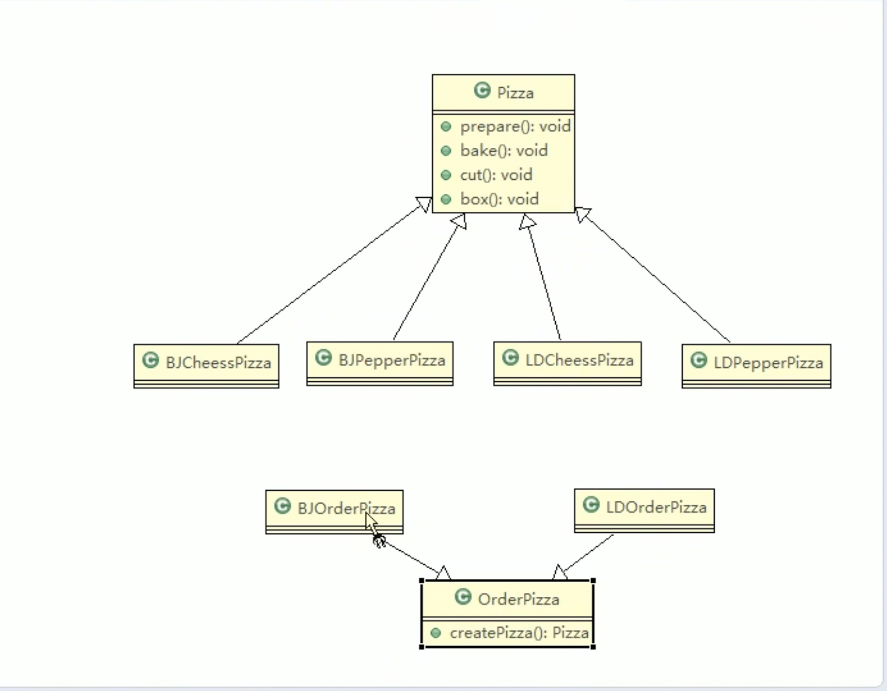
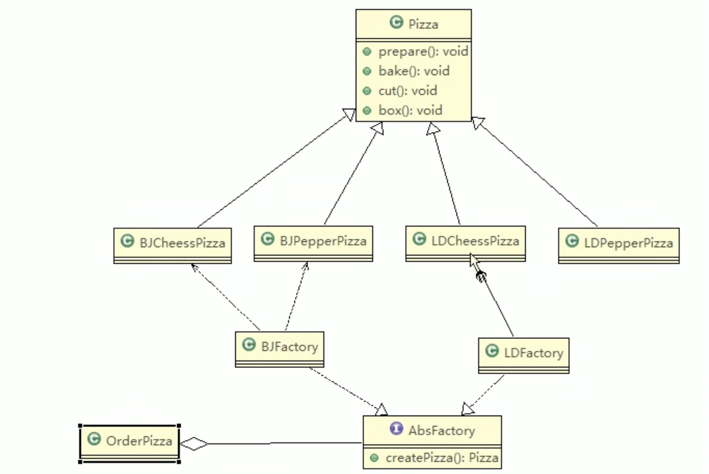

# design


| 项目              | 地址                                           |
| :----------------------- | :--------------------------------------- |
| 晓智科技                 | [晓智科技](https://xiaozhi.shop)|
| 晓智文档                 | [晓智文档](https://doc.xiaozhi.shop/backend/design) |
| 文档源码                 | [文档源码](https://github.com/dezhizhang/doc) |


## 设计模式七大原则

1. ##### 单一职责原则
```java
package principle;

public class SingleResponse {
    public static void main(String[] args) {
        Vehicle vehicle = new Vehicle();
        vehicle.run("小汔车");
        vehicle.runAir("飞机");
        vehicle.runWater("轮船");
    }
}

class Vehicle {
   public void run(String vehicleName) {
       System.out.println(vehicleName + "在公路上运行...");
   }

   public void runAir(String vehicleName) {
       System.out.println(vehicleName + "在天空飞行...");
   }

   public void runWater(String vehicleName) {
       System.out.println(vehicleName + "在水中运行");
   }
   
}

```
2. ##### 接口隔离原则
```java
package sergregation;

public class Segregation {
    public static void main(String[] args) {
        A a = new A();
        // 通过接口进行依赖
        a.depend1(new B());
        a.depend2(new B());
        a.depend3(new B());

        System.out.println("--------");
        //
        C c = new C();
        c.depend1(new D());
        c.depend5(new D());
    }
}

class A {
    public void depend1(Interface1 i) {
        i.operation1();
    }
    public void depend2(Interface2 i) {
        i.operation2();
    }
    public void depend3(Interface2 i) {
        i.operation3();
    }
}

class C {
    public void depend1(Interface1 i) {
        i.operation1();
    }

    public void depend4(Interface3 i) {
        i.operation4();
    }
    public void depend5(Interface3 i) {
        i.operation5();
    }
}


interface Interface1{
    void operation1();
}

interface Interface2{
    void operation2();
    void operation3();
}

interface Interface3{
    void operation4();
    void operation5();
}

class B implements Interface1,Interface2{
    public void operation1() {
        System.out.println("B 实现了operation 1");
    }
    public void operation2() {
        System.out.println("B 实现了operation 2");
    }
    public void operation3() {
        System.out.println("B 实现了operation 3");
    }
}


class D implements Interface1,Interface3{
    public void operation1() {
        System.out.println("D 实现了operation 1");
    }
    public void operation4() {
        System.out.println("D 实现了operation 2");
    }
    public void operation5() {
        System.out.println("D 实现了operation 3");
    }
}

```
3. ##### 依赖倒置
```java
package shop.xiaozhi.inversion;

public class DependInversion {
    public static void main(String[] args) {
        Person person = new Person();
        person.receive(new Email());

        // 微信
        person.receive(new WeiXin());
    }
}

// 定义接口
interface IReceiver {
    public String getInfo();
}

// 电子邮件
class Email implements IReceiver {
    @Override
    public String getInfo() {
        return "电子邮箱信息：1541609448@qq.com";
    }
}

class WeiXin implements IReceiver {
    public String getInfo() {
        return "微信信息：15992478448";
    }
}

class Person{
   public void receive(IReceiver receiver) {
       System.out.println(receiver.getInfo());
   };
}
```
4. ##### 里氏替换原则
```java
package shop.xiaozhi.liskov;

public class Liskov {
    public static void main(String[] args) {
        A a = new A();
        System.out.println("1-3=" + a.func1(11,3));
        System.out.println("1-8=" + a.func1(1,8));

        System.out.println("--------------------");
        B b = new B();
        System.out.println("11+3=" + b.func1(11,3));
        System.out.println("1+8=" + b.func1(1,8));
        System.out.println("11-3=" + b.func3(11,3));
    }
}

class Base {

}


class A extends Base {
    public int func1(int num1, int num2) {
        return num1 - num2;
    }
}


class B extends Base {
    A a = new A();
    public int func1(int num1, int num2) {
        return num1 + num2;
    }

    public int func2(int num1, int num2) {
        return func1(num1, num2) + 9;
    }

    public int func3(int num1, int num2) {
        return a.func1(num1, num2);
    }
}
```

4. ##### 开闭原则
```java
package shop.xiaozhi.ocp;

public class Ocp {
    public static void main(String[] args) {
        GraphicEditor graphicEditor = new GraphicEditor();
        graphicEditor.drawShape(new Circle());
        graphicEditor.drawShape(new Rectangle());

    }
}

class GraphicEditor{
    public void drawShape(Shape s){
        s.draw();
    }
}


abstract class Shape {
    public abstract void draw();
}

class Circle extends Shape {

    @Override
    public void draw() {
        System.out.println("draw circle");
    }
}

class Rectangle extends Shape {

    @Override
    public void draw() {
        System.out.println("draw rectangle");
    }
}

```
5. ##### 合成复用原则

## 创建型模式
### 单例模式
- 所谓的单例设计模式，就是采取一定的方法保证在整个软件系统中，对某个类只能存在一个对像实例，并且该类只提供一个取得其对像实例的方法(静态方法)

1. ##### 饿汉式(静态变量)
- 优点： 这种写法比较简单，就是在类装载的时候就完成实例化。避免了线程同步问题
- 缺点：在类装载的时候就完成实例化，没有达到Lazy Loading的效果，如果从始至终从未使用过这个实例，则会造成内存的浪费
```java
package shop.xiaozhicloud.singleton;

public class SingletonTest {
    public static void main(String[] args) {
        Singleton s1 = Singleton.getInstance();
        Singleton s2 = Singleton.getInstance();

        System.out.println(s1 == s2);
        System.out.println(s1.hashCode() == s2.hashCode());
    }
}


//饿汉式(静态变量)
class Singleton{
    // 1. 构造器私有化，外部不能new
    private Singleton() {

    };
    // 2. 本类内部创建实例
    private final static Singleton instance = new Singleton();
    // 3. 提供一个公有的静态方法，返回实例对像
    public static Singleton getInstance(){
        return instance;
    }
}

```
2. ##### 饿汉式(静态代码块)
- 优点： 这种写法比较简单，就是在类装载的时候就完成实例化。避免了线程同步问题
- 缺点：在类装载的时候就完成实例化，没有达到Lazy Loading的效果，如果从始至终从未使用过这个实例，则会造成内存的浪费
```java
package shop.xiaozhicloud.singleton;

public class SingletonTest2 {
    public static void main(String[] args) {
        Singleton2 singleton2 = Singleton2.getInstance();
        Singleton2 Singleton = Singleton2.getInstance();
        System.out.println(singleton2.hashCode() == Singleton.hashCode());
    }
}

class Singleton {

    private static Singleton2 instance;
    //1. 构造器私有化，外部不能new
    private Singleton(){

    }
    //2. 本类内部创建对像实例

    static {
        // 静态代码块中 创建单例对像
        instance = new Singleton();
    }

    //3. 提供一个公有的静态方法，返回实例对像
    public static Singleton getInstance() {
        return instance;
    }

}
```

3. ##### 悚汉式(线程不安全)
- 优点： 起到了Lazy Loading的效果，但是只能在单线程下使用
- 缺点：如果在多线程下，一个线程进入if(singleton==null)判断语句块，还未来得及往下执行，另外一个线程也通过了这个判断语句，这时便会产生多个实例，所以在多线程环境下不可以使用这种方式。
```java
package shop.xiaozhicloud.singleton;

public class SingletonTest3 {
    public static void main(String[] args) {
        Singleton s1 = Singleton.getInstance();
        Singleton s2 = Singleton.getInstance();

        System.out.println(s1.hashCode() == s2.hashCode());
    }
}


// 懒汉式
class Singleton{
    private static Singleton instance;

    private Singleton() {

    }
    // 提供一个静态方法当使用到该方法时，才去创建instance
    public static Singleton getInstance() {
        if(instance == null) {
            instance = new Singleton();
        }
        return instance;
    }
}
```

4. ##### 悚汉式(线程安全, 同步方法)
- 解决了线程不安全问题
- 效率太低，每个线程想获取实例时候，都要进行同步，而且这个方法只执行一次实例化代码就够了，后面的想获取该类实例直接return就行了，方法进行同步效率太低

```java

package shop.xiaozhicloud.singleton;

public class SingletonTest4 {
    public static void main(String[] args) {
        Singleton s1 = Singleton.getInstance();
        Singleton s2 = Singleton.getInstance();

        System.out.println(s1 == s2);
    }
}


class Singleton {
    private static Singleton instance;

    private Singleton() {

    }

    public static synchronized Singleton getInstance() {
        if(instance == null) {
            instance = new Singleton();
        }
        return instance;
    }
}

```

5. ##### 双重检查单例
```java
package shop.xiaozhicloud.singleton;

public class SingletonTest5 {
    public static void main(String[] args) {
        Singleton s1 = Singleton.getInstance();
        Singleton s2 = Singleton.getInstance();
        System.out.println(s1 == s2);
    }
}

class Singleton{
    private static volatile Singleton instance;
    private Singleton() {}
    // 提供一人静态的公有方法，加入双重检查代码，解决线程安全问题，同时解决赖加载问题
    public static Singleton getInstance() {
        if(instance == null) {
            synchronized (Singleton.class) {
                if(instance == null) {
                    instance = new Singleton();
                }
            }
        }
        return instance;
    }
}
```
6. ##### 静态内部类单列
- 静态内部类采用了类装载换机制来保证初始化实例时只有一个线程
- 静态内部类方式在Singleton类被装时并不会立即实例化，而是在需要实例时时，调用getInstance方法才会装载SingletonInstance类，从而完成Singleton的实例化
- 类的静态属性只会在第一次加载类的时候初始化，所以在这里,jvm帮助我们保证了线程的安全性，在类进行初始化时，别的线程是无法进入的
- 避免了线程不安全，利用了静态内部类特点实现延迟加载效率高

```java
package shop.xiaozhicloud.singleton;

public class SingletonTest6 {
    public static void main(String[] args) {
        Singleton s1 = Singleton.getInstance();
        Singleton s2 = Singleton.getInstance();


        System.out.println(s1.hashCode() == s2.hashCode());
    }
}

// 静态内部内完成
class Singleton{
    private Singleton(){}
    // 静态内部内，该类中有一个静态属性Singleton
    private static class SingletonInstance{
        private static final Singleton  instance = new Singleton();
    }

    public static Singleton getInstance(){
        return SingletonInstance.instance;
    }
}

```
7. ##### 枚举类型单例
- 这借助jdk1.5中添加的枚举来实现单例模式,不仅能避免多线程问题，而且还能防止反序列化重新创建新的对像
- 这种方式是Effective java 作者Josh Bloch提倡的方式
```java
package shop.xiaozhicloud.singleton;

public class SingletonTest7 {
    public static void main(String[] args) {
        Singleton s1 =Singleton.INSTANCE;
        Singleton s2 =Singleton.INSTANCE;
        System.out.println(s1.hashCode() == s2.hashCode());
    }
}
enum Singleton{
    INSTANCE;
    public void sayOk() {
        System.out.println("sayOk");
    }
}
```
### 工厂模式

1. ##### 工厂方法模式

```java
package shop.xiaozhicloud.factory.method;

public abstract class Pizza {
    protected String name;

    public abstract void prepare();

    public void bake() {
        System.out.println(this.name + " bake complete.");
    }

    public void cut() {
        System.out.println(this.name + " cut complete.");
    }

    public void box() {
        System.out.println(this.name + " box complete.");
    }

    public void setName(String name) {
        this.name = name;
    }

}

//---------------------------------------
package shop.xiaozhicloud.factory.method;

public class LDPepperPizza extends Pizza {
    @Override
    public void prepare() {
        setName("伦敦的胡椒pizza");
        System.out.println("伦敦的胡椒pizza准备原材料");
    }
}

//---------------------------------------
package shop.xiaozhicloud.factory.method;

public class LDCheesePizza extends Pizza {
    @Override
    public void prepare() {
        setName("伦敦奶酪pizza");
        System.out.println("伦敦奶酪准备原材料pizza");
    }
}

//---------------------------------------
package shop.xiaozhicloud.factory.method;

public class BjPepperPizza extends Pizza {
    @Override
    public void prepare() {
        setName("北京胡椒pizza");
        System.out.println("北京胡椒pizza准备原材料");
    }

}

//---------------------------------------
package shop.xiaozhicloud.factory.method;

public class BjCheesePizza extends Pizza {

    public void prepare() {
        setName("北京奶酪pizza");
        System.out.println("北京奶酪准备原材料pizza");
    }
}

//---------------------------------------

package shop.xiaozhicloud.factory.method.order;

import shop.xiaozhicloud.factory.method.Pizza;

import java.io.BufferedReader;
import java.io.IOException;
import java.io.InputStreamReader;

abstract class OrderPizza {
   abstract Pizza createPizza(String pizzaName);

   public OrderPizza() {
       Pizza pizza = null;
       String pizzaName = null;

       do{
           pizzaName = getType();
           pizza = createPizza(pizzaName);
           pizza.prepare();
           pizza.bake();
           pizza.cut();
           pizza.box();

       }while(true);
   }

    public String getType() {
        try{
            BufferedReader in = new BufferedReader(new InputStreamReader(System.in));
            System.out.println("input pizza type:");
            return in.readLine();
        }catch (IOException e) {
            System.out.println(e);
            return "";
        }
    }

}

//---------------------------------------
package shop.xiaozhicloud.factory.method.order;

import shop.xiaozhicloud.factory.method.LDCheesePizza;
import shop.xiaozhicloud.factory.method.LDPepperPizza;
import shop.xiaozhicloud.factory.method.Pizza;

public class LDOrderPizza extends OrderPizza {

    @Override
    Pizza createPizza(String pizzaName) {
        Pizza pizza = null;
        if(pizzaName.equals("cheese")){
            pizza = new LDCheesePizza();
        }else if(pizzaName.equals("pepper")){
            pizza = new LDPepperPizza();
        }
        return pizza;
    }
}

//---------------------------------------
package shop.xiaozhicloud.factory.method.order;

import shop.xiaozhicloud.factory.method.BjCheesePizza;
import shop.xiaozhicloud.factory.method.BjPepperPizza;
import shop.xiaozhicloud.factory.method.Pizza;

public class BJOrderPizza extends OrderPizza {

    @Override
    Pizza createPizza(String pizzaName) {
        Pizza pizza = null;
        if(pizzaName.equals("cheese")){
            pizza = new BjCheesePizza();
        }else if(pizzaName.equals("pepper")){
            pizza = new BjPepperPizza();
        }
        return pizza;
    }
}

//---------------------------------------
package shop.xiaozhicloud.factory.method.order;

public class PizzaStore {
    public static void main(String[] args) {
        // 创建北京
        new BJOrderPizza();
    }
}
```

2. ##### 抽像工厂模式

```java
package shop.xiaozhicloud.factory.absfactory;

public abstract class Pizza {
    protected String name;

    public abstract void prepare();

    public void bake() {
        System.out.println(this.name + " bake complete.");
    }

    public void cut() {
        System.out.println(this.name + " cut complete.");
    }

    public void box() {
        System.out.println(this.name + " box complete.");
    }

    public void setName(String name) {
        this.name = name;
    }

}
//---------------------------------------
package shop.xiaozhicloud.factory.absfactory;

public class BjPepperPizza extends Pizza {
    @Override
    public void prepare() {
        setName("北京胡椒pizza");
        System.out.println("北京胡椒pizza准备原材料");
    }

}
//---------------------------------------
package shop.xiaozhicloud.factory.absfactory;


public class BjCheesePizza extends Pizza {

    public void prepare() {
        setName("北京奶酪pizza");
        System.out.println("北京奶酪准备原材料pizza");
    }
}
//---------------------------------------
package shop.xiaozhicloud.factory.absfactory.order;

import shop.xiaozhicloud.factory.absfactory.Pizza;

public interface AbsFactory {
    public Pizza createPizza(String orderType);
}
//---------------------------------------
package shop.xiaozhicloud.factory.absfactory.order;

import shop.xiaozhicloud.factory.absfactory.Pizza;
import shop.xiaozhicloud.factory.absfactory.BjCheesePizza;
import shop.xiaozhicloud.factory.absfactory.BjPepperPizza;

public class BJFactory implements AbsFactory {

    @Override
    public Pizza createPizza(String orderType) {

        Pizza pizza = null;
        if(orderType.equals("cheese")){
            pizza = new BjCheesePizza();
        }else if(orderType.equals("pepper")){
            pizza = new BjPepperPizza();
        }

        return pizza;
    }
}
//---------------------------------------
package shop.xiaozhicloud.factory.absfactory.order;

import shop.xiaozhicloud.factory.absfactory.Pizza;

import java.io.BufferedReader;
import java.io.IOException;
import java.io.InputStreamReader;

public class OrderPizza {
  AbsFactory factory;


  public OrderPizza(AbsFactory factory) {
      setFactory(factory);
  }

  private void setFactory(AbsFactory factory) {
      Pizza pizza = null;
      String orderType = "";
      this.factory = factory;

      do {
          orderType = getType();
          pizza = factory.createPizza(orderType);

          if(pizza != null) {
              pizza.prepare();
              pizza.bake();
              pizza.cut();
              pizza.box();
          }else{
              System.out.println("订购失败");
              break;
          }
      }while (true);
  }

    public String getType() {
        try{
            BufferedReader in = new BufferedReader(new InputStreamReader(System.in));
            System.out.println("input pizza type:");
            return in.readLine();
        }catch (IOException e) {
            System.out.println(e);
            return "";
        }
    }

}
//---------------------------------------
package shop.xiaozhicloud.factory.absfactory.order;

public class PizzaStore {
    public static void main(String[] args) {
        new OrderPizza(new BJFactory());
    }
}
```
### 原型模式
1. ##### 原型模式实现克隆
```java
package shop.xiaozhicloud.prototype;
public class Sheep implements Cloneable {
    private String name;
    private int age;
    private String color;
    public Sheep(String name, int age, String color) {
        this.name = name;
        this.age = age;
        this.color = color;
    }
    public String getName() {
        return name;
    }
    public int getAge() {
        return age;
    }
    public String getColor() {
        return color;
    }
    public void setName(String name) {
        this.name = name;
    }
    public void setAge(int age) {
        this.age = age;
    }
    public void setColor(String color) {
        this.color = color;
    }
    // 原型模式拷贝
    @Override
    protected Object clone() throws CloneNotSupportedException {
        Sheep sheep = null;
        try{
            sheep = (Sheep) super.clone();
        }catch (CloneNotSupportedException e){
            System.out.println(e.getMessage());
        }
        return sheep;
    }

    @Override
    public String toString() {
        return "Sheep{" +
                "name='" + name + '\'' +
                ", age=" + age +
                ", color='" + color + '\'' +
                '}';
    }
}

```


## 结构型模式
## 行为型模式


<!-- last(https://www.bilibili.com/video/BV1G4411c7N4?p=88&vd_source=10257e657caa8b54111087a9329462e8) -->