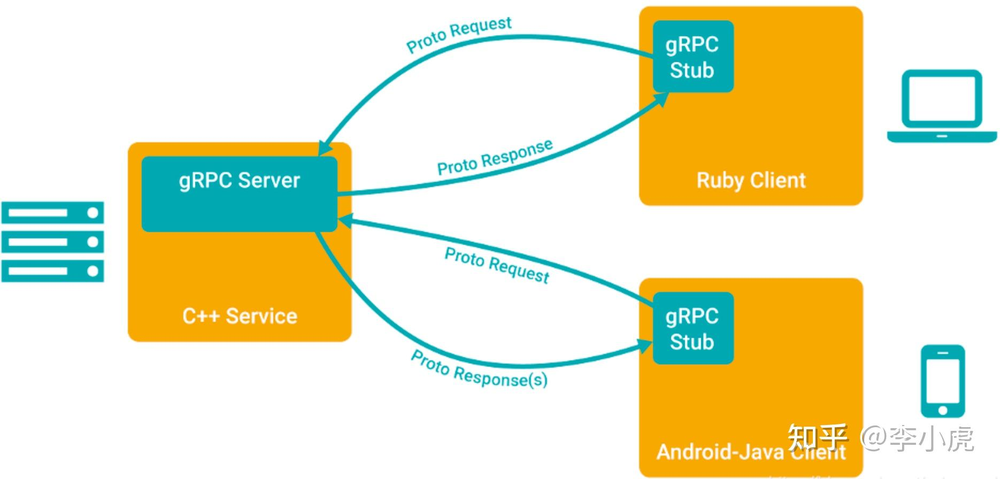
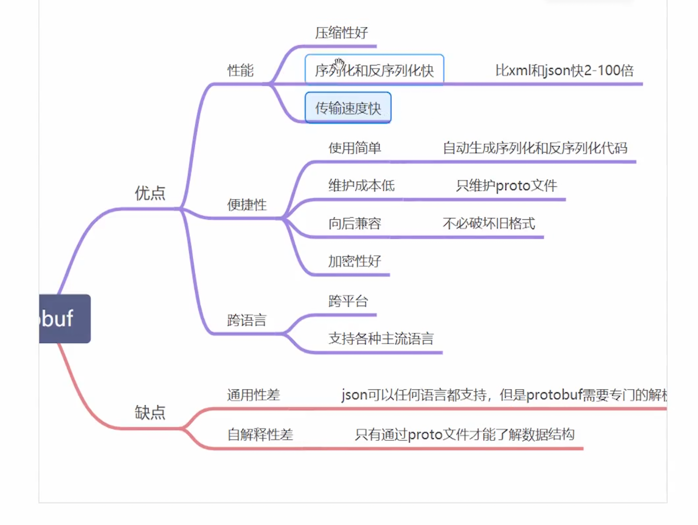
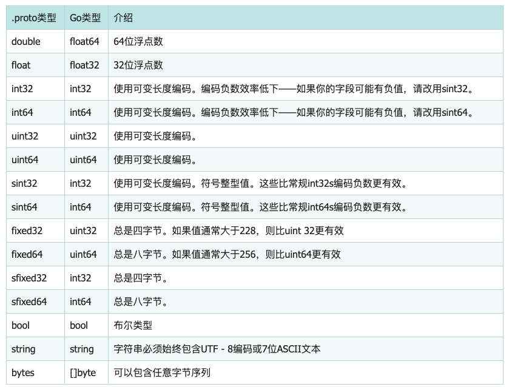

# grpc

### 什么是 grpc

1. ##### 基本介绍

- grpc 是一个高性能，开源和通用 rpc 框架，面向移动和 http/2 设计，目前提供 c,java 和 go 语言版本。

2. ##### 调用图解



### gprc 开发环境准备

1. ##### 安装 protoc 工具

```bash
https://github.com/protocolbuffers/protobuf/releases
```

2. ##### 安装依赖包

```bash
go get github.com/golang/protobuf/protoc-gen-go
```

### grpc 简单入门

1. ##### 编写 protobuf 文件

```go
syntax = "proto3";
option go_package = ".;proto";
message HelloRequest {
  string name = 1;
}

message HelloReply{
  string message = 1;
}

service Greeter{
  rpc SayHello(HelloRequest) returns(HelloReply);
}
```

2. ##### 生成 grpc 对应代码

```bash
cd /proto

protoc --go_out=. --go_opt=paths=source_relative --go-grpc_out=. --go_opt=paths=source_relative helloworld.proto
```

3. ##### 编写服务端代码

```go
type Server struct {
	proto.UnimplementedGreeterServer
}

// SayHello rpc服务调用
func (s *Server) SayHello(ctx context.Context, req *proto.HelloRequest) (*proto.HelloReply, error) {
	return &proto.HelloReply{Message: req.Name + "hello"}, nil
}

func main() {
	//1. 实例化grpc
	g := grpc.NewServer()
	// 注册服务
	proto.RegisterGreeterServer(g, &Server{})
	// 启动服务
	l, err := net.Listen("tcp", ":8080")
	if err != nil {
		panic("启动服务失败" + err.Error())
	}

	err = g.Serve(l)
	if err != nil {
		panic(err)
	}
}
```

4. ##### 编写客户端代码

```go
func main() {
	conn, err := grpc.Dial("localhost:8080", grpc.WithInsecure())
	if err != nil {
		panic(err)
	}

	defer func(conn *grpc.ClientConn) {
		err := conn.Close()
		if err != nil {
			panic(err)
		}
	}(conn)

	c := proto.NewGreeterClient(conn)

	r, err := c.SayHello(context.Background(), &proto.HelloRequest{
		Name: "tom",
	})
	if err != nil {
		panic(err)
	}
	fmt.Println(r.Message)
}

```

### rpc 服务调和客户端报务调用

```go
// server---------------------------------

type HelloService struct{}

func (s *HelloService) Hello(request string, reply *string) error {
	*reply = "Hello " + request
	return nil
}

func main() {
	//1. 实例化server
	listen, err := net.Listen("tcp", ":8080")
	if err != nil {
		panic(err)
	}
	//2. 注册服务
	err = rpc.RegisterName("HelloService", &HelloService{})
	if err != nil {
		panic(err)
	}
	// 启动服务
	conn, err := listen.Accept()
	rpc.ServeConn(conn)
}
// client---------------------------------
func main() {
	//1.建立连接
	conn, err := rpc.Dial("tcp", "127.0.0.1:8080")
	if err != nil {
		panic("连接失败")
	}
	var reply string
	err = conn.Call("HelloService.Hello", "world", &reply)
	if err != nil {
		panic("服务调用失败")
	}
	fmt.Println(reply)
}
```

### 什么是 protobuf

1. ##### 基本介绍

- protobuf（Protocol Buffers）协议 😉 protobuf 是一种由 google 开发的二进制序列化格式和相关的技术，它用于高效地序列化和反序列化结构化数据，通常用于网络通信、数据存储等场景

2. ##### 优点与缺点



3. ##### protobuf 对应 go 类型



4. ##### 类型引用

```go
//common.proto
syntax = "proto3";

option go_package = ".;proto";

message Pong{
  string id = 1;
}
// hello.proto
syntax = "proto3";
option  go_package = ".;proto";

import "google/protobuf/empty.proto";
import "common.proto"; // 调用公共protobuf

message HelloRequest{
  string name = 1;
}

message HelloReply {
  string message = 1;
}

service Greeter{
  rpc SayHello (HelloRequest) returns(HelloReply);
  rpc Ping(google.protobuf.Empty) returns(Pong);
}
```

5. ##### 嵌套的 message

```go
message HelloReply {
  string message = 1;
  message Result {
    string name = 1;
    string url = 2;
  }
}
```

6. ##### 枚举类型

```go
enum Gender{
  MALE =0;
  FEMALE = 1;
}

message HelloRequest{
  string name = 1;
  Gender g = 3;
}
```

7. ##### map 类型

```go
message HelloRequest{
  string name = 1;
  Gender g = 3;
  map<string,string> mp = 4;
}
```

8. ##### timestamp类型
```go
message HelloRequest{
  string name = 1;
  Gender g = 2;
  map<string,string> mp = 3;
  google.protobuf.Timestamp createTime = 4;
}
```
