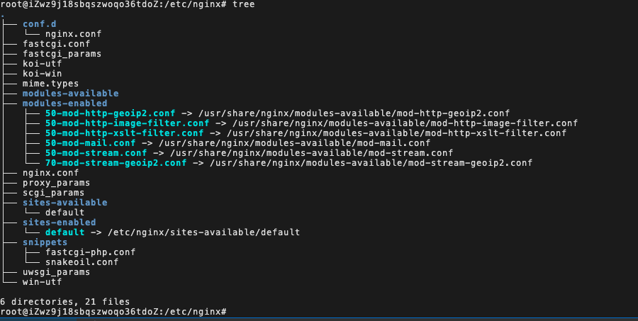
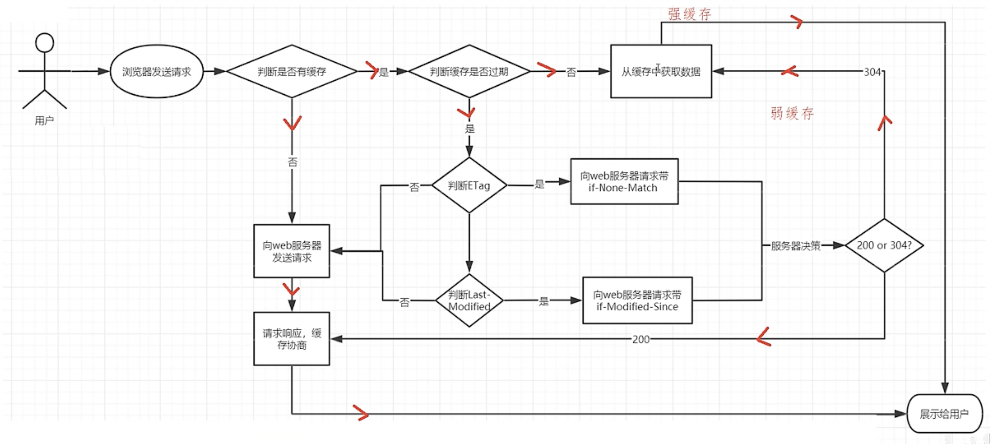
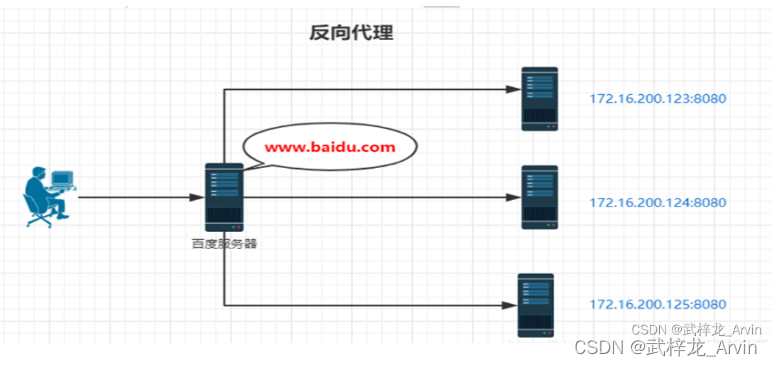

# nginx

| 项目     | 地址                                                                       |
| :------- | :------------------------------------------------------------------------- |
| 晓智科技 | [晓智科技](https://xiaozhi.shop)                                           |
| 晓智文档 | [晓智文档](https://doc.xiaozhi.shop/backend/algorithm)                     |
| 源码地址 | [源码地址](https://github.com/dezhizhang/java-awesome/tree/main/algorithm) |
| 文档源码 | [文档源码](https://github.com/dezhizhang/doc)                              |

### yum 安装 nginx

1. ##### 安装 yum-utils

```bash
sudo yum  install -y yum-utils
```

2. ##### 添加 yum 源文件

```bash
# 新建文件
vim /etc/yum.repos.d/nginx.repo
# 添加文件源
[nginx-stable]
name=nginx stable repo
baseurl=http://nginx.org/packages/centos/$releasever/$basearch/
gpgcheck=1
enabled=1
gpgkey=https://nginx.org/keys/nginx_signing.key
module_hotfixes=true

[nginx-mainline]
name=nginx mainline repo
baseurl=http://nginx.org/packages/mainline/centos/$releasever/$basearch/
gpgcheck=1
enabled=0
gpgkey=https://nginx.org/keys/nginx_signing.key
module_hotfixes=true
```

3. ##### 使用 yum 进行安装

```bash
yum install -y nginx
```

4. ##### 查看是否安装成功

```bash
yum list | grep nginx
```

5. ##### 查看 nginx 的安装位置

```bash
whereis nginx
```

6. ##### 启动 nginx

```bash
systemctl start nginx
```

7. ##### 查看 nginx 是否启动成功

```
ps -ef | grep nginx
```

### nginx 常用系统命令

1. ##### 启动 nginx

```bash
systemctl start nginx
```

2. ##### 停止 nginx

```bash
systemctl stop nginx
```

3. ##### 重启 nginx

```bash
systemctl restart nginx
```

4. ##### 重新加载配置文件

```bash
systemctl reload nginx
```

5. ##### 查看 nginx 状态

```bash
systemctl status nginx
```

6. ##### 开机启动

```bash
systemctl enable nginx
```

### 目录结构

1. ##### nginx 常用目录



### 核心配置文件

1. ##### nginx.conf 配置文件

```bash
user www-data;
#master_process on| off #指定是否开启工作进程
worker_processes auto; #设置工作进程个数
daemon off; #是否以守护进程运行
pid /run/nginx.pid; #用来配置nginx进程id存放位置
include /etc/nginx/modules-enabled/\*.conf;

events {
    worker_connections 768; #单个worker进程最大连接数
    multi_accept on; #设置是否允许周时接收多个网络链接
}

http {
    sendfile on; #是否使用sendfile()传输文件，可以大大提高nginx文件传输
    tcp_nopush on; #
    types_hash_max_size 2048;
    # server_tokens off;
    # server_names_hash_bucket_size 64;
    # server_name_in_redirect off;

    keepalive_timeout 75s #用来设置长链接的超时时间
    keepalive_requests 100; #用来设置一个keep-alive连接使用的次数

    include /etc/nginx/mime.types;
    default_type application/octet-stream; #响应浏览器请求默认MIME类型

    ssl_protocols TLSv1 TLSv1.1 TLSv1.2 TLSv1.3; # Dropping SSLv3, ref: POODLE
    ssl_prefer_server_ciphers on;

    access_log /var/log/nginx/access.log;
    error_log /var/log/nginx/error.log; #配置错误日志

    gzip on;
}
```

2. ##### 配置返回不同 MIME 类型

```bash
server
{
    listen 80;
    server_name 47.107.101.79;
    index index.html index.htm default.htm default.html;

    location /get_text {
        default_type text/html; #返回html类型
        return 200 "<h1>this is a text</h1>";
    }

    location /get_json {
        default_type application/json; #返回json类型
        return 200 "{'name':'hello'}";
    }
}
```

### nginx 配置到系统变量

1. ##### 修改/etc/profile 文件

```bash
vim /etc/profile
export PATH=$PATH:/usr/sbin;
```

2. ##### 使之立即生效

```bash
source /etc/profile
```

3. ##### 验证是否生效

```bash
nginx -v
```

### server_name 匹配规则

1. ##### 匹配优先级

- 精确区配 > 前通配符匹配 > 后通配符匹配 > 正则表过式匹配 > 默认匹配

2. ##### 精确匹配

```bash
server
{
    listen 80;
    server_name www.xiaozhi.shop m.xiaozhi.shop doc.xiaozhi.shop;
    ...
}
```

3. ##### 通配符匹配

```bash
server
{
    listen 80;
    server_name *.xiaozhi.shop;
    ...
}
```

4. ##### 正则表达式匹配

```bash
server
{
    listen 80;
    server_name ~^www\.(\w+)\.shop;
    ....
}
```

### location 匹配规则

1. ##### 不带任何符号,以指定模式开始

```bash
location /abc {
    default_type text/plain;
    return 200 "success";

}
```

2. ##### 精确模式匹配（=）

```bash
location =/abc {
    default_type text/plain;
    return 200 "success";

}
```

3. ##### 区分大小写正则表达式匹配（~）

```bash
location ~/abc\w$ {
    default_type text/plain;
    return 200 "success";
}
```

4. ##### 不区分大小写正则表达式匹配（~\*）

```bash
location ~*^/abc\w$ {
    default_type text/plain;
    return 200 "success";
}
```

5. ##### 停止向后搜索模式(^~)

```bash
location ^~/abcd {
    default_type text/plain;
    return 200 "abcd success";
}
```

### 请求资源目录 root/alias

- root 的处理结果是： root 路径+location 路径
- alias 的处理结果：使用 alias 路径替换 location 路径
- alias 目一个目录别名的定义,root 则是最上层目录的含义
- 如果 location 路径以'/'结尾，则 alias 也必须以'/'结尾，root 没有要求

1. ##### root 为 root 路径+location 路径

```bash
location /images {
    root /mnt/html;
}
```

2. ##### alias 为 alias 路径替换 location 路径

```bash
location /images {
    alias /mnt/html/images;
}
```

### index 加载静态资源

1. ##### 可以跟多个请求资源，依次查找，找到第一个为止

```bash
location /images {
    root /mnt/html;
    index index.html 1.png;
}
```

### error_page 错误访问页面

1. ##### 可以指定具体跳转的地址

```bash
server{
    error_page 404 https://xiaozhi.shop;
}
```

2. ##### 可以指定重定向地址

```bash
server{
        error_page 404 500 502 503 504 /50x.html;
    location /50x.html{
        root /mnt/html;
    }
}
```

### 静态资源优化

- 请求静态资源的过程：客户端通过网络接口向服务端发送请求，操作系统将这些客户端的请求传递给服务器端应用程序，服务器端应用程序会处理这些请求，请求处理完成以后，操作系统还需要将处理得到的结果通过网络适配器传递回去。

```bash
sendfile on;
tcp_nopush on;
```

### gip 压缩配置

```bash
http {
    gzip on; # 是否开启压缩
    gzip_vary on; # gip压缩时是否携带头信息
    gzip_proxied any; # 对服务端返回结时进行gip压缩
    gzip_comp_level 6; # 压缩级别
    gzip_disable "Mozilla/*"; # 选择情的开启或开闭gip压缩
    gzip_buffers 16 8k; # 缓存空间大小
    gzip_http_version 1.1; # 选择压缩最低版本
    gzip_min_length 20; # 传输数据的大小
    gzip_types text/plain text/css application/json application/javascript text/xml application/xml application/xml+rss text/javascript;
}
```

### 静态资源缓存

1. ##### 缓存流程图

   

2. ##### 配置代码

```bash
server{
    location ~.*\.(html|js|css|png)$ {
        expires 1000;
        add_header Cache-Control no-store;
        root /mnt/html;
    }
}
```

### 跨域问题

1. ##### 基本介绍

- 同源策略是一种约定，由 Netscape 公司 1995 年引入浏览器，它是浏览器最核心也最基本的安全功能，如果缺少了同源策略，浏览器很容易受到 XSS、CSFR 等攻击。所谓同源是指"协议+域名+端口"三者相同， 即便两个不同的域名指向同一个 ip 地址，也非同源。

2. ##### 配置代码

```bash
location /api/v1 {
    add_header Access-Control-Allow-Origin *;
    add_header Access-Control-Allow-Methods GET,POST,PUT,DELETE;
    default_type application/json;
    return 200 '{"id":1,"name":"tom"}';
}
```

### 防盗链实现

1. ##### 基本介绍

- Referer 是 Header 的一部分，当浏览器向 Web 服务器发送请求的时候，一般会带上 Referer，告诉服务器该请求是从哪个页面链接过来的，服务器就可以禁止或允许某些来源的网站访问资源。
- 如果直接在浏览器直接打开文件链接https://examplebucket-1250000000.cos.ap-guangzhou.myqcloud.com/1.jpg，请求 Header 里不会带有 Referer。

2. ##### 配置代码

```bash
location ~.*\.(jpeg|jpg|png)$ {
    valid_referers no backed *.xiaozhi.shop;
    if ($invalid_referer) {
            return 403;
    }
    root /mnt/html;
}
```

### rewrite 重写链接地址

1. ##### 基本介绍

- 在实际工作中往往会遇到很多跳转（重写 URL）的需求。比如：更换域名后需要保持旧的域名能够跳转到新的域名上、某网页发生改变需要跳转到新的页面、网站防盗链等等需求，使用 nginx 跳转效率会更高

2. ##### set 指令

```bash
location /write {
    set $name tom;
    set $age 18;
    default_type application/json;
    return 200 '{"name":$name,"age":$age}';
}
```

3. ##### if 指令

```bash
location /testif {
    default_type text/plain;
    set $username 'hello';
    if ($username) {
        return 200 $username;
    }
    return 200 'username is empty';
}
```

4. ##### break 指令

```bash
location /testbreak{
    default_type text/plain;
    set $username tom;
    if ($args) {
        set $username jeray;
        break;
        set $username rose;
    }
    add_header username $username;
    return 200 $username;
}
```

4. ##### return 指令

- 该指令用于完成对请求的处理，直接向客户端返回，在 return 后的所有 nginx 配置都是无效的。

```bash
location /testreturn {
    default_type application/json;
    return  200 '{"name":"tom","age":20}';
}
```

5. ##### rewrite 指令

- 该指令通过正则表过式的使用来改变 URI，可以同时存在一外或多个指令，按照顺序依次对 URL 进行匹配和处理

```bash
location /rewrite {
    rewrite ^/rewrite/url\w*$ https://www.baidu.com;
    rewrite ^/rewrite/(test)\w*$ /$1;
    rewrite ^/rewrite/(demo)\w*$ /$1;
}

location /test {
    default_type text/plain;
    return 200 'test success';
}

location /demo {
    default_type text/plain;
    return 200 'demo success';
}
```

5. ##### rewrite_log 指令

- 该指令配置是否开启 URL 重写日志输出功能

```bash
rewrite_log on;
error_log /var/log/nginx/error.log notice;
```

### 反向代理

1. ##### 基本介绍

- 反向代理是一种代理服务器的配置模式，它代表服务器向客户端提供服务。客户端发送请求到反向代理服务器，然后反向代理服务器将请求转发到后端的真实服务器上，并将响应返回给客户端。简单理解为用户直接访问反向代理服务器就可以获得目标服务器的资源。这一过程叫反向代理

2. ##### 反向代理图解



3. ##### proxy_pass 指令

- 该指令用来设置被代理服务器地址，可以是主机名称，ip 地址+port(端口形式)

```bash
location / {
    proxy_pass https://8.134.182.122;
}
```

4. ##### proxy_set_header 指令

- 该指令可以更改 nginx 服务器接收到的客户端请求的请求头信息，然后将新的请求头信息发送给代理服务器

```bash
location / {
    proxy_set_header username tom;
    proxy_pass https://8.134.182.122;
}
```

5. ##### proxy_redirect 指令

- 该指令是用来重置头信息的 location 和 refresh 的值

```bash
location / {
    proxy_redirect http://47.107.101.79/ http://8.134.182.122/;
}
```

### 负载均衡

1. ##### 基本介绍

- 负载均衡是指将用户的请求分配到多个后端服务器上进行处理，以达到优化资源利用率、提高响应速度和增加系统的可靠性的目的。负载均衡器通常位于用户和服务器之间，接收用户的请求，并根据某种算法将请求分发给合适的后端服务器。

2. ##### 负载均衡图解


3. ##### 负载均衡配置

```bash
upstream backend {
    server 8.134.182.122;
    server 106.15.74.79;
}
server
{
    listen 80;
    server_name 47.107.101.79;

    location / {
            proxy_pass http://backend;
    }
}
```

4. ##### 负载均衡 backup

- 将该服务器标记为备份服务器，当主服务器不可用时，将用来传递请求。

```bash
upstream backend {
    server 8.134.182.122;
    server 106.15.74.79 backup;
}
server
{
    listen 80;
    server_name 47.107.101.79;

    location / {
            proxy_pass http://backend;
    }
}
```

5. ##### 负载均衡 max_fails 和 fail_timeout

- max_fails 设置允许请求代理服务器失败的次数默认为 1。
- fail_timeout=time;设置经过 max_fails 失败后，服务器暂停的时间，默认是 10 秒。

```bash
upstream backend {
    server 8.134.182.122 max_fails=3 fail_timeout=15;
    server 106.15.74.79;
}

server
{
    listen 80;
    server_name 47.107.101.79;

    location / {
        proxy_pass http://backend;
    }
}
```

6. ##### weight 加权[加权轮询]

- weight=number：用来设置服务器权重，默认为 1，权重数据越大，被分配到请求的几越大，该权重值,主要是针对实际工作环境中的不同的后端服务器硬件配置进行调整的，所有此策略比较适合服务器硬件配置差别较大的情况。

```bash
upstream backend {
    server 8.134.182.122 weight=1;
    server 106.15.74.79 weight=10;
}

server
{
    listen 80;
    server_name 47.107.101.79;

    location / {
        proxy_pass http://backend;
    }
}
```

7. ##### 负载均衡策略 ip_hash

- 对于后端的多台动态应用服务器做负载均衡时，ip_hash 指令能够将某个客户端 ip 的请求通过哈希算法定位到周一台服务器上，这样当来自某一个 ip 的用户在后端 web 服务器 A 上登录后，在访问该站点的共他 URL,能保证其访问的还是后端 web 服务器 A。

```bash
upstream backend {
    ip_hash;
    server 8.134.182.122 weight=1;
    server 106.15.74.79 weight=10;
}

server
{
    listen 80;
    server_name 47.107.101.79;

    location / {
        proxy_pass http://backend;
    }
}
```

8. ##### 负载均衡策略 least_conn

- 最少连接，把请求转发给连接数较少的后端服务器，轮询算法是把请求平均的转发给各个后端，使它们的负载大致相同，但是，有些请求占用的时间很长，会导致其所在的后端负载较高，

```bash
upstream backend {
    least_conn;
    server 8.134.182.122;
    server 106.15.74.79;
}

server
{
    listen 80;
    server_name 47.107.101.79;

    location / {
        proxy_pass http://backend;
    }
}
```

8. ##### 负载均衡策略 url_hash

- 按访问 url 的 hash 结果来分配请求，使每个 url 定向到周一个后端服务器，要配合缓存命中来使用。同一个资源多次请求，可能会达到不同的服务器上，导致不必要的多次下载，缓存命中率不高，以及一些资源时间的浪费，而使用 url_hash，可以使得同一个 url 会到达同一台服务器，一旦缓存住了资源，再次收到请求，就可以从缓存中读取。

```bash
upstream backend {
    hash &request_uri;
    server 8.134.182.122;
    server 106.15.74.79;
}

server
{
    listen 80;
    server_name 47.107.101.79;

    location / {
        proxy_pass http://backend;
    }
}
```

9. ##### 负载均衡策略 fair

- fair 采用的不是内建负载均衡使用的轮换的均衡算法，而是可以根据页面大小，加载时间长短智能进行负载均衡

```bash
upstream backend {
    fair;
    server 8.134.182.122;
    server 106.15.74.79;
}

server
{
    listen 80;
    server_name 47.107.101.79;

    location / {
        proxy_pass http://backend;

    }
}
```

### nginx 缓存设置

1. ##### 基本介绍

- web 缓存（或 HTTP 缓存）是用于临时存储（缓存）web 文档（如 HTML 页面和图像），以减少服务器延迟的一种信息技术。web 缓存系统会保存下通过这套系统的文档的副本；如果满足某些条件，则可以由缓存满足后续请求。 Web 缓存系统既可以指设备，也可以指计算机程序。

2. ##### proxy_cache_path

- 该指令用于设置缓存文件存放的路径

```bash
http{
    proxy_cache_path /var/log/nginx/cache levels=2:1 keys_zone=xiaozhi:200m inactive=1d max_size=20g;
}
```

3. ##### proxy_cache

- 该指令用来开启或关闭代理缓存,如果是开启则自定义使用那个缓存区来进行缓存

```bash
location / {
    proxy_cache xiaozhi;
    proxy_cache_key xiaozhi;
    proxy_cache_valid 200 5d;
    proxy_pass http://backend;
}
```
### 
<div align="center">贵州晓智信息科技有限公司</div>
<div align="center">  </div>

<!-- https://www.bilibili.com/video/BV1ov41187bq?p=136&vd_source=10257e657caa8b54111087a9329462e8 -->
