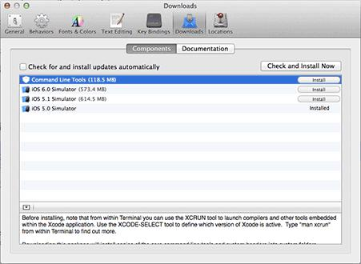
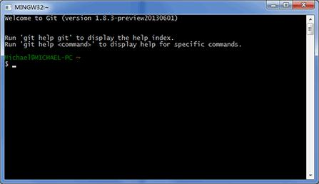

# git

| 项目     | 地址                                                                       |
| :------- | :------------------------------------------------------------------------- |
| 晓智科技 | [晓智科技](https://xiaozhi.shop)                                           |
| 晓智文档 | [晓智文档](https://doc.xiaozhi.shop/backend/algorithm)                     |
| 源码地址 | [源码地址](https://github.com/dezhizhang/java-awesome/tree/main/algorithm) |
| 文档源码 | [文档源码](https://github.com/dezhizhang/doc)                              |

### 介绍

1. ##### 基本简介

- git（读音为/gɪt/）是一个开源的分布式版本控制系统，可以有效、高速地处理从很小到非常大的项目版本管理。 [1]也是 Linus Torvalds 为了帮助管理 Linux 内核开发而开发的一个开放源码的版本控制软件。

### 安装

1. ##### Linux 上安装 git

- 如果你碰巧用 Debian 或 Ubuntu Linux，通过一条 sudo apt-get install git 就可以直接完成 Git 的安装，非常简单。 -老一点的 Debian 或 Ubuntu Linux，要把命令改为 sudo apt-get install git-core，因为以前有个软件也叫 GIT（GNU Interactive Tools），结果 Git 就只能叫 git-core 了。由于 Git 名气实在太大，后来就把 GNU Interactive Tools 改成 gnuit，git-core 正式改为 git。
- 如果是其他 Linux 版本，可以直接通过源码安装。先从 Git 官网下载源码，然后解压，依次输入：./config，make，sudo make install 这几个命令安装就好了。

```bash
sudo apt-get install git
```

2. ##### Mac OS X 上安装 Git

- 如果你正在使用 Mac 做开发，有两种安装 Git 的方法,是安装 homebrew，然后通过 homebrew 安装 Git：

```bash
brew install git
```

- 第二种方法更简单，就是直接从 AppStore 安装 Xcode，Xcode 集成了 Git，不过默认没有安装，你需要运行 Xcode，选择菜单“Xcode”->“Preferences”，在弹出窗口中找到“Downloads”，选择“Command Line Tools”，“Install”就可以完成安装了。



3. ##### 在 Windows 上安装 Git

- 在 Windows 上使用 Git，可以从 Git 官网直接下载安装程序，然后按默认选项安装即可。
- 安装完成后，在开始菜单里找到“Git”->“Git Bash”，蹦出一个类似命令行窗口的东西，就说明 Git 安装成功！



- 安装完成后，还需要最后一步设置，在命令行输入：

```bash
git config --global user.name "Your Name"
git config --global user.email "email@example.com"
```

<div align="center">晓智科技公众号</div>
<div align="center">  </div>
