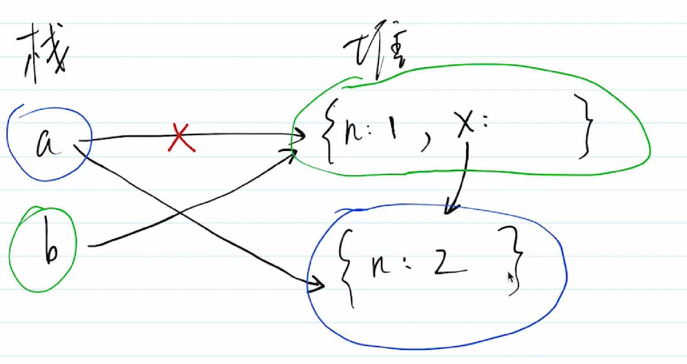

# inverview

# 前端面试

| 项目     | 地址                                                    |
| :------- | :------------------------------------------------------ |
| 晓智科技 | [晓智科技](https://xiaozhi.shop)                        |
| 晓智文档 | [晓智文档](https://doc.xiaozhi.shop/frontend/interview) |
| 源码地址 | [源码地址](https://github.com/dezhizhang/interview)     |
| 文档源码 | [文档源码](https://github.com/dezhizhang/doc)           |

[全网首发【2024七月最新版前端面试题】一周刷完前端面试八股文100题](https://www.bilibili.com/video/BV121sTeQEDJ/?spm_id_from=333.337.search-card.all.click&vd_source=10257e657caa8b54111087a9329462e8)
[2024最新前端面试突击，3天看完轻松拿捏前端面试官](https://www.bilibili.com/video/BV1Dt42147h4/?spm_id_from=333.337.search-card.all.click&vd_source=10257e657caa8b54111087a9329462e8)
<!-- [微前端面试完结](https://www.bilibili.com/video/BV1H34y117fe/?spm_id_from=333.337.search-card.all.click&vd_source=10257e657caa8b54111087a9329462e8) -->
[一线大厂面试](https://www.bilibili.com/video/BV1Mf4y1r7xX?p=1&vd_source=10257e657caa8b54111087a9329462e8)
[尚硅谷JavaScript高级教程(javascript实战进阶)完结](https://www.bilibili.com/video/BV14s411E7qf/?spm_id_from=333.337.search-card.all.click&vd_source=10257e657caa8b54111087a9329462e8)
[Web前端高频面试题100题精讲（11月22日更新）](https://www.bilibili.com/video/BV18j411M74W/?spm_id_from=333.337.search-card.all.click&vd_source=10257e657caa8b54111087a9329462e8)

[线性代数](https://www.bilibili.com/video/BV1aW411Q7x1/?p=3&spm_id_from=pageDriver&vd_source=10257e657caa8b54111087a9329462e8)
[收费面庞大题]（https://www.bilibili.com/cheese/play/ep178093?query_from=0&search_id=986261495675504298&search_query=%E5%89%8D%E7%AB%AF%E9%9D%A2%E8%AF%95&csource=common_hpsearch_null_null&spm_id_from=333.337.search-card.all.click）

### Promise

1. await 相当于 Promise.then 处理不了 Promise.reject

```js
!(async function () {
  const p4 = Promise.reject('err1');
  const d = await p4;
  console.log('data', d);
})();
```

### 微任务执行时机比宏任务时机早

1. 宏任务 setInterval,setTimeout,Ajax,Dom
2. 微任务 async/await

```js
console.log(100);

setTimeout(() => {
  console.log(200);
});

Promise.resolve().then(() => {
  console.log(300);
});

console.log(400);
```

### 进程 process 和线程 thread

```js
// 进程, OS进行资源分配和调度的最小单位，有独立内存空间
// 线程, OS进行运算调度的最小单位，共享进程内存空间
```

### 手写 promise TODO 回来重点看

```js
class MyPromise {
  state = 'pending';
  value = undefined;
  reason = undefined;

  resolveCallbacks = [];
  rejectCallbacks = [];

  constructor(fn) {
    const resolveHandler = (value) => {
      if (this.state === 'pending') {
        this.state = 'fulfilled';
        this.value = value;
        this.resolveCallbacks.forEach((fn) => fn(this.value));
      }
    };
    const rejectHandler = (reason) => {
      if (this.state === 'pending') {
        this.state = 'rejected';
        this.reason = reason;
        this.resolveCallbacks.forEach((fn) => fn(this.reason));
      }
    };
    try {
      fn(resolveHandler, rejectHandler);
    } catch (err) {
      rejectHandler(err);
    }
  }
  then(fn1, fn2) {
    fn1 = typeof fn1 === 'function' ? fn1 : (v) => v;
    fn2 = typeof fn2 === 'function' ? fn2 : (e) => e;

    if (this.state === 'pending') {
      const p1 = new MyPromise((resolve, reject) => {
        this.resolveCallbacks.push(() => {
          try {
            const newValue = fn1(this.value);
            resolve(newValue);
          } catch (err) {
            reject(err);
          }
        });

        this.rejectCallbacks.push(() => {
          try {
            const newReason = fn2(this.reason);
            reject(newReason);
          } catch (err) {
            reject(err);
          }
        });
      });
      return p1;
    }

    // fulfilled状态
    if (this.state === 'fulfilled') {
      const p1 = new MyPromise((resolve, reject) => {
        try {
          const newValue = fn1(this.value);
          resolve(newValue);
        } catch (err) {
          reject(err);
        }
      });
      return p1;
    }

    // rejcted
    if (this.state === 'rejcted') {
      const p1 = new MyPromise((resolve, reject) => {
        try {
          const newReason = fn2(this.reason);
          reject(newReason);
        } catch (err) {
          reject(err);
        }
      });
      return p1;
    }
  }
  catch(fn) {
    return this.then(null, fn);
  }
}

MyPromise.resolve = function (value) {
  return new MyPromise((resolve) => resolve(value));
};

MyPromise.reject = function (reason) {
  return new MyPromise((resolve, reject) => reject(reason));
};

MyPromise.all = function (promiseList = []) {
  const p1 = new Promise((resolve, reject) => {
    const result = [];
    const length = promiseList.length;
    let resolveCount = 0;
    promiseList.forEach((p) => {
      p.then((data) => {
        result.push(data);
        resolveCount++;
        if (resolveCount === length) {
          resolve(result);
        }
      }).catch((err) => {
        reject(err);
      });
    });
  });
  return p1;
};

MyPromise.race = function (promiseList) {
  let resolved = false;
  const p1 = new MyPromise((resolve, reject) => {
    promiseList.forEach((p) => {
      p.then((data) => {
        if (!resolved) {
          resolve(data);
          resolved = true;
        }
      }).catch((err) => {
        reject(err);
      });
    });
  });
  return p1;
};
```

### 深拷贝

```js
function deepClone(obj = {}) {
  if (typeof obj !== 'object' || obj == null) {
    return obj;
  }

  let result;
  if (obj instanceof Array) {
    result = [];
  } else {
    result = {};
  }

  for (let key in obj) {
    // 保证key 不是原型的属性
    if (obj.hasOwnProperty(key)) {
      result[key] = deepClone(obj[key]);
    }
  }

  return result;
}
```

###

```js
const obj = {
  x: 100,
};

if (obj.a == null) {
}

// 相当于
// if(obj.a === null || obj.a === undefined) {}
```

### 闭包

```js
function create() {
  let a = 100;
  return function () {
    console.log(a);
  };
}

const fn = create();

const a = 200;
fn(); // 100
```

### 闭包函数作为参数

```js
function print(fn) {
  const a = 200;
  fn();
}

const a = 100;
function fn() {
  console.log(a);
}

print(fn);
```

### 异步处理

```js
import $ from 'jQuery';

console.log('start');

$.get('https://cnodejs.org/api/v1/topics', function (data) {
  console.log('data', data);
});

console.log('end');
```

### promise 加载图片

```js
function loadImage(url) {
  return new Promise((resolve, reject) => {
    const img = document.createElement('img');
    img.onload = () => {
      resolve(img);
    };
    img.onerror = () => {
      reject(new Error('图片加载失败'));
    };
    img.src = url;
  });
}
```

### 事件代理

```js
<div id="div1">
  <a href="#">aaa</a>
  <a href="#">bbb</a>
  <a href="#">ccc</a>
</div>;

const div1 = document.getElementById('div1');

div1.addEventListener('click', (event) => {
  event.preventDefault();
  console.log(event.target);
});
```

### 代理函数

```ts
function bindEvent(elem, type, selector, fn) {
  if (fn == null) {
    fn = selector;
    selector = null;
  }

  elem.addEventListender(type, (event) => {
    const target = event.target;
    if (selector) {
      // 代理邦定
      if (target.matches(selector)) {
        fn.call(target, event);
      }
      return;
    }
    fn.call(target, event);
  });
}
```

### ajax

```js
const xhr = new XMLHttpRequest();
xhr.open('GET', 'https://cnodejs.org/api/v1/topics', false);
xhr.onreadystatechange = function () {
  if (xhr.readyState === 4 && xhr.status === 200) {
    console.log(JSON.parse(xhr.responseText));
  }
};

xhr.send(null);
```

### Promise 版 ajax

```js
function ajax(url) {
  return new Promise((resolve, reject) => {
    const xhr = new XMLHttpRequest();
    xhr.open('GET', url, true);
    xhr.onreadystatechange = () => {
      if (xhr.readyState === 4 && xhr.status === 200) {
        resolve(JSON.parse(xhr.responseText));
      } else if (xhr.status === 400) {
        reject(new Error('请求出错'));
      }
    };
    xhr.send(null);
  });
}
```

### http 和 https

1. http 是明文传输，敏感信息容易被中间劫持
2. https = http + 加密 劫持了也无法解密

### 加密方式

1. 对称加密： 一个 key 同负责加密，解密
2. 非对称加密： 一对 key,A 加密之后只能用 B 来解密 https 同时用到对称加密和非对称加密

### 防抖函数

```js
const oInput = document.getElementById('input');

function debounce(fn, delay = 500) {
  let timer = null;
  return function () {
    if (timer) {
      clearTimeout(timer);
    }
    timer = setTimeout(() => {
      fn.apply(this, arguments);
      timer = null;
    }, delay);
  };
}

oInput.addEventListener(
  'keyup',
  debounce(() => {
    console.log(oInput.value);
  }),
);
```

### 节流函数

```js
const div1 = document.getElementById('div1');

function throttle(fn, delay = 200) {
  let timer = null;
  return function () {
    if (timer) {
      return;
    }
    timer = setTimeout(() => {
      fn.apply(this, arguments);
      timer = null;
    }, delay);
  };
}

div1.addEventListener(
  'drag',
  throttle((event) => {
    console.log(event.offsetX);
  }),
);
```

### 判断两个对像是否相等

```js
function isObject(obj) {
  return typeof obj === 'object' && obj !== null;
}

function isEqual(obj1, obj2) {
  if (!isObject(obj1) || !isObject(obj2)) {
    return obj1 === obj2;
  }

  if (obj1 === obj2) {
    return true;
  }

  const obj1Keys = Object.keys(obj1);
  const obj2Keys = Object.keys(obj2);

  if (obj1Keys.length !== obj2Keys.length) {
    return false;
  }

  for (let key in obj1) {
    const result = isEqual(obj1[key], obj2[key]);
    if (!result) {
      return false;
    }
  }
  return true;
}

const obj1 = {
  a: 100,
  b: {
    x: 100,
    y: 200,
  },
};

const obj2 = {
  a: 100,
  b: {
    x: 100,
    y: 200,
  },
};
```

### splice 的用法

```js
const arr = [10, 20, 30, 40, 50];
const result = arr.splice(1, 2, 'a', 'b', 'c');

console.log('arr', arr);
console.log('result', result);
```

### map 操作

```js
const arr = [10, 20, 30].map((num, index) => {
  return parseInt(num, index);
});

console.log(arr);
```

### 函数场明函数提升

```js
const result = sum(10, 20);

function sum(x, y) {
  return x + y;
}
```

### 函数表过式不会变量提升

```js
const result = sum(10, 20);
console.log('result', result);

const sum = function (x, y) {
  return x + y;
};
```

### this 的场影题

```js
const User = {
  count: 1,
  getCount: function () {
    return this.count;
  },
};

console.log(User.getCount());
const func = User.getCount;

console.log(func());
```

### trim 方法

```js
String.prototype.trim = function () {
  return this.replace(/^\s+/, '').replace('/s+$', '');
};
```

### 数组拍平

```js
function flatten(arr) {
  const isDeep = arr.some((item) => item instanceof Array);
  if (!isDeep) {
    return arr;
  }

  const result = Array.prototype.concat.apply([], arr);
  return flatten(result);
}

const result = flatten([
  [1, 2],
  [3, 4],
]);
```

### map 类型有序类型

```js
const m = new Map([
  ['k1', 'hello'],
  ['k2', 100],
]);

m.set('name', 'hello');

m.forEach((key, value) => console.log({ key, value }));
```

### set 无序速度快

```js
const set = new Set([10, 20, 30, 40]);
set.forEach((val) => console.log(val));
```

### WeakMap

```js
const vMap = new WeakMap();

const userInfo = {
  name: 'hello',
};

const cityInfo = {
  name: 'world',
};

vMap.set(userInfo, cityInfo);

console.log(vMap.get(userInfo));
```

### reduce 求和函数

```js
const arr = [10, 20, 30, 40, 50];

const sum = arr.reduce((sum, curVal, index, arr) => {
  console.log({ sum, curVal, index, arr });
  return sum + curVal;
}, 0);

console.log('sun', sum);
```

### 旋转数组 key 步 pop 和 unshift

```js
function rotate1(arr, k) {
  const length = arr.length;
  if (!k || length === 0) return arr;

  const step = Math.abs(k % length);

  for (let i = 0; i < step; i++) {
    const n = arr.pop();
    if (n) {
      arr.unshift(n);
    }
  }
  return arr;
}

const arr = [1, 2, 3, 4, 5, 6, 7];
const arr1 = rotate1(arr, 3);
console.log(arr1);
```

### 旋转数组 key 步 slice 和 concat

```js
function rotate2(arr, k) {
  const length = arr.length;
  if (!k || length === 0) return arr;

  const step = Math.abs(k % length);

  const part1 = arr.slice(-step);
  const part2 = arr.slice(0, length - step);

  return part1.concat(part2);
}

const arr = [1, 2, 3, 4, 5, 6, 7];

const arr1 = rotate2(arr, 3);
console.log(arr1);
```

### 微任务与宏任务

```js
console.log('start');

setTimeout(() => {
  console.log('timeout');
});

Promise.resolve().then(() => {
  console.log('promise then');
});

console.log('end');
```

### for 和 forEach 那个更快

```js
// for更快
// forEeach每次都要创建一个函数来调用，而for不会创建函数
// 函数需要独立的作用域，会有额外的开销
const arr = [];

for (let i = 0; i < 10000 * 10000; i++) {
  arr.push(i);
}

const length = arr.length;

console.time('for');
let n = 0;

for (let i = 0; i < length; i++) {
  n++;
}

console.timeEnd('for'); // 2.36 for更快

console.time('forEach');
let n1 = 0;
arr.forEach(() => {
  n1++;
});
console.timeEnd('forEach'); //8.78
```

### 判断括号是否匹配

```js
function isMatch(left, right) {
  if (left === '{' && right === '}') return true;
  if (left === '[' && right === ']') return true;
  if (left === '(' && right === ')') return true;

  return false;
}

function matchBracket(str) {
  const length = str.length;

  if (length === 0) return true;

  const stack = [];

  const leftSymbols = '([{';
  const rightSymbols = '}])';

  for (let i = 0; i < length; i++) {
    const s = str[i];
    if (leftSymbols.includes(s)) {
      stack.push(s);
    } else if (rightSymbols.includes(s)) {
      const top = stack[stack.length - 1];
      if (isMatch(top, s)) {
        stack.pop();
      } else {
        return false;
      }
    }
  }

  return stack.length === 0;
}

const str = '([{}])';

console.log(matchBracket(str));
```

### 栈模拟队列

```js
class Queue {
  stack1 = [];
  stack2 = [];
  constructor() {}

  add(n) {
    this.stack1.push(n);
  }

  delete() {
    let result;
    const stack1 = this.stack1;
    const stack2 = this.stack2;

    while (stack1.length) {
      const n = stack1.pop();
      if (n != null) {
        stack2.push(n);
      }
    }

    // 执行stack pop
    result = stack2.pop();
    while (stack2.length) {
      const n = stack2.pop();
      if (n != null) {
        stack1.push(n);
      }
    }

    return result || null;
  }

  get length() {
    return this.stack1.length;
  }
}
```

### 链表反转

```js
// 链表反转
function reverseLinkList(listNode) {
  let prevNode;
  let curNode;
  let nextNode = listNode;

  while (nextNode) {
    if (curNode && !prevNode) {
      delete curNode.next;
    }

    if (curNode && prevNode) {
      curNode.next = prevNode;
    }

    prevNode = curNode;
    curNode = nextNode;
    nextNode = nextNode.next;
  }

  curNode.next = prevNode;

  return curNode;
}

function createLinkList(arr) {
  const length = arr.length;

  if (length === 0) throw new Error('数组为空');

  let curNode = {
    value: arr[length - 1],
  };

  if (length === 1) return curNode;

  for (let i = length - 2; i >= 0; i--) {
    curNode = {
      value: arr[i],
      next: curNode,
    };
  }

  return curNode;
}

const n = createLinkList([1, 2, 3, 4]);

console.log(reverseLinkList(n));
```

### 同域多 tab 数据共享

```js
let btn = document.getElementById('btn');

btn.addEventListener('click', () => {
  let obj = {
    id: Math.random(),
    name: 'hello',
  };
  console.log('hello');
  localStorage.setItem('info', JSON.stringify(obj));
});

window.addEventListener('storage', (event) => {
  console.log('key', event.key);
  console.log('value', event.newValue);
});
```

### kao2 洋葱圈模型

```js
const Koa = require('koa2');

const app = new Koa();

app.use(async (ctx, next) => {
  await next();

  const rt = ctx.response.get('X-Response-Time');
  console.log(`${ctx.method} ${ctx.url} - ${rt}`);
});

app.use(async (ctx, next) => {
  const start = Date.now();
  await next();

  const ms = Date.now() - start;
  ctx.set('X-Response-Time', `${ms}ms`);
});

app.use(async (ctx) => {
  ctx.body = 'hello world';
});

app.listen(3000);
```

### parseInt 进制转换

```js
// [1,NaN,NaN]
let arr = ['1', '2', '3', '4', '5', '6', '7', '8', '9', '10', '11'];

console.log(arr.map(parseInt));
```

### 数组转树

```js
let arr = [
  {
    id: 1,
    name: '部门A',
    parentId: 0,
  },
  {
    id: 2,
    name: '部门B',
    parentId: 1,
  },
  {
    id: 3,
    name: '部门C',
    parentId: 1,
  },
  {
    id: 4,
    name: '部门D',
    parentId: 2,
  },
  {
    id: 5,
    name: '部门E',
    parentId: 2,
  },
  {
    id: 6,
    name: '部门F',
    parentId: 3,
  },
];

function convert(arr) {
  const map = new Map();

  let root = null;

  let length = arr.length;
  for (let i = 0; i < length; i++) {
    const { id, name, parentId } = arr[i];

    let treeNode = {
      id,
      name,
    };
    map.set(id, treeNode);

    let parentNode = map.get(parentId);
    if (parentNode) {
      if (parentNode.children == null) parentNode.children = [];
      parentNode.children.push(treeNode);
    }
    if (parentId === 0) root = treeNode;
  }

  return root;
}

console.log(convert(arr));
```

### 树转树组

```js
let obj = {
  id: 1,
  name: '部门A',
  children: [
    {
      id: 2,
      name: '部门B',
      children: [
        {
          id: 4,
          name: '部门D',
        },
        {
          id: 5,
          name: '部门E',
        },
      ],
    },
    {
      id: 3,
      name: '部门C',
    },
  ],
};

function convert(root) {
  const map = new Map();

  const arr = [];

  // 广度优先遍历
  const queue = [];
  queue.unshift(root);

  while (queue.length > 0) {
    const curNode = queue.pop();
    if (!curNode) break;

    const { id, name, children = [] } = curNode;

    const parentNode = map.get(curNode);
    const parentId = (parentNode && parentNode.id) || 0;
    const item = { id, name, parentId };
    arr.push(item);

    // 子节点入队
    children.forEach((child) => {
      map.set(child, curNode);
      queue.unshift(child);
    });
  }
  return arr;
}

console.log(convert(obj));
```

### 原型

```js
function Foo() {
  Foo.a = function () {
    console.log(1);
  };
  this.a = function () {
    console.log(2);
  };
}

Foo.prototype.a = function () {
  console.log(3);
};

Foo.a = function () {
  console.log(4);
};

Foo.a(); // 4

let obj = new Foo();

obj.a(); // 2;

Foo.a(); // 1
```

### then 交替执行

```js
Promise.resolve()
  .then(() => {
    console.log(0);
    // then中返回promise实例 ‘慢两拍’
    return Promise.resolve(4);
  })
  .then((res) => {
    console.log(res);
  });

Promise.resolve()
  .then(() => {
    console.log(1);
  })
  .then(() => {
    console.log(2);
  })
  .then(() => {
    console.log(3);
  })
  .then(() => {
    console.log(5);
  })
  .then(() => {
    console.log(6);
  });
```

### 连续赋值

```js
// undefined {n:2}
let a = {
  n: 1,
};

let b = a;

a.x = a = { n: 2 };

console.log(a.x);
console.log(b.x);
```

### 对像 key 只能是字符串和 Symbol 其它类型都会调用 toString()

```js
let a = {},
  b = '123',
  c = 123;
a[b] = 'b';
a[c] = 'c';

console.log(a[b]); //c

let a = {},
  b = Symbol('123'),
  c = Symbol('123');
a[b] = 'b';
a[c] = 'c';

console.log(a[b]); // b

let a = {},
  b = { key: '123' },
  c = { key: '123' };
a[b] = 'b';
a[c] = 'c';

console.log(a[b]);
```

### 数组偏平化

```js
export function flatten(arr) {
  const result = [];
  arr.forEach((item) => {
    if (Array.isArray(item)) {
      result.push(...item);
    } else {
      result.push(item);
    }
  });
  return result;
}

console.log(flatten([1, 2, [3, 4]]));
```

### 数组深度扁平化

```js
export function flattenDeep1(arr) {
  const result = [];
  (arr || []).forEach((item) => {
    if (Array.isArray(item)) {
      const flatItem = flattenDeep1(item);
      result.push(...flatItem);
    } else {
      result.push(item);
    }
  });

  return result;
}

export function flattenDeep2(arr) {
  let result = [];
  (arr || []).forEach((item) => {
    if (Array.isArray(item)) {
      const flatItem = flattenDeep2(item);
      result = result.concat(flatItem);
    } else {
      result = result.concat(item);
    }
  });

  return result;
}

console.log(flattenDeep2([1, 2, [3, [4, [5, [6, ['a', 'b']]]]]]));
```

### 获取数据类型

```js
export function getType(x) {
  const originType = Object.prototype.toString.call(x);

  const spaceIndex = originType.indexOf(' ');
  return originType.slice(spaceIndex + 1, -1).toLowerCase();
}

console.log(getType('123'));
```

### 函数柯里化

```js
function curry(fn) {
  const fnArgsLength = fn.length;
  let args = [];

  function calc(...newArgs) {
    args = [...args, ...newArgs];
    if (args.length < fnArgsLength) {
      // 参数不够返回函数
      return calc;
    } else {
      // 参数够了返回执行结果
      return fn.apply(this, args.slice(0, fnArgsLength));
    }
  }
  return calc;
}

function add(a, b, c) {
  return a + b + c;
}

const curryAdd = curry(add);
console.log(curryAdd(10)(20)(30));
```

### LazyMan 任务队列

```js
class LazyMan {
  constructor(name) {
    this.name = name;
    this.tasks = [];
    setTimeout(() => {
      this.next();
    });
  }

  next() {
    const task = this.tasks.shift();
    task && task();
  }

  eat(food) {
    const task = () => {
      console.log(`${this.name} eat ${food}`);
      this.next();
    };
    this.tasks.push(task);
    return this;
  }

  sleep(seconds) {
    const task = () => {
      console.log(`${this.name} 开始睡觉`);
      setTimeout(() => {
        console.log(`${this.name} 已经睡完了 ${seconds}s 开始执行下一个任务`);
        this.next();
      }, seconds * 1000);
    };
    this.tasks.push(task);
    return this;
  }
}

const man = new LazyMan('tom');
man.eat('苹果').eat('香蕉').sleep(2).eat('葡萄');
```

### 自定义 InstanceOf 原理是什么，请用代码表示

```js
export function MyInstance(instance, origin) {
  if (instance == null) return false; // null undefined

  if (typeof instance !== 'object' && typeof instance !== 'function') {
    return false;
  }

  let tempInstance = instance;
  while (tempInstance) {
    if (tempInstance.__proto__ === origin.prototype) {
      return true;
    }
    tempInstance = tempInstance.__proto__;
  }
  return false;
}

console.log(MyInstance({}, Object));
console.log(MyInstance([], Object));
console.log(MyInstance([], Array));
console.log(MyInstance('123', Number));
```

### 自定义 bind

```js
Function.prototype.mybind = function (context, ...bindArgs) {
  const self = this;

  return function (...args) {
    const newAargs = bindArgs.concat(args);
    return self.apply(context, newAargs);
  };
};

function fn(a, b, c) {
  console.log({ a, b, c });
}

const fn1 = fn.mybind({ x: 100 }, 10);
fn1(20, 30);
```

### 自定义 call

```js
Function.prototype.myCall = function (context, ...args) {
  if (context == null) context = globalThis;

  if (typeof context !== 'object') context = new Object(context);

  const fnKey = Symbol();
  context[fnKey] = this;

  const result = context[fnKey](...args);
  delete context[fnKey];

  return result;
};

function fn(a, b, c) {
  console.log(a, b, c);
}

fn.myCall({ x: 123 }, 1, 2, 3);
```

### 自定义 EventBus 事件总线

```js
class EventBus {
  constructor() {
    this.events = {};
  }

  on(type, fn, isOnce = false) {
    const events = this.events;
    if (events[type] == null) {
      events[type] = [];
    }
    events[type].push({ fn, isOnce });
  }

  once(type, fn) {
    this.on(type, fn, true);
  }

  off(type, fn) {
    if (!fn) {
      // 解邦所有type的函数
      this.events[type] = [];
    } else {
      // 解绑单个fn
      const fnList = this.events[type];
      if (fnList) {
        this.events[type] = fnList.filter((item) => item.fn !== fn);
      }
    }
  }
  emit(type, ...args) {
    const fnList = this.events[type];
    if (fnList == null) return;

    this.events[type] = fnList.filter((item) => {
      const { fn, isOnce } = item;
      fn(...args);

      if (!isOnce) return true;
      return false;
    });
  }
}

const events = new EventBus();

function fn1(a, b) {
  console.log('fn1', a, b);
}

function fn2(a, b) {
  console.log('fn2', a, b);
}

function fn3(a, b) {
  console.log('fn3', a, b);
}

events.on('key1', fn1);
events.on('key1', fn2);
events.once('key1', fn3);

events.emit('key1', 10, 20);

events.off('key1', fn1);
events.emit('key1', 10, 20);
// events.emit('key1',10,20);
```

### 拆分存诸 EventBus

```js
class EventBus {
  constructor() {
    this.events = {};
    this.onceEvents = {};
  }

  on(type, fn) {
    const events = this.events;
    if (!events[type]) events[type] = [];
    events[type].push(fn);
  }

  once(type, fn) {
    const onceEvents = this.onceEvents;
    if (!onceEvents[type]) onceEvents[type] = [];
    onceEvents[type].push(fn);
  }
  off(type, fn) {
    if (fn) {
      //解绑所有事件
      this.events[type] = [];
      this.onceEvents[type] = [];
    } else {
      // 解绑单个事件
      const fnList = this.events[type];
      const onceFnList = this.onceEvents[type];

      if (fnList) {
        this.events[type] = fnList.filter((curFn) => curFn !== fn);
      }

      if (onceFnList) {
        this.onceEvents[type] = onceFnList.filter((curFn) => curFn !== fn);
      }
    }
  }
  emit(type, ...args) {
    const fnList = this.events[type];
    const onceFnList = this.onceEvents[type];

    if (fnList) {
      fnList.forEach((fn) => fn(...args));
    }
    if (onceFnList) {
      onceFnList.forEach((fn) => fn(...args));
      this.onceEvents = [];
    }
  }
}
```

### LRU 缓存

- LRU 是 Least Recently Used 的缩写，意思是最近最少使用，它是一种 Cache 替换算法。 什么是 Cache？狭义的 Cache 指的是位于 CPU 和主存间的快速 RAM， 通常它不像系统主存那样使用 DRAM 技术，而使用昂贵但较快速的 SRAM 技术。 广义上的 Cache 指的是位于速度相差较大的两种 硬件之间， 用于协调两者数据传输速度差异的结构。除了 CPU 与主存之间有 Cache， 内存与硬盘 之间也有 Cache，乃至在硬盘与网络之间也有某种意义上的 Cache── 称为 Internet 临时文件夹或 网络内容缓存等。

```js
class LRUCache {
  constructor(length) {
    if (length < 1) throw new Error('invalid length');
    this.length = length;
    this.data = new Map();
  }
  set(key, value) {
    const data = this.data;

    // 如果存在key则删除
    if (data.has(key)) {
      data.delete(key);
    }

    // 重新设置key
    data.set(key, value);

    if (data.size > this.length) {
      // 如果超出了容量，则删除map最老元素
      const delKey = data.keys().next().value;
      data.delete(delKey);
    }
  }

  get(key) {
    const data = this.data;
    // 如果不存在则返回null
    if (!data.has(key)) return null;

    const value = data.get(key);

    data.delete(key);
    // 重新设置
    data.set(key, value);
    return value;
  }
}

const lruCache = new LRUCache(2);
lruCache.set(1, 1);
lruCache.set(2, 2);
console.log(lruCache.get(1));

lruCache.set(3, 3);
console.log(lruCache.get(2));
```

### 统计 sdk

```js
class MyStatis {
  constructor(productId) {
    this.productId = productId;

    //
    this.performance();
  }

  // 发送统计数据
  send(url, params = {}) {
    params.productId = this.productId;

    const paramsArr = [];
    for (let key in params) {
      const value = params[key];

      paramsArr.push(`${key}=${value}`);

      const newUrl = `${url}?${paramsArr.join('&')}`;

      // 用 发送1. 可跨域;2.兼容性非常好
      const img = document.createElement('img');
      img.src = newUrl;
    }
  }

  // 初始化性能统计
  initPerformance() {
    const url = 'xxxx';
    this.send(url, performance.timing);
  }

  // 初始化错误监控
  initError() {
    // js错误
    window.addEventListener('error', (event) => {
      const { error, lineno, colno } = event;
      this.error(error, { lineno, colno });
    });

    window.addEventListener('unhandledrejection', (event) => {
      this.error(new Error(event.reason), { type: 'unhandledrejection' });
    });
  }

  pv() {
    this.event('pv');
  }

  event(key, value) {
    const url = 'xxx';
    this.send(url, { key, value });
  }

  error(err, info) {
    const url = 'xxx';
    const { message, stack } = err;
    this.send(url, { message, stack, ...info });
  }
}
```

### 请说明 Ajax Fetch Axios 三者的区别

- 三者都用于网络请求，但是不同维度
- Ajax(Asynchorous javascript and xml) 一种技术统称
- Fetch 浏览器原生 api
- Axios，是一个 http 第三方库

### 防抖

- 防抖：限制执行次数，多次密集的触发只执行一次

```js
function debounce(fn, delay = 200) {
  let timer = 0;
  return function () {
    if (timer) clearTimeout(timer);

    timer = setTimeout(() => {
      fn.applay(this, arguments);
      timer = 0;
    }, delay);
  };
}
```

### 节流

- 节流：限制执行频率，有节奏的执行

```js
function throttle(fn, delay = 200) {
  let timer = 0;
  return function () {
    if (timer) return;
    timer = setTimeout(() => {
      fn.applay(this, arguments);
      timer = 0;
    }, delay);
  };
}
```

### px 和%

- px 基本单位，绝对单位（）
- % 相对于父元素的宽度比例

### em 和 rem

- em 相对于当前元素的 font-size
- rem 相对于根节点的 font-size

### vw 和 vh

- vw 屏幕宽度的 1%
- vh 屏幕高度的 1%

### 不适用箭头函数的场景

- 对像方法
- 对像原型
- 构造函数
- 动态上下文回调函数
- Vue 生命周期 method

### for...in

- for...in 用于可枚举数据，如对像，数组，字符串

### for...of

- for...of 用于可迭代数据，如数组，字符串，Map,Set

### for await...of 有什么作用

- for await...of 用于遍历多个 promise

```js
function createPromise(val) {
  return new Promise((resolve) => {
    setTimeout(() => {
      resolve(val);
    }, 1000);
  });
}

(async function () {
  const p1 = createPromise(100);
  const p2 = createPromise(200);
  const p3 = createPromise(300);

  const list = [p1, p2, p3];
  for await (let res of list) {
    console.log(res);
  }
})();
```

### js 严格模式有什么特点

- 全局变量必须先声明
- 禁止使用 with
- 创建 eval 作用域
- 禁止 this 指向 window
- 函数参数不能重名

### http 跨域请求为何发送 options 请求

- options 请求是跨域请求之前的预检查
- 浏览器自行发起不需我们干预

### for 和 forEach 那个更快

- for 更快 forEach 每次都会创建一个函数来调用，而 for 不会创建函数
- 函数需要独立的作用域，会有额外的开销

```js
const arr = [];

for (let i = 0; i < 100 * 10000; i++) {
  arr.push(i);
}

const length = arr.length;

console.time('for');

let n1 = 0;

for (let i = 0; i < length; i++) {
  n1++;
}
console.timeEnd('for');

console.time('forEach');
let n2 = 0;
arr.forEach(() => n2++);
console.timeEnd('forEach');
```

### nodejs 开启多进程

```js
// 主进程
const http = require('http');
const fork = require('child_process').fork;

const server = http.createServer((req, res) => {
  if (req.url === '/get-sum') {
    console.log('主进程id', process.pid);

    // 开启子进程
    const computeProcess = fork('./compute.js');
    computeProcess.send('开始计算');

    computeProcess.on('message', (data) => {
      console.log('主进程接受到的信息:', data);
      res.end('sum is ' + data);
    });

    computeProcess.on('close', () => {
      console.log('子进程报错退出');
      computeProcess.kill();
      res.end('error');
    });
  }
});

server.listen(3000, () => {
  console.log('localhost:3000');
});

// 子进程
function getSum() {
  let sum = 0;
  for (let i = 0; i < 10000; i++) {
    sum += i;
  }
  return sum;
}

process.on('message', (data) => {
  console.log('子进程id', process.pid);
  console.log('子进程接受到消息', data);

  const sum = getSum();
  process.send(sum);
});
```

### jsbrage

```js
const sdk = {
  invoke(url, data = {}, onSuccess, onError) {
    const iframe = document.createElement('iframe');
    iframe.style.visibility = 'hidden';
    document.body.appendChild(iframe);

    iframe.onload = function () {
      const content = iframe.contentWindow.document.body.innerHTML;
      onSuccess(JSON.parse(content));
      iframe.remove();
    };
    iframe.onerror = () => {
      onError();
      iframe.remove();
    };
    iframe.src = `${url}?data=${JSON.stringify(data)}`;
  },
  fn1(data, onSuccess, onError) {
    this.invoke('https://xiaozhi.shop', data, onSuccess, onError);
  },
};

sdk.fn1(
  {},
  () => {},
  () => {},
);
```

### requestIdleCallback 和 requestAnimationFramer 区别

- requestAnimationFramer 每次渲染完都会执行高优
- requestIdleCallback 空闲时才执行，低优

```js
const box = document.getElementById('box');

const btn = document.getElementById('btn');

btn.addEventListener('click', () => {
  let curWidth = 100;
  let maxWidth = 400;

  function addWidth() {
    curWidth = curWidth + 3;
    box.style.width = `${curWidth}px`;
    if (curWidth < maxWidth) {
      requestIdleCallback(addWidth);
    }
  }

  addWidth();
});
```

### h5 click 有 300ms 延迟 如果何解决

- FastClick
- 浏览器响应式 width=device-width

### 网络请求中 token 和 cooke 的区别

- cookie： HTTP 标准,跨域限制，配合 session 使用
- token：无标准，无跨域限制，用于 jwt

### session 和 jwt 那个更好

- session 的优点与缺点

1. 原理简单易于学习，用户信息存储在服务端，可以快速封禁某个用户
2. 占用服务端内存，硬件成本高
3. 多进和多服务时不好同步，需要使用第三方缓存如 redis
4. 默认有跨域限制

- jwt 的优点与缺点

1. 用户信息存储在客户端，无法快速封禁某个用户
2. 服务器秘被泄漏，用户信息全部丢失
3. token 体积一搬大于 cookie,会增加请求数据量

### http 协议和 udp 协议有什么区别

- http 协议在应用程，TCP UDP 是传输层
- TCP 有连接有断开稳定传输
- UDP 无连接无断开不稳定传输，但效率高

### 标签 script defer 和 async 有什么区别


### 你知道哪些前端攻击？该如何预防？

- xss Cross Site Script 跨站脚本攻击 手段：黑客将 js 代码插入到网页内容中，渲染时执行 js 代码,预孩：特殊字符替换
- csrf Cross Site Request Forgery 跨站请求伪造，手段：黑客诱导用户去访问另一个网站的接口，伪造请求，预防：严格的跨域限制+ 验证码机制
- click jacking 手段：透导界面上蒙一个透明的 iframe,诱导用户点击 预防：让 iframe 不能跨域加载
- DDos Distribute denial-of-service 分布式拒绝服务，手段：分布式的大规模的流量访问，使服务器瘫痪，预防：如阿里云 waf
- SQL 注入 手段：黑客提交内容时写入 sql 语句，破坏数据库,预防：处理输入的内容，替换特殊字符

### webSocket 和 http 区别

- webSocket 协议名是 ws://,可以双端发起请求
- webSocket 没有跨域限制
- 通过 send 和 onmessage 通讯(http 通过 req 和 res)

```js
// sever
const { WebSocketServer } = require('ws');

const wsServer = new WebSocketServer({
  port: 3000,
});

wsServer.on('connection', (ws) => {
  console.log('connected');
  ws.on('message', (msg) => {
    console.log('收到消息', msg.toString());
    setTimeout(() => {
      ws.send('服务端已经收到了信息：' + msg.toString());
    }, 2000);
  });
});
// client
const ws = new WebSocket('ws://127.0.0.1:3000');
ws.onopen = () => {
  console.log('opened');

  ws.send('client opened');
};

ws.onmessage = (event) => {
  console.log('收到了信息', event.data);
};
```

### 描述从输入 url 到页面展示的完整过程

1. 网络请求： dns 解析，http 请求
2. 解析：DOM 树,CSSOM 树,Render Tree
3. 渲染：计算，绘制，同时执行 js


### 重绘 repaint 和重排 reflow 有什么区别

- 重绘： 元素外观改变，如颜色，背景色，但元素的尺寸，定位不变，不影响其它元素的位置
- 重排： 重新计算尺寸和布局，可能会影响其它元素的位置，
- 区别：重排比重绘影响更大，消耗也更大

### 如果实现多 tab 通讯

1. ##### webstocket

- 无跨域限制，需要服务端支持成本高

2. ##### 通过 localStorage 通讯

- 同域的 A 和 B 两个页面

```js
// A页面
const btn = document.getElementById('btn');

btn.addEventListener('click', () => {
  const info = {
    id: 100,
    name: '标题',
  };
  localStorage.setItem('changeInfo', JSON.stringify(info));
});
// B页面
window.addEventListener('storage', (event) => {
  console.log(event.changeInfo);
});
```

3. ##### 通过 ShadedWorker 通讯

- webWorker 可以单独开启一个进程，用于同域间通讯

```js
const set = new Set();

onconnect = (event) => {
  const port = event.ports[0];

  set.add(port);

  port.onmessage = (e) => {
    // 广播消息
    set.forEach((p) => {
      p.postMessage(e.data);
    });
  };
  // 发送消息
  port.postMessage('worker.js done');
};

//
const worker = new SharedWorker('./worker.js');

const btn = document.getElementById('btn');

btn.addEventListener('click', () => {
  worker.port.postMessage('detail go ....');
});
```

### 网页和 iframe 如何通信

```js
const btn = document.getElementById('btn');

btn.addEventListener('click', () => {
  console.log('clicked');
  window.parent.postMessage('world', '*');
});

window.addEventListener('message', (event) => {
  console.log(event.origin);
});
```

### 请描述 koa2 洋葱圈模型


```js
const Koa = require('koa2');
const app = new Koa();

app.use(async (ctx, next) => {
  await next();
  const rt = ctx.response.get('X-Response-Time');
  console.log(`${ctx.method} ${ctx.url} - ${rt}`);
});

app.use(async (ctx, next) => {
  const start = Date.now();
  await next();

  const ms = Date.now() - start;
  ctx.set('X-Response-Time', `${ms}ms`);
});

app.use(async (ctx) => {
  ctx.body = 'hello world';
});

app.listen(3000);
```

### 数组扁平化(push 和 concat)

```js
function flatten(arr) {
  const result = [];
  arr.forEach((item) => {
    if (Array.isArray(item)) {
      item.forEach((n) => result.push(n));
    } else {
      result.push(item);
    }
  });

  return result;
}

function flatten2(arr) {
  let result = [];
  arr.forEach((item) => {
    result = result.concat(item);
  });
  return result;
}

const arr = [1, 2, [3, 4, [5, 6], 7]];
console.log(flatten(arr));
```

### 数组深度拍平

```js
function flattenDeep(arr) {
  const result = [];

  arr.forEach((item) => {
    if (Array.isArray(item)) {
      const flatItem = flattenDeep(item);
      flatItem.forEach((n) => result.push(n));
    } else {
      result.push(item);
    }
  });

  return result;
}

const arr = [1, 2, 3, [4, 5, [6, 7, [8, 9]]], 10];
console.log(flattenDeep(arr));
```

### 获取数据类型

```js
function getDataType(x) {
  const originType = Object.prototype.toString.call(x);
  const spaceIndex = originType.indexOf(' ');
  const type = originType.slice(spaceIndex + 1, -1);
  return type.toLowerCase();
}
console.log(getDataType('hello'));
```

### new 一个对像发生了什么？请手写代码表示

```js
function constomNew(constructor, ...args) {
  //1. 创建空对像继承constructor的原型
  const obj = Object.create(constructor.prototype);
  console.log(constructor);
  //2. 将object作为this 执行constructor传入参数
  constructor.apply(obj, args);
  // 返回obj
  return obj;
}

function Foo(name) {
  this.name = name;
}

Foo.prototype.getNmae = function () {
  return this.name;
};

const f = constomNew(Foo, 'tom');
console.log(f);
```

### new 深度优先遍历 DOM 树

```js
// 访问节点
function visitNode(n) {
  if (n instanceof Comment) {
    // 注释
    console.log('Comment', n.textContent);
  }
  if (n instanceof Text) {
    // 文本
    console.log('text node---', n.textContent && n.textContent.trim());
  }
  if (n instanceof HTMLElement) {
    console.log('element node', `<${n.tagName.toLowerCase()}>`);
  }
}

// 深度优先遍历
function deptchFirstTraverse(root) {
  visitNode(root);

  const childNodes = root.childNodes;

  if (childNodes.length) {
    childNodes.forEach((child) => {
      deptchFirstTraverse(child);
    });
  }
}

const box = document.getElementById('box');
if (box == null) throw new Error('box is null');
deptchFirstTraverse(box);
```

### 广度优先遍历 DOM 节点

```js
// 访问节点
function visitNode(n) {
  if (n instanceof Comment) {
    // 注释
    console.log('Comment', n.textContent);
  }
  // 文本
  if (n instanceof Text) {
    console.log('text node', n.textContent && n.textContent.trim());
  }
  // 元素
  if (n instanceof HTMLElement) {
    console.log('element node', `<${n.tagName.toLowerCase()}>`);
  }
}

// 广度优先遍历
function breadthFirstTraverse(root) {
  const queue = [];

  // 根节点入队列
  queue.unshift(root);

  while (queue.length > 0) {
    const curNode = queue.pop();
    if (curNode == null) break;

    visitNode(curNode);

    // 子节点入队列
    const childNodes = curNode.childNodes;
    if (childNodes.length) {
      childNodes.forEach((child) => queue.unshift(child));
    }
  }
}

const box = document.getElementById('box');
if (box == null) throw new Error('box is null');
breadthFirstTraverse(box);
```

### 自定义 apply

```js
Function.prototype.myApply = function (context, args) {
  if (context === null) context = globalThis;
  if (typeof context !== 'object') context = new Object(context);

  const fnKey = Symbol();

  context[fnKey] = this;

  const result = context[fnKey](...args);

  // 清理掉fn
  delete context[fnKey];
  return result;
};

function fn(a, b, c) {
  console.log(this, a, b, c);
}

fn.myApply({ x: 100 }, [10, 20, 30]);
```

### 手写一个深拷贝函数，考虑 Map,Set,循环引用

```js
function cloneDeep(obj, map = new WeakMap()) {
  if (typeof obj !== 'object' || obj === null) return obj;

  // 避免循环引用
  const objFormMap = map.get(obj);
  if (objFormMap) return objFormMap;

  let target = {};
  map.set(obj, target);

  // map
  if (obj instanceof Map) {
    target = new Map();
    obj.forEach((v, k) => {
      const v1 = cloneDeep(v, map);
      const k1 = cloneDeep(k, map);
      target.set(k1, v1);
    });
  }

  // set
  if (obj instanceof Set) {
    target = new Set();
    obj.forEach((v) => {
      const v1 = cloneDeep(v, map);
      target.add(v1);
    });
  }

  // array
  if (obj instanceof Array) {
    target = obj.map((item) => cloneDeep(item, map));
  }

  // Object
  for (const key in obj) {
    const value = obj[key];
    const value1 = cloneDeep(value, map);
    target[key] = value1;
  }

  return target;
}

const a = {
  set: new Set([10, 20, 30]),
  map: new Map([
    ['x', 10],
    ['y', 20],
  ]),
};

a.self = a;
console.log(cloneDeep(a));
```

### 执行['1','2','3'].map(parseInt)返回什么

```js
const arr = ['1', '2', '3'];
const nums = arr.map((item, index) => {
  return parseInt(item, index);
});

console.log(nums);
//[1, NaN, NaN]
```

### 以下代码输出什么

```js
function changeArg(x) {
  x = 200;
}

let num = 100;
changeArg(num);

console.log('changeArg num', num); // 100

let obj = {
  name: 'tom',
};
changeArg(obj);
console.log('changeArg', obj); //obj={name:'tom'}
```

### 数组转成树

```js
const arr = [
  {
    id: 1,
    name: '部门A',
    parentId: 0,
  },
  {
    id: 2,
    name: '部门B',
    parentId: 1,
  },
  {
    id: 3,
    name: '部门C',
    parentId: 1,
  },
  {
    id: 4,
    name: '部门D',
    parentId: 2,
  },
  {
    id: 5,
    name: '部门E',
    parentId: 2,
  },
  {
    id: 6,
    name: '部门F',
    parentId: 3,
  },
];

function convert(arr) {
  let root = null;
  const map = new Map();
  arr.forEach((item) => {
    const { id, name, parentId } = item;

    // 定义treeNode
    const treeNode = {
      id,
      name,
    };
    map.set(id, treeNode);

    // 找到parentNode并加入到children
    const parentNode = map.get(parentId);

    if (parentNode) {
      if (!parentNode.children) parentNode.children = [];
      parentNode.children.push(treeNode);
    }
    if (parentId === 0) root = treeNode;
  });
  return root;
}

console.log(convert(arr));
```

### 广度优先遍历将树转换成数组

```js
const obj = {
  id: 1,
  name: '部门A',
  children: [
    {
      id: 2,
      name: '部门B',
      children: [
        {
          id: 4,
          name: '部门D',
        },
        {
          id: 5,
          name: '部门E',
        },
      ],
    },
    {
      id: 3,
      name: '部门C',
      children: [
        {
          id: 6,
          name: '部门F',
        },
      ],
    },
  ],
};

// 队列实现广度优先遍历
function convert(root) {
  const map = new Map();

  let arr = [];

  // 广度优先遍历 queue
  const queue = [];
  queue.unshift(root); // 入队

  while (queue.length > 0) {
    const curNode = queue.pop();

    if (curNode == null) break;

    const { id, name, children = [] } = curNode;

    // 创建数据item并push
    const parentNode = map.get(curNode);

    const parentId = (parentNode && parentNode.id) || 0;
    const item = { id, name, parentId };
    arr.push(item);

    children.forEach((child) => {
      map.set(child, curNode);

      // 入队
      queue.unshift(child);
    });
  }
  return arr;
}
console.log(convert(obj));
```

### prototype 执行

```js
function Foo() {
  Foo.a = function () {
    console.log(1);
  };
  console.log(this);
  this.a = function () {
    console.log(2);
  };
}
Foo.prototype.a = function () {
  console.log(3);
};
Foo.a = function () {
  console.log(4);
};

Foo.a(); // 4

let obj = new Foo(); //
obj.a(); // 2
Foo.a(); // 1
```

### Promise 执行顺序

```js
// 0,1,2,3,4,5,6
// fulfilled then交替执行
// then返回promise实例，会出现慢两拍效果
// 第一拍 promise 需要由pending变志fulfilled
// 第二拍 then函数挂载到MicoTaskQueue
Promise.resolve()
  .then(() => {
    console.log(0);
    return Promise.resolve(4);
  })
  .then((res) => {
    console.log(res);
  });

Promise.resolve()
  .then(() => {
    console.log(1);
  })
  .then(() => {
    console.log(2);
  })
  .then(() => {
    console.log(3);
  })
  .then(() => {
    console.log(5);
  })
  .then(() => {
    console.log(6);
  });
```

### 对象和属性的连续赋值



```js
// a.x 比赋值的优先级高
let a = { n: 1 };
let b = a;
a.x = a = { n: 2 };

console.log(a);
console.log(b.x);
```

### 对象属性类型的问题

```js
// key只能是字符串和Symbol期它类型会调用tostring
let a = {},
  b = '123',
  c = 123;
a[b] = 'b';
a[c] = 'c';

console.log(a[b]); // c

let a = {},
  b = Symbol('123'),
  c = Symbol('123');

a[b] = 'b';
a[c] = 'c';

console.log(a[b]); // b

let a = {},
  b = { key: '123' },
  c = { key: '456' };
a[b] = 'b';
a[c] = 'c';

console.log(a[b]); // c
```

### React 中的 setState

- 默认情况下合并异步更新
- 同步更新不在 React 上下文件触发 setTimeout,setInterval,promise.then

```js
//
componentDidMount() {
  this.setState({val:this.state.val + 1})
  console.log('a-----',this.state.val);

  this.setState({val:this.state.val + 1})
  console.log('b----',this.state.val);


  setTimeout(() => {
    this.setState({val:this.state.val + 1});
    console.log('----c',this.state.val);

    this.setState({val:this.state.val + 1});
    console.log('----d',this.state.val);
  },0)

}
// 0,0,2,3
```

### React 中的 setState 是微任务还是宏任务

- setState 是同步，只不过让 React 做成了异步的样子
- 因为要考虑性能，多次 state 修改,只进行一次 DOM 沉浸
- setState 是同步执行，state 都是同步更新
- 即在微任务 Promise.then 开始之前,state 已经计算完了
- 同步不是微任务或宏任务

```js
componentDidMount() {
  setTimeout(() => {
    console.log('------start------');

    Promise.resolve().then(() => console.log('promise then'));

    this.setState({
      val:this.state.val + 1
    });
    console.log('state...',this.state);
    console.log('-----end------')
  })
}
```

### 前端统计 sdk


```js
const PV_URL_SET = new Set();

class MyStatic {
  constructor(productId) {
    this.productId = productId;

    this.initPerformance();
    this.initError();
  }

  // 发送数据
  send(url, params = {}) {
    console.log(this.productId);
    params.productId = this.productId;

    const paramsArr = [];

    for (let key in params) {
      const val = params[key];
      paramsArr.push(`${key}=${val}`);
    }
    const newUrl = `${url}?${paramsArr.join('&')}`;

    // 1. 可跨域，2兼容性非常好
    const img = document.createElement('img');
    img.src = newUrl;
  }
  // 初始化性能统计
  initPerformance() {
    const url = 'https://xiaozhi.shop';
    this.send(url, performance.timing);
  }
  // 初始化错误监控
  initError() {
    window.addEventListener('error', (event) => {
      const { error, lineno, colno } = event;
      this.error(error, { lineno, colno });
    });
    // Promise 未catch住的报错
    window.addEventListener('unhandledrejection', (event) => {
      this.error(new Error(event.reason), { type: 'unhandledrejection' });
    });
  }

  pv() {
    const href = location.href;
    // 不重复发送pv
    if (PV_URL_SET.get(href)) return;

    this.event('pv');
    PV_URL_SET.add(href);
  }

  event(key, val) {
    // 自定义事件
    const url = 'https://xiaozhi.shop';
    this.send(url, { key, val });
  }
  error(error, info) {
    const url = 'https://xiaozhi.shop';
    const { message, stack } = error;
    this.send(url, { message, stack, ...info });
  }
}

const my = new MyStatic('xiaozhi');
my.send('vip', { close: 'hello' });
```

### sourcemap 有什么作用?如何配置

- js 上线时要压缩,混淆
- 线上的 js 报错信息，将无法识别行，列
- sorcemap 即可以解决这个问题
- 开发环境 eval,eval-source-map
- 线上环境 source-map

### 前端负责人，如何做技术选型

- 技术没有好坏之分，看是否适合自已
- 社区是否足够成熟
- 公司是否已有经验
- 团队成员学习成本

### 如何做 Code review 要考虑哪些内容

- 代码规范(eslint 不能全检查，如变量命名，代码语义)
- 重复代码要抽离，复用
- 单个函数内容过长，需要拆分
- 自法复杂度是否可用？是否可以继续优化
- 是否有安全漏洞
- 扩展性如休？（不用为了扩展而扩展，不封闭即可）
- 是否和现有的功能重复了？
- 是否有完善的单元测试
- 组件设计是否合理

### 如何学习一门新语言，要考虑哪些方面

- 它的优势和应用场景
- 语法(常量，变量，数据类型，运算符，函数等)
- 内置模块和 API
- 常用的第三方框架和库
- 开发环境和调试工具

### class 组件的问题

- 大型组件很难拆分和重构，很难测试（即 class 不易拆分）
- 相同业务逻辑分散到各个方法中，逻辑混乱
- 复用逻辑变得复杂，如 Minxins HOC,Render Props

### State Hook

### useEffect

- 模拟 componentDidMount -> useEffect 依赖为空数组
- 模拟 componentDidUpdate -> useEffect 无依赖或者依赖[a,b]
- 模拟 componentWillUnMount -> useEffect 中返回一个函数

### useRef

- useRef 返回一个可变的 ref 对象，其 .current 属性被初始化为传入的参数（initialValue）。返回的 ref 对象在组件的整个生命周期内保持不变。

```js
import React, { useEffect, useRef } from 'react';

const App = () => {
  const ref = useRef();
  useEffect(() => {
    console.log('ref', ref);
  }, []);
  return <div ref={ref}>hello</div>;
};

export default App;
```

### useContext

- 开发者都是使用的 class 组件，通过 props 传值。现在使用方法组件（Function）开发了，没有 constructor 构造函数也就没有了 props 的接收，所以父子组件的传值就成了一个问题。 React Hooks 就为我们准备了 useContext 来解决这个问题。

```js
import React, { useContext } from 'react';

const themes = {
  light: {
    foreground: '#000',
    background: '#eee',
  },
};

const ThemeContext = React.createContext(themes.light);

const ThemeButton = () => {
  const theme = useContext(ThemeContext);
  console.log('theme');
  return <div style={{ background: theme.background }}>thene button</div>;
};

const App = () => {
  return (
    <ThemeContext.Provider value={themes.light}>
      <ThemeButton />
    </ThemeContext.Provider>
  );
};

export default App;
```

### useReducer

- 在某些场景下，useReducer 会比 useState 更适用，例如 state 逻辑较复杂且包含多个子值，或者下一个 state 依赖于之前的 state 等。并且，使用 useReducer 还能给那些会触发深更新的组件做性能优化，因为你可以向子组件传递 dispatch 而不是回调函数。

```js
import React, { useReducer } from 'react';

const initialState = { count: 0 };

const reducer = (state, action) => {
  switch (action.type) {
    case 'increment':
      return { count: state.count + 1 };
    case 'decrement':
      return { count: state.count - 1 };
    default:
      return state;
  }
};

const App = () => {
  const [state, dispatch] = useReducer(reducer, initialState);
  return (
    <div>
      <div>{state.count}</div>
      <button onClick={() => dispatch({ type: 'increment' })}>increment</button>
      <button onClick={() => dispatch({ type: 'decrement' })}>decrement</button>
    </div>
  );
};

export default App;
```

### useMemo

- 把“创建”函数和依赖项数组作为参数传入 useMemo，它仅会在某个依赖项改变时才重新计算 memoized 值。这种优化有助于避免在每次渲染时都进行高开销的计算。

```js
import React, { memo, useMemo, useState } from 'react';

const Child = memo(({ userInfo }) => {
  console.log({ userInfo });
  return <div>hello</div>;
});

const App = () => {
  const [name, setName] = useState();
  const userInfo = useMemo(() => {
    return { name: 'hello' };
  }, [name]);
  return <Child userInfo={userInfo} />;
};

export default App;
```

### 自定义 hooks

- 当你优化渲染性能的时候，有时需要缓存传递给子组件的函数。让我们先关注一下如何实现，稍后去理解在哪些场景中它是有用的。
- 为了缓存组件中多次渲染的函数，你需要将其定义在 useCallback Hook 中

```js
function useAxios(url) {
  const [data, setData] = useState();
  const [error, setError] = useState();
  const [loading, setLoading] = useState(false);

  useEffect(() => {
    setLoading(true);
    axios
      .get(url)
      .then((res) => setData(res.data))
      .catch((err) => {
        setError(err);
      })
      .finally(() => setLoading(false));
  }, [url]);

  return [loading, data, error];
}
```

### hooks 组件逻辑复用

```js
function useMousePosition() {
  const [x, setX] = useState(0);
  const [y, setY] = useState(0);

  useEffect(() => {
    function handlerMouseMove(event) {
      setX(event.clientX);
      setY(event.clientY);
    }

    document.body.addEventListener('mousemove', handlerMouseMove);
    return () => {
      document.body.removeEventListener('mousemove', handlerMouseMove);
    };
  }, []);
  return [x, y];
}
```

### hooks 坑 1

- useState 初始化值，只能第一次有效

```js
import { useState } from 'react';

function Child({ userInfo }) {
  const [name, setName] = useState(userInfo.name);

  return (
    <div>
      <p>Child, props name:{userInfo.name}</p>
      <p>Child, state name:{name}</p>
    </div>
  );
}

function App() {
  const [name, setName] = useState('tom');
  const userInfo = { name };
  return (
    <div>
      <div>
        parent
        <button onClick={() => setName('hello')}>setName</button>
      </div>
      <Child userInfo={userInfo} />
    </div>
  );
}

export default App;
```

### hooks 坑 2

- useEffect 内部依赖为空不能修改 state

```js
import { useEffect, useState } from 'react';

function App() {
  const [count, setCount] = useState(0);

  useEffect(() => {
    console.log('useEffect...', count);

    const timer = setInterval(() => {
      console.log('setIntercal...', count);
      setCount(count + 1);
    }, 1000);

    return () => clearInterval(timer);
  }, []);

  return <div>count:{count}</div>;
}

export default App;
```

### hooks 坑 3

- useState 可以出现死循环

```js
import { useState, useEffect } from 'react';
import axios from 'axios';

function useAxios(url, config = {}) {
  const [data, setData] = useState();
  const [error, setError] = useState();
  const [loading, setLoading] = useState(false);

  useEffect(() => {
    setLoading(true);
    axios
      .get(url)
      .then((res) => setData(res.data))
      .catch((err) => setError(err))
      .finally(() => setLoading(false));
  }, [url, config]);

  return [loading, data, error];
}

function App() {
  const [x, y] = useAxios(' https://cnodejs.org/api/v1/topics');

  console.log({ x, y });

  return <div>hello</div>;
}

export default App;
```

### event bind this

```js
import React from 'react';

class App extends React.Component {
  constructor() {
    super();
    this.state = {
      name: 'hello',
    };
    this.handleClick = this.handleClick.bind(this);
  }

  handleClick() {
    this.setState({
      name: 'lish',
    });
  }
  render() {
    return <p onClick={this.handleClick}>{this.state.name}</p>;
  }
}

export default App;
```

### 事件绑定


### 受控组件

```js
import React from 'react';

class App extends React.Component {
  constructor() {
    super();
    this.state = {
      name: 'hello',
    };
    this.handleClick = this.handleClick.bind(this);
  }

  handleClick(event) {
    this.setState({
      name: event.target.value,
    });
  }
  render() {
    return (
      <div>
        <p>{this.state.name}</p>
        <label htmlFor="username">姓名</label>
        <input value={this.state.name} onChange={this.handleClick} />
      </div>
    );
  }
}

export default App;
```

### setState 不可变值

```js
import React from 'react';

class App extends React.Component {
  constructor() {
    super();
    this.state = {
      count: 0,
    };
    this.handleIncrement = this.handleIncrement.bind(this);
  }

  handleIncrement() {
    // this.state.count ++
    this.setState({
      count: this.state.count + 1,
    });
  }
  render() {
    return (
      <div>
        <p>{this.state.count}</p>
        <button onClick={this.handleIncrement}>累加</button>
      </div>
    );
  }
}

export default App;
```

### setState 可能是同步可能是异步更新

```js
import React from 'react';

class App extends React.Component {
  constructor() {
    super();
    this.state = {
      count: 0,
    };
    this.handleIncrement = this.handleIncrement.bind(this);
  }

  handleIncrement() {
    this.setState({
      count: this.state.count + 1,
    });
    // 异步
    console.log('count', this.state.count);

    // setTimeout 是同步的
    setTimeout(() => {
      this.setState({
        count: this.state.count + 1,
      });
      console.log('count', this.state.count);
    }, 0);
  }

  handleClickHandler = () => {
    this.setState({
      count: this.state.count + 1,
    });
    console.log('count in body event', this.state.count);
  };

  componentDidMount() {
    // 自定义dom事件 setState是同步的
    document.body.addEventListener('click', this.handleClickHandler);
  }
  render() {
    return (
      <div>
        <p>{this.state.count}</p>
        <button onClick={this.handleIncrement}>累加</button>
      </div>
    );
  }
}

export default App;
```

### 可能被合并,函数不会被合并

```js
import React from 'react';

class App extends React.Component {
  constructor() {
    super();
    this.state = {
      count: 0,
    };
    this.handleIncrement = this.handleIncrement.bind(this);
  }

  handleIncrement() {
    // 可能被合并
    this.setState({
      count: this.state.count + 1,
    });

    this.setState({
      count: this.state.count + 1,
    });

    this.setState({
      count: this.state.count + 1,
    });

    // 函数不会被合并
    this.setState((prevSteate, props) => {
      return {
        count: prevSteate.count + 1,
      };
    });
    this.setState((prevSteate, props) => {
      return {
        count: prevSteate.count + 1,
      };
    });
    this.setState((prevSteate, props) => {
      return {
        count: prevSteate.count + 1,
      };
    });
  }
  render() {
    return (
      <div>
        <p>{this.state.count}</p>
        <button onClick={this.handleIncrement}>累加</button>
      </div>
    );
  }
}

export default App;
```

### react18 所有事件都自动批处理

```js
import React, { useEffect, useState } from 'react';

function App() {
  const [value, setValue] = useState(100);
  function handleClick() {
    // 合并+异步更新
    // setValue(value + 1);
    // setValue(value + 1);
    // setValue(value + 1);
    // setValue(value + 1);
    // console.log(value);
    // setTimeout(() => {
    //   // 合并+异点更新
    //   setValue(value + 1);
    //   setValue(value + 1);
    //   setValue(value + 1);
    //   setValue(value + 1);
    //   console.log(value);
    // });
  }

  useEffect(() => {
    // 合并+异点更新
    const btn = document.getElementById('btn');
    btn.addEventListener('click', () => {
      setValue(value + 1);
      setValue(value + 1);
      setValue(value + 1);
      setValue(value + 1);
      console.log(value);
    });
  });

  return (
    <div>
      <p>{value}</p>
      <button onClick={handleClick}>increment</button>
      <button id="btn">increment</button>
    </div>
  );
}

export default App;
```

### 组件生命周期


### 非受控组件

- 必须手动操作 dom 元素，setState 实现不了

```js
import React from 'react';

class App extends React.Component {
  constructor() {
    super();
    this.state = {
      name: 'hello',
    };
    this.inputRef = React.createRef();
  }

  handleClick = () => {
    const name = this.inputRef.current.value;
    console.log('name', name);
  };

  render() {
    return (
      <div>
        <input defaultValue={this.state.name} ref={this.inputRef} />
        <p>{this.state.name}</p>
        <p>
          <button onClick={this.handleClick}>click name</button>
        </p>
      </div>
    );
  }
}

export default App;
```

### Portals

- zIndex 层级太小

```js
import React from 'react';
import ReactDOM from 'react-dom';
import './App.css';

class PortalDemo extends React.Component {
  render() {
    return ReactDOM.createPortal(
      <div>{this.props.children}</div>,
      document.body,
    );
  }
}

class App extends React.Component {
  constructor() {
    super();
    this.state = {
      name: 'hello',
    };
    this.inputRef = React.createRef();
  }

  handleClick = () => {
    const name = this.inputRef.current.value;
    console.log('name', name);
  };

  render() {
    return <PortalDemo>hello world</PortalDemo>;
  }
}

export default App;
```

### context

- 公共信息(语言、主题)传第给每个组件
- 用 props 太复杂

```js
import React from 'react';

const ThemeContext = React.createContext('light');

function ThemeLink(props) {
  return (
    <ThemeContext.Consumer>
      {(value) => <p>link's theme is {value}</p>}
    </ThemeContext.Consumer>
  );
}

class App extends React.Component {
  constructor() {
    super();
    this.state = {
      theme: 'light',
    };
    this.inputRef = React.createRef();
  }

  handleClick = () => {
    const name = this.inputRef.current.value;
    console.log('name', name);
  };

  render() {
    return (
      <ThemeContext.Provider value={this.state.theme}>
        <ThemeLink />
        <button onClick={() => this.setState({ theme: 'dark' })}>
          click me
        </button>
      </ThemeContext.Provider>
    );
  }
}

export default App;
```

### 加载异步组件

- import()
- React.lazy
- React.Suspense

```js
import React from 'react';

const ContextDemo = React.lazy(() => import('./ReactLazy'));

class App extends React.Component {
  constructor() {
    super();
    this.state = {
      theme: 'light',
    };
    this.inputRef = React.createRef();
  }

  handleClick = () => {
    const name = this.inputRef.current.value;
    console.log('name', name);
  };

  render() {
    return (
      <div>
        <React.Suspense>
          <ContextDemo fallback={<div>loading...</div>} />
        </React.Suspense>
      </div>
    );
  }
}

export default App;
```

### immutable.js

- 彻底拥抱“不可变质”
- 基于共享数据(不是深拷贝)
- 按需使用&state 层级

### 高阶组件 HOC

```js
import React from 'react';

const HOCFactory = (Component) => {
  class HOC extends React.Component {
    // 在此定义多个组件的公共逻辑
    render() {
      return <Component {...this.props} />;
    }
  }
  return HOC;
};

const Info = () => {
  return <div>info</div>;
};

const Info2 = HOCFactory(Info);

function App() {
  return <Info2 />;
}

export default App;
```

### Render props

```js
import React from 'react';
import PropTypes from 'prop-types';

class Mouse extends React.Component {
  constructor(props) {
    super();
    this.state = {
      x: 0,
      y: 0,
    };
  }
  handleMouseMove = (event) => {
    this.setState({
      x: event.clientX,
      y: event.clientY,
    });
  };
  render() {
    return (
      <div onMouseMove={this.handleMouseMove}>
        {this.props.render(this.state)}
      </div>
    );
  }
}

Mouse.propTypes = {
  render: PropTypes.func.isRequired,
};

function App() {
  return (
    <div style={{ height: '500px' }}>
      <Mouse
        render={({ x, y }) => (
          <h1>
            The mouse position is{x},{y}
          </h1>
        )}
      />
    </div>
  );
}

export default App;
```

### redux


### 说一下 React 的合成事件机制

- 所有事件都挂载到 document 上
- event 不是原生的，是 SyntheticEvent 合成事件对像
- 更好的兼容性和跨平台
- 挂载到 document,减少内存消耗，避免频繁解绑
- 方便事件的统一管理
  

```js
import React from 'react';

function App() {
  const handleClick = (event) => {
    event.preventDefault();
    event.stopPropagation();

    console.log('target', event.target);
    console.log('current target', event.currentTarget);
  };
  return (
    <div style={{ height: '500px' }}>
      <a onClick={handleClick} target="" role="button">
        click me
      </a>
    </div>
  );
}

export default App;
```

### 说一下 React 的 batchUpdate 机制


### transaction 事务机制


### 组件渲染和更新的过程


### 对像的 prototype

```js
function Fn() {
  // 内部语句 this.prototype={}
}
// 每个函数function 都有一个prototype 即显示原型属性，默认指向一个空的Object对像
console.log(Fn.prototype);
// 每个实例对像都有一个__proto__ 可称为隐式原型
var fn = new Fn();
console.log(fn.__proto__);

// 对像的隐式原型的值为其对应构造函数的显示原型的值
console.log(Fn.prototype === fn.__proto__); // true
Fn.prototype.test = function () {
  console.log('test()');
};
fn.test();
```


### 原型链

```js
// 原型边先在自身属性中查找，找到返回
// 如果没有，再沿着__proto__ 这条链向上查找找到返回
// 如果最终没有找到返回undefined

function Fn() {
  this.test1 = function () {
    console.log('test1');
  };
}

Fn.prototype.test2 = function () {
  console.log('test2');
};

var fn = new Fn();
fn.test1();
fn.test2();

console.log(Fn.prototype.__proto__ === Object.prototype); // true
console.log(fn.__proto__ === Fn.prototype); // true

// 函数的显示原型默认是空Object实例对像(但Object不满足)
console.log(Fn.prototype instanceof Object); //
console.log(Object.prototype instanceof Object); // false

// 所有函数都是Function实列包括Function
console.log(Function.__proto__ === Function.prototype);

// Object的原型对像是原型链的尽头
console.log(Object.prototype.__proto__); // null
```


### 原型链面试题

```js
function A() {}

A.prototype.n = 1;

var b = new A();

A.prototype = {
  n: 2,
  m: 3,
};

var c = new A();
console.log(b.n, b.m, c.n, c.m); // 1,undefined,2,3
```


### 原型链面试题

```js
var F = function () {};
Object.prototype.a = function () {
  console.log('a()');
};

Function.prototype.b = function () {
  console.log('b()');
};

var f = new F();
f.a(); // 'a()'
f.b(); // 报错
F.a(); // 'a()'
F.b(); // 'b()'
```


### 变量和声明方式函数提升

```js
var a = 3;
function fn() {
  // 变量声明提升
  // var a = undefined;
  console.log(a);
  var a = 4;
}

fn(); // undefined
// 函数提升只能使用声明的方式
fn2(); // 'fn2'
fn3(); // 报错
function fn2() {
  console.log('fn2');
}
var fn3 = function () {
  console.log('fn3');
};
```

### 函数执行上下文

```js
function fn(a1) {
  console.log(a1); // 2
  console.log(a2); // undefined

  a3(); // 'a3()'

  console.log(this); // 'window'
  console.log(arguments); // 2,3

  var a2 = 3;
  function a3() {
    console.log('a3()');
  }
}

fn(2, 3);
```

### 函数执行调用栈

```js
console.log('global begin:' + i); // undefined
var i = 1;

foo(1);

function foo(i) {
  if (i == 4) {
    return;
  }

  console.log('foo() begin:' + i); // 1,2,3
  foo(i + 1);
  console.log('foo() end:' + i); // 3,2,1
}
console.log('global end:' + i); // 1
```


### 变量提升与函数提升

```js
// 先执行变量提升再执行函数提升
function a() {}
var a;
console.log(typeof a);
('function');

if (!(b in window)) {
  var b = 1;
}

console.log(b); // undefined

var c = 1;
function c(c) {
  console.log(c);
}
c(2); // 报错
```

### 函数作用域

```js
var x = 10;

function fn() {
  console.log(x); // 10
}

function show(fn) {
  var x = 20;
  fn();
}
show(fn);

var fn = function () {
  console.log(fn); // function
};

fn();
var obj = {
  fn2: function () {
    console.log(fn2); // 报错
  },
};

obj.fn2();
```

### this 指向问题

```js
var name = 'The window';

var object = {
  name: 'My Object',
  getNameFunc: function () {
    return function () {
      console.log(this);
      return this.name;
    };
  },
};

console.log(object.getNameFunc()()); // The window

var name = 'The window';

var object = {
  name: 'My Object',
  getNameFunc: function () {
    var that = this;
    return function () {
      console.log(this);
      return that.name;
    };
  },
};

console.log(object.getNameFunc()()); // 'My Object
```

### 原型链的继承

```js
function Supper() {
  this.supProp = 'Supper property';
}

Supper.prototype.getSupProp = function () {
  console.log(this.supProp);
};

function Sub() {
  this.subProp = 'Sub property';
}

// 子尖型的原型为父类型的实例对像
Sub.prototype = new Supper();

Sub.prototype.getSubProp = function () {
  console.log(this.subProp);
};

var sub = new Sub();
sub.getSupProp();
```


### 原型链+构造函数继承

```js
// 原型链 + 构造函数继承
function Person(name, age) {
  this.name = name;
  this.age = age;
}

Person.prototype.setName = function (name) {
  this.name = name;
};

function Student(name, age, price) {
  Person(this, name, age);
  this.price = price;
}

Student.prototype = new Person();
Student.prototype.constructor = Student;

Student.prototype.setPrice = function (price) {
  this.price = price;
};

var st = new Student('tom', 18, 123);
console.log(st instanceof Person);
```

### 浏览器支持 JS 形式有哪些?

```html
<!-- 方式1: 直接加载js -->
<script src="./static/a.js"></script>
<script src="./static/123.js"></script>
<script async src="./static/123.js"></script>
<script defer src="./static/123.js"></script>

<!--方式2：类似于 async -->
<script>
  const script = document.createElement('script');

  script.src = './async.x.js';
  script.type = 'text/javascript';
  script.onload = handleLoad;
  script.onerror = handleError;

  document.head.append(script);

  //--------------------------

  const loadScript = (src) => {
    return new Promise((resolve, reject) => {
      const script = document.createElement('script');

      script.src = './async.x.js';
      script.type = 'text/javascript';
      script.onload = handleLoad;
      script.onerror = handleError;

      document.head.append(script);
    });
  };
</script>

<!--方式3：类似于 loadfunc -->
<script>
  var a = 3;
  var b = 4;
</script>

<!--方式4：类似于 loadfunc -->
<script type="module">
  import { bar } from './bar.js';
</script>
```

### 构建一个公共库，要考虑那些构建产特？

- 支持 ESM 的引入方式: 更灵活，同时结合 treeshaking 的能力，可以实现按需引入

```js
import { Card } from '@ui/shuqin';
```

- 支持 commonjs 的引入方式

```js
const { Card } = require('@ui/shuqin');
```

- 支持 umd/iife 的引入方式

```js
<script src="www.cdn/xxx/@ui/shuqin.umd.min.js">
```

### react 项目中, 如何使用 ts 的编译器？

- tsc 官方编译器,依赖于 tsconfig.json
- webpack 有一个 ts-loader, 内部调用了 ts 所以一搬 ts-loader,默认可以使用 tsconfig.json
- @babel/preset-typescript 只做编译，不做类型检查
- 一个大型项目中，为了保证编译的统一，一搬我们不用 tsc 作为代码产出，仅仅做类型检查，
- 没有 babelr 的情况下，tsc + ts-loader
- 有 babel 的情况下 @babel/preset-typescript + tsc 的类型检查

### 前端的 css 方案

1. ##### css in js 的方案

```js
import {css,cx} from 'emotion';

const app = css`
  background-color:blue
`
return <div classname={cx(app)}>
```

2. ##### css-module 的方案

- 搬情况下，webpack 是直接支持的，我们配置一下 css-loader 即可

```js
import styles from 'index.less';
return <div classname={styles.title}>
```

3. ##### utility-css 的方案

### 如果提高 webpack 的打包速度

- 不用 webpack,使用 esbuild,vite,本质上是利用 go,rust 等语言的特点来处理 js 的 ast 部分耗时。
- 利于缓存或第三方的能力 dllplugin，避免重构构建没有变化的代码。
- 使用多进程/多线程的能力，使用 tread-loader,happypack 等插件, 将构建的过程分解为多个进程或线程。

### 如果缩小打包的包体积

- 代码分割（code splitting): 将应用程序的代码分为多个代码块，按需加载
- babel polyfill 使用 useBuiltin:usage-> 首屏的代码在相应的浏览器环境中，始终是最小量加载
- tree shaking 不必要用到的代码给 shaking 掉
- 压缩和 uglify

### pnpm 比 npm 快?

- pnpm 比 npm 快的原因,主要在于其有了文件存储方式，依赖管理方式与并行下载能力
- pnpm 在下载和安装依赖的时候，采用了并行下载的能力，也能提高安装的速度。

### 为什么要做测试，有那些工程方法

- 稳定健状: 当代码被用例复盖了以后，健状性更强
- 设计先行

### npm 包的依赖关于，为什么有 devDependencies

- dependencies: 直接项目依赖,项目中打包实际要用到的
- devDependencies: 开发依赖,不会被自动下载，打包是否会依赖，取决于项目是否声明
- peerDependencies: 同版本依赖，插件依赖，插件不能单独运行，插件运行的前提是核心库必须安装了。
- bundledDependencies: 捆绑依赖 npm pack 命令时 压缩包时会有对应的 bundle
- optionsDependencies: 可选依赖

### npm ci 和 npm install 有什么区别？

- npm ci 要求项目中必须存在 lock 文件
- npm ci 完全根据 package-lock.json 去安装依赖,可以保存整个团队开发都是用版本一致的依赖
- npm ci 不需要计算依赖树，所以速度更快
- npm ci 安装时候会先删除 node_modules
- npm ci 无法单独安装某一个依赖包，只能一次安装整个项目的依赖包
- npm ci 是非常稳定的安装方式，完全不会改变 package.json 和 lock 文件

### npm 和 yarn 之间有什么区别

- npm 在 v5.0.x 根据 package-lock.json 来下载的
- npm 在 v5.1.0 ~ v5.4.2 如果 package.json 有符合的更新版本 忽略 package-lock.json 按照 package.json 进行安装
- npm 在 v5.4.2 以上，如果 package.json 和 package-lock.json 之前兼容，则根据 lock 进行安装，如果不兼容，则根据 package.json 来安装，然后更新 lock 文件

### process 对像是什么，一搬用来做什么?

- process 代表的就是 node 的应用程序，它获取到程序运行时的各种环境

```js
process.argv.forEach((item, index) => console.log(`参数${index}:${item}`));
```

### 如何创建子进程,以及子进程 crash 以后如何重启

```js
// master

const child_process = require('child_process');

const processMaster = child_process.fork(__dirname + '/child.js');

processMaster.send('hello');

processMaster.on('message', (str) => {
  console.log('master:', str);
});

// child
process.on('message', (str) => {
  console.log('child:', str);
  console.log('child');
});
```

### 简述一下你的 node 多进程架构的理解

- 多进程架构又称为 master-worker 架构，或者主从架构。
- 进程分主进程，工作进程
- 典型分布式的并行处理任务模式，具有较好的稳定性，扩展性和伸缩性。
- 进进程：一搬用来调度和管理子进程
- 子进程：一搬直接处理业务
- node 中可以通过 fork 复制出子进程，需要 30ms 和 10MB 内存空间。

### child_process 有啊几种子线程的方法，区别是什么

- spawn: 最基础的，所有的其它方法，都基于 spawn 派生的，异步方法。

```js
require('child_process').spawn('node', ['index.js', 'create'], {
  cwd: path.resolve('xxx'),
  stdio: ['pipe', 'pipe', process.stderr],
});
```

- fork: 在源码里加了一个 RPC，默认只能走 RPC 通信。
- execfile：专门用于运行某个可执行文件拿不到系统环境,参数是数组。
- excl：能拿到系统环境，将参数进行了格式化。

### 如何实现一个 require.js

```js
const fs = require('fs');
const path = require('path');
const vm = require('vm');

function myRequire(filename) {
  const fileContent = fs.readFileSync(
    path.resolve(__dirname, filename),
    'utf-8',
  );
  const wrapper = `(function(require,module,exports){
        ${fileContent}
    })`;

  const scripts = new vm.Script(wrapper, {
    filename: 'index.js',
  });

  const module = {
    exports: {},
  };

  const func = scripts.runInThisContext();
  func(myRequire, module, module.exports);

  return module.exports;
}

console.log(myRequire('./module.js'));
```

### readfile 和 createReadStream 有什么区别?

- readfile： 异步的文件读取函数， 读取的内容是一次读取，存储在内存中再传给用户。
- createReadStream：可读流，逐块的读取文件，而不是一次性全部放在内存中。

### 实现简单发布订阅

```js
class EventEmitter {
  constructor() {
    this.event = {};
  }

  on(type, cb) {
    if (this.event[type]) {
      this.event[type].push(cb);
    } else {
      this.event[type] = [cb];
    }
  }
  emit(type, ...args) {
    if (this.event[type]) {
      this.event[type].forEach((cb) => {
        cb(...args);
      });
    }
  }
  once(type, cb) {
    const fn = (...args) => {
      cb(...args);
      this.off(type, fn);
    };
    this.on(type, fn);
  }
  off(type, cb) {
    if (this.event[type]) {
      this.event[type] = this.event[type].filter((item) => item === cb);
    }
  }
}

const ev = new EventEmitter();
ev.on('data', (...args) => {
  console.log('event1', args);
});

ev.on('data', (...args) => {
  console.log('event2', args);
});

ev.once('data', (...args) => {
  console.log('event3', args);
});

ev.emit('data', 'a', 'b', 'c', 'd');
```
<!-- [last](https://www.bilibili.com/video/BV121sTeQEDJ?p=1&vd_source=10257e657caa8b54111087a9329462e8) -->

<!-- [last](https://www.bilibili.com/video/BV1mH4y1Q7Z7/?spm_id_from=333.337.search-card.all.click&vd_source=10257e657caa8b54111087a9329462e8) -->
<!-- [last](https://www.bilibili.com/video/BV19K411C7Ko/?spm_id_from=333.337.search-card.all.click&vd_source=10257e657caa8b54111087a9329462e8) -->

<!-- <div align="center"><a target="_blank" href="https://xiaozhi.shop">贵州晓智信息科技有限公司</a></div>
<div align="center">  </div> -->
