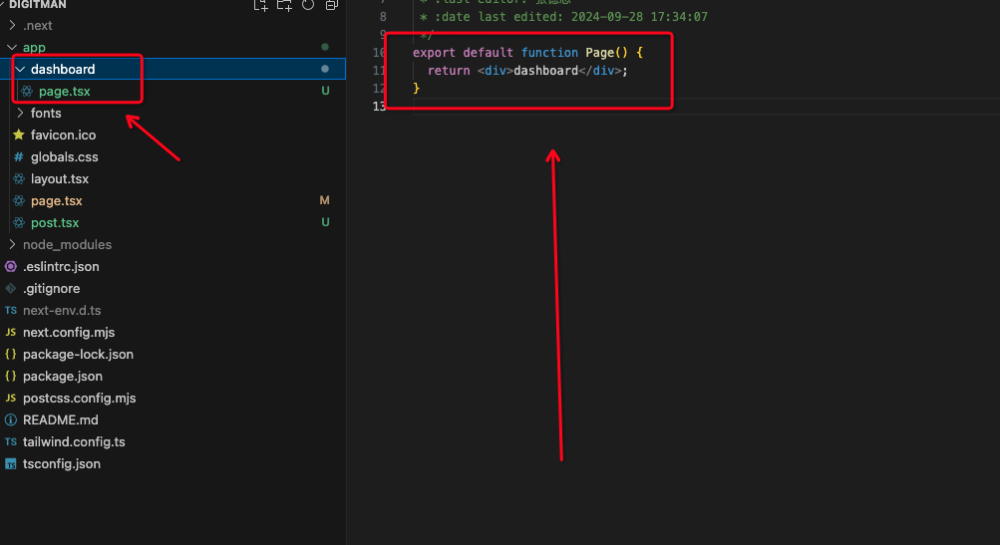
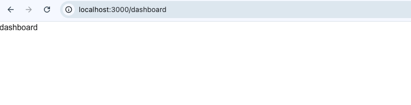
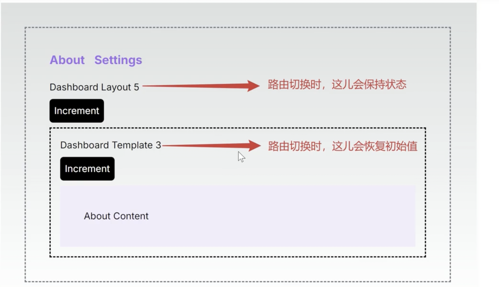

# next 从入门到精通

### 相关链接

1. ##### 演示地址 [演示地址](https://www.shuqin.cc/market/design-component)
2. ##### 源码地址 [源码地址](https://github.com/starfruitcloud/shuqin)

- hello 大家好，我是 数擎科技，今天来跟大家聊聊 Next.js 如果你遇到任何问题，欢迎联系我 m-xiaozhicloud

### 什么是 Next.js

- Next.js 是一个基于 React 的框架，用于构建服务器端渲染（SSR）和静态生成（SSG）的网页应用。它提供了页面路由、API 路由、自动代码拆分等功能，帮助开发者更高效地创建现代 web 应用

### 项目创建

1. ##### 自动安装

- 我们建议使用 启动一个新的 Next.js 应用 create-next-app，它会自动为您设置一切。要创建项目

```bash
npx create-next-app@latest
```

2. ##### 安装时，您将看到以下提示：

```bash
What is your project named? my-app
Would you like to use TypeScript? No / Yes
Would you like to use ESLint? No / Yes
Would you like to use Tailwind CSS? No / Yes
Would you like your code inside a `src/` directory? No / Yes
Would you like to use App Router? (recommended) No / Yes
Would you like to use Turbopack for `next dev`?  No / Yes
Would you like to customize the import alias (`@/*` by default)? No / Yes
What import alias would you like configured? @/*
```

### 路由创建

- Next.js 使用基于文件系统的路由器，其中使用文件夹来定义路由。
- 每个文件夹代表一个映射到 URL 段的路由段。要创建嵌套路由，您可以将文件夹相互嵌套。




- 浏览器上输入 localhost:3000 你将看到
  

### 布局和模板

1. ##### 根布局

- 布局是在多个路由之间共享的 UI。在导航时，布局保留状态、保持交互性并且不重新渲染。布局也可以嵌套。


```js
import type { Metadata } from 'next';
import localFont from 'next/font/local';

const geistSans = localFont({
  src: './fonts/GeistVF.woff',
  variable: '--font-geist-sans',
  weight: '100 900',
});
const geistMono = localFont({
  src: './fonts/GeistMonoVF.woff',
  variable: '--font-geist-mono',
  weight: '100 900',
});

export const metadata: Metadata = {
  title: 'Create Next App',
  description: 'Generated by create next app',
};

export default function RootLayout({
  children,
}: Readonly<{
  children: React.ReactNode,
}>) {
  return (
    <html lang="en">
      <body
        className={`${geistSans.variable} ${geistMono.variable} antialiased`}
      >
        {children}
      </body>
    </html>
  );
}
```

2. ##### 模板

- 模板与布局类似，它们包装子布局或页面。与跨路线持续存在并维护状态的布局不同，模板为导航上的每个子级创建一个新实例。这意味着当用户在共享模板的路由之间导航时，会安装子级的新实例，重新创建 DOM 元素，客户端组件中不会保留状态，并且会重新同步效果。


```js
export default function Template({ children }: { children: React.ReactNode }) {
  return <div>{children}</div>;
}
```

### 布局与模板的区别

- 模板与布局类似，它们包装子布局或页面。与跨路线持续存在并维护状态的布局不同，模板为导航上的每个子级创建一个新实例。这意味着当用户在共享模板的路由之间导航时，会安装子级的新实例，重新创建 DOM 元素，客户端组件中不会保留状态，并且会重新同步效果。



### 元数据

1. ##### 静态元数据

- 您可以使用元数据 API 修改 <head> HTML 元素，例如标题和元。

```js
import type { Metadata } from 'next';

export const metadata: Metadata = {
  title: '数擎科技',
};
export default function Home() {
  return <div>数擎科技</div>;
}
```

2. ##### 动态元数据

- 所有基于配置的元数据选项以及 generateMetadata

```js
import type { Metadata } from 'next';

// either Static metadata
export const metadata: Metadata = {
  title: '...',
};

// or Dynamic metadata
export async function generateMetadata({ params }) {
  return {
    title: '...',
  };
}
```

### 自定义 404 页面

```js
import Link from 'next/link';

export default function NotFound() {
  return (
    <div>
      <h2>Not Found</h2>
      <p>Could not find requested resource</p>
      <Link href="/">Return Home</Link>
    </div>
  );
}
```

### 数据获取

1. ##### 客户端模式获取数据

- 如果您在此路线的其他任何地方都没有使用任何动态函数，则它将在下次构建静态页面时预渲染。然后可以使用增量静态再生来更新数据。

```js
export default async function Home() {
  const baseUrl = 'https://cnodejs.org/api/v1';
  const rsp = await fetch(`${baseUrl}/topics`).then((res) => res.json());
  return (
    <div>
      {rsp.data.map((item: any) => (
        <h3 key={item?._id}>{item?.title}</h3>
      ))}
    </div>
  );
}
```

2. ##### 客户端模式获取数据（不推荐）

- 然而，在某些情况下，客户端数据获取仍然有意义。在这些场景中，您可以在 useEffect 中手动调用 fetch （不推荐），或者依靠社区中流行的 React 库（例如 SWR 或 React Query）进行客户端获取。

```js
'use client';

import { useEffect, useState } from 'react';

export default function Home() {
  const [data, setData] = useState([]);
  const featchTopics = async () => {
    const baseUrl = 'https://cnodejs.org/api/v1';
    const rsp = await fetch(`${baseUrl}/topics`).then((rsp) => rsp.json());
    setData(rsp.data);
  };
  useEffect(() => {
    featchTopics();
  }, []);
  return (
    <div>
      {data.map((item) => (
        <h3 key={item._id}>{item.title}</h3>
      ))}
    </div>
  );
}
```

### 未完待续 。。。。。。。。

### 联系我们

1. ##### 关注我们


2. ##### 联系作者


<!-- [last](https://www.bilibili.com/video/BV1Sb41197i2/?spm_id_from=333.788&vd_source=10257e657caa8b54111087a9329462e8) -->

<!-- [h5技术](https://www.bilibili.com/video/BV1Ao4y1m7ut/?spm_id_from=333.337.search-card.all.click&vd_source=10257e657caa8b54111087a9329462e8)
[nextui](https://www.bilibili.com/video/BV1Jb4y1L7EH/?spm_id_from=333.337.search-card.all.click&vd_source=10257e657caa8b54111087a9329462e8)
 -->
