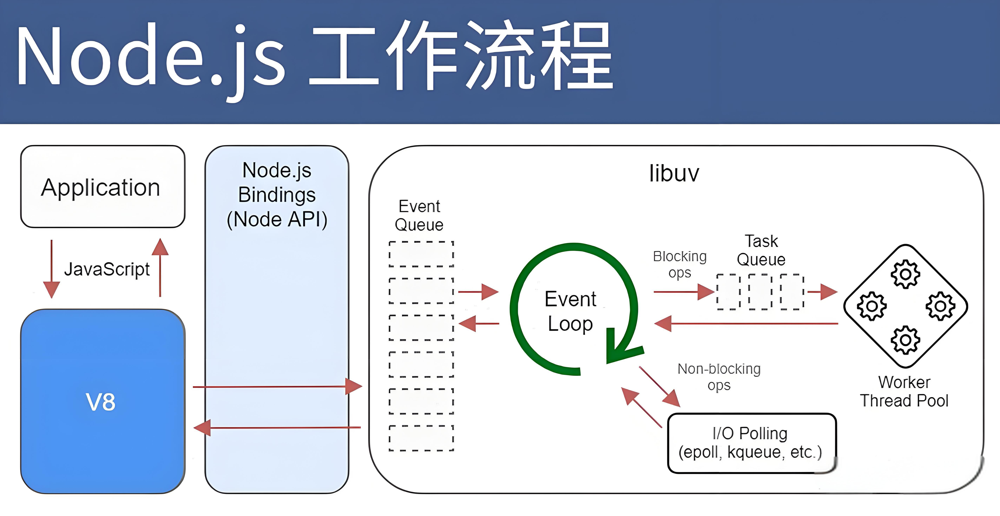

# nodejs 构建高性能服务器的关键技术

1. ##### 演示地址 [演示地址](https://www.shuqin.cc/market/design-component)
2. ##### 源码地址 [源码地址](https://github.com/starfruitcloud/shuqin)
3. ##### 获取更多 [获取更多](https://www.xiaozhi.shop/)

- 在现代 Web 开发中，Node.js 已成为构建高性能、可扩展网络应用的首选平台之一。它的非阻塞 I/O 模型与事件驱动架构使其能够在处理大量并发请求时表现出色，尤其适合构建实时应用，如聊天系统、数据流处理等。这篇博客将介绍 Node.js 的核心特性、常用模块以及如何利用其优势来开发高效的服务器端应用。

### 什么是 Node.js？

- Node.js 是一个基于 Chrome V8 JavaScript 引擎 的 JavaScript 运行时。它允许开发者使用 JavaScript 编写服务器端代码，而不仅仅是前端代码。与传统的多线程 Web 服务器（如 Apache、Tomcat）不同，Node.js 采用 单线程、事件驱动 的架构，这使它能够有效处理高并发请求。

### Node.js 的核心特点

1. ##### 事件驱动、非阻塞 I/O
   Node.js 最大的特点是 非阻塞 I/O，也就是在进行 I/O 操作时（如读取文件、数据库查询或 HTTP 请求），它不会阻塞主线程，而是通过 事件循环 和 回调函数 来处理。这使得即使在 I/O 密集型场景下，Node.js 也能保持高效的响应。

```js
const fs = require('fs');

fs.readFile('example.txt', 'utf8', (err, data) => {
  if (err) throw err;
  console.log(data);
});

console.log('This will print first!');
```

2. ##### 单线程，但高并发

- 虽然 Node.js 是单线程的，但它通过 libuv 库将一些复杂的操作交给底层线程池处理，如文件读写、网络请求等。这种模型使 Node.js 在处理大量并发请求时拥有极高的性能，避免了传统多线程 Web 服务器因上下文切换而导致的性能损耗。

### nodejs 架构图



- Node.js 架构的核心是 事件驱动、非阻塞 I/O，它利用了 事件循环（Event Loop） 来处理 I/O 操作，实现高效的并发处理。主要组件包括：

1. V8 引擎：这是 Google 的 JavaScript 引擎，负责解析和执行 JavaScript 代码。
2. libuv：Node.js 使用的库，支持事件驱动、异步 I/O 操作，主要处理文件系统、网络、DNS、以及定时器等。
3. 事件循环（Event Loop）：Node.js 的心脏，管理和调度 I/O 事件，使其可以通过单线程处理多任务。
4. 回调队列（Callback Queue）：事件循环将完成的异步任务的回调函数放入回调队列中，逐一执行。
5. 线程池：尽管 Node.js 是单线程的，但底层通过 libuv 维护一个线程池，用来处理 CPU 密集型任务。

### 常见全局变量

1. ##### \_\_dirname

- 表示当前执行的脚本所在目录的绝对路径。

```js
console.log(__dirname);
```

2. ##### \_\_filename

- 表示当前执行的脚本文件的绝对路径。

```js
console.log(__filename);
```

3. ##### global

- global 是 Node.js 的全局对象，类似于浏览器中的 window 对象。
- 任何挂载到 global 的属性或方法都可以在整个应用中访问。

```js
global.myVar = 'Hello, World!';
console.log(global.myVar); // 输出: Hello, World!
```

4. ##### process

- process 对象提供有关当前 Node.js 进程的信息以及控制进程的方法。它包含关于环境、命令行参数、标准输入输出流等信息。

```js
console.log(process.version); // Node.js 的版本
console.log(process.env); // 环境变量
console.log(process.argv); // 命令行参数
```

5. ##### Buffer

- Buffer 对象用于处理二进制数据流，特别是在处理文件或网络数据时非常有用。

```js
const buf = Buffer.from('Hello, World!');
console.log(buf.toString()); // 输出: Hello, World!
```

6. ##### setTimeout()

- 用于延迟执行代码。与浏览器中的 setTimeout 一样，但在 Node.js 中，这是全局函数，不需要引入任何模块。

```js
setTimeout(() => {
  console.log('Executed after 1 second');
}, 1000);
```

7. ##### setInterval

- 用于定时执行代码。与 setTimeout() 类似，但它会以固定的时间间隔重复执行。

```js
setInterval(() => {
  console.log('Repeated every 2 seconds');
}, 2000);
```

8. ##### clearTimeout

- 用于取消由 setTimeout() 创建的定时器。

```js
const timer = setTimeout(() => {
  console.log('This will not be logged');
}, 5000);

clearTimeout(timer);
```

9. ##### clearInterval

- 用于取消由 setInterval() 创建的定时器。

```js
const interval = setInterval(() => {
  console.log('This will not repeat');
}, 2000);

clearInterval(interval);
```

10. ##### require()

- require() 函数用于引入模块。它是 CommonJS 模块系统的一部分。

```js
const fs = require('fs');
```

11. ##### module

- module 对象表示当前模块本身。它包含关于模块的信息，比如 module.exports 属性，它用于导出模块的内容。

```js
console.log(module.exports); // 打印导出的内容
```

12. ##### exports

- exports 是 module.exports 的快捷方式，用于导出模块的属性或方法。

```js
exports.myFunction = function () {
  return 'Hello!';
};
```

13. ##### console

- 提供与控制台输出相关的方法，如 console.log()、console.error()、console.warn() 等。

```js
console.log('This is a log message');
console.error('This is an error message');
```

### path 常用方法

- path 模块是 Node.js 的核心模块之一，提供了处理和转换文件路径的实用方法。它能够帮助开发者跨平台地处理文件路径问题，因为不同操作系统的路径分隔符不同（Windows 使用 \，而 POSIX 系统（如 Linux 和 macOS）使用 /）。

1.  ##### path.basename(p[, ext])

- 作用：返回路径的最后一部分，也就是文件名。如果提供了 ext 参数，会从结果中移除这个扩展名。
- 参数：

1. p: 文件路径。
2. ext: 可选，文件扩展名（若提供此参数，会从返回值中移除它）。

```js
const path = require('path');
const filePath = '/user/local/bin/file.txt';
console.log(path.basename(filePath)); // 输出: file.txt
console.log(path.basename(filePath, '.txt')); // 输出: file
```

2.  ##### path.dirname(p)

- 作用：返回路径的目录部分。
- 参数：

- p: 文件路径。

```js
const path = require('path');
const filePath = '/user/local/bin/file.txt';
console.log(path.dirname(filePath)); // 输出: /user/local/bin
```

3. ##### path.extname(p)

- 作用：返回路径中文件的扩展名。
- 参数：
- p: 文件路径。

```js
const path = require('path');
const filePath = '/user/local/bin/file.txt';
console.log(path.extname(filePath)); // 输出: .txt
```

4. ##### path.join([...paths])

- 作用：使用平台特定的分隔符将所有给定的路径片段连接在一起，并规范化生成的路径。

```js
const path = require('path');
const joinedPath = path.join('/user', 'local', 'bin/file.txt');
console.log(joinedPath); // 输出: /user/local/bin/file.txt
```

5. ##### path.resolve([...paths])

- 作用：将路径或路径片段解析为绝对路径。如果没有给定路径片段，则使用当前工作目录。

```js
const path = require('path');

const absolutePath = path.resolve('file.txt');
console.log(absolutePath);

const resolvedPath = path.resolve('/user', 'local', 'bin/file.txt');
console.log(resolvedPath);
```

6. ##### path.normalize(p)

- 作用：规范化给定的路径，解析 .. 和 . 片段，并移除多余的斜杠。
- 参数：
- p: 需要规范化的路径。

```js
const path = require('path');
const normalizedPath = path.normalize('/user//local/../bin/file.txt');
console.log(normalizedPath);
```

7. ##### path.isAbsolute(p)

- 作用：判断给定路径是否为绝对路径。
- 参数：
- p: 文件路径。
- 返回：布尔值，表示路径是否是绝对路径。

```js
const path = require('path');
console.log(path.isAbsolute('/user/local/bin')); // 输出: true
console.log(path.isAbsolute('file.txt')); // 输出: false
```

8. ##### path.relative(from, to)

- 作用：根据两个给定的路径，返回相对路径。
- 参数：
- from: 起始路径。
- to: 目标路径。

```js
const path = require('path');
const fromPath = '/user/local/bin';
const toPath = '/user/local/lib/file.txt';
console.log(path.relative(fromPath, toPath)); // 输出: ../lib/file.txt
```

9. ##### path.parse(p)

- 作用：将路径解析为一个对象，包含 root、dir、base、ext 和 name 属性。
- 参数：
- p: 文件路径。
- 返回：一个对象，包含路径的各个部分。

```js
const path = require('path');
const filePath = '/user/local/bin/file.txt';
const parsedPath = path.parse(filePath);
console.log(parsedPath);
//-------------------------------------
{
  root: '/',
  dir: '/user/local/bin',
  base: 'file.txt',
  ext: '.txt',
  name: 'file'
}
```

9. ##### path.format(pathObject)

- 作用：将 path.parse() 返回的对象重新组合为路径。
- 参数：
- pathObject: 包含路径信息的对象，类似 path.parse() 的输出。

```js
const path = require('path');
const pathObject = {
  root: '/',
  dir: '/user/local/bin',
  base: 'file.txt',
  ext: '.txt',
  name: 'file',
};
const formattedPath = path.format(pathObject);
console.log(formattedPath); // 输出: /user/local/bin/file.txt
```

### Buffer 模块

- 在 Node.js 中，Buffer 是处理二进制数据的核心模块。它在网络通信、文件读写等场景中非常常用，特别是在处理像 TCP 数据流、文件 I/O 以及其他没有明确编码的原始数据时。
- 与浏览器 JavaScript 不同，Node.js 中的 Buffer 类可以直接处理和存储二进制数据，且在引入了 TypedArray 之前，这是 Node.js 中唯一可用的处理原始字节的方式。

1. ##### Buffer.alloc(size[, fill[, encoding]])

- 作用：分配一个大小为 size 的缓冲区，并用 fill 填充该缓冲区。encoding 是填充时的编码，默认为 'utf8'。

```js
const buf = Buffer.alloc(10);
const bufFilled = Buffer.alloc(10, 'a');
console.log(bufFilled.toString());
```

2. ##### Buffer.from(array)

- 作用：将数组、字符串或其他对象转换为 Buffer。

```js
const bufFromArray = Buffer.from([1, 2, 3]);
console.log(bufFromArray); // 输出: <Buffer 01 02 03>

const bufFromString = Buffer.from('Hello, World!', 'utf8');
console.log(bufFromString); // 输出: <Buffer
```

- 作用：将 Buffer 中的数据解码为字符串。默认使用 utf8 编码，可以指定起始和结束位置。

```js
const buf = Buffer.from('Hello, World!', 'utf8');
console.log(buf.toString()); // 输出: Hello, World!
console.log(buf.toString('utf8', 0, 5)); // 输出: Hello
```

4. ##### buf.write(string[, offset[, length]][, encoding])

- 作用：将 string 写入 Buffer。offset 是从 Buffer 的哪个位置开始写入，length 是写入的字节数，encoding 是编码格式，默认是 'utf8'。

```js
const buf = Buffer.alloc(10);
buf.write('Hello', 0, 'utf8');
console.log(buf.toString()); // 输出: Hello
```

5. ##### Buffer.concat(list[, totalLength])

- 作用：合并多个 Buffer 为一个 Buffer。list 是要合并的 Buffer 数组，totalLength 是合并后 Buffer 的总长度。

```js
const buf1 = Buffer.from('Hello,');
const buf2 = Buffer.from('World!');

const combinedBuf = Buffer.concat([buf1, buf2]);
console.log(combinedBuf.toString());
```

6. ##### Buffer.byteLength(string[, encoding])

- 作用：返回给定字符串的字节长度。

```js
const str = 'hello world';
console.log(Buffer.byteLength(str));
```

7. ##### buf.slice([start[, end]])

- 作用：返回 Buffer 的一个片段，类似于数组的 slice() 方法。

```js
const buf = Buffer.from('Hello, World!', 'utf8');
const sliceBuf = buf.slice(0, 5);
console.log(sliceBuf.toString()); // 输出: Hello
```

8. ##### buf.copy(target[, targetStart[, sourceStart[, sourceEnd]]])

- 作用：将当前 Buffer 的内容复制到目标 Buffer。

```js
const buf1 = Buffer.from('Hello');
const buf2 = Buffer.alloc(5);
buf1.copy(buf2);
console.log(buf2.toString()); // 输出: Hello
```

9. ##### buf.equals(otherBuffer)

- 作用：比较两个 Buffer 的内容是否相同。

```js
const buf1 = Buffer.from('ABC');
const buf2 = Buffer.from('ABC');
const buf3 = Buffer.from('DEF');

console.log(buf1.equals(buf2)); // 输出: true
console.log(buf1.equals(buf3)); // 输出: false
```

10. ##### buf.indexOf(value[, byteOffset][, encoding])

- 作用：查找 Buffer 中的某个值，返回其首次出现的位置，如果没有找到则返回 -1。

```js
const buf = Buffer.from('Hello, World!', 'utf8');
console.log(buf.indexOf('World')); // 输出: 7
console.log(buf.indexOf('XYZ')); // 输出: -1
```

11. ##### buf.fill(value[, offset[, end]][, encoding])

- 作用：用指定值填充 Buffer 的内容。

```js
const buf = Buffer.alloc(10);
buf.fill('a');
console.log(buf.toString()); // 输出: aaaaaaaaaa
```

### fs 常用方法

- fs 模块是 Node.js 提供的核心模块之一，用于处理文件系统相关操作。它提供了同步和异步方法，支持文件的读写、文件夹操作、文件权限修改等功能

1. ##### fs.readFile(path, [options], callback)

- 作用：异步读取文件的全部内容。
- 参数：

1. path: 文件路径。
2. options: 可选，指定编码或返回格式（默认为 Buffer）。
3. callback: 回调函数，传递 (err, data)

```js
const fs = require('fs');

fs.readFile('data.txt', 'utf-8', (err, data) => {
  if (err) throw err;
  console.log(data);
});
```

2. ##### fs.readFileSync(path, [options])

- 作用：同步读取文件的全部内容。返回读取到的数据。
- 参数：
- path: 文件路径。
- options: 可选，指定编码或返回格式。

```js
const fs = require('fs');
const data = fs.readFileSync('data.txt', 'utf-8');
console.log('data', data);
```

3. ##### fs.writeFile(file, data, [options], callback)

- 作用：异步写入数据到文件，如果文件不存在会创建文件。
- 参数：

1. file: 文件路径。
2. data: 要写入的数据。
3. options: 可选，指定编码。
4. callback: 回调函数，传递 (err)。

```js
const fs = require('fs');
fs.writeFile('data.txt', 'change info', (err) => {
  if (err) throw err;
  console.log('file hash been write');
});
```

4. ##### fs.writeFileSync(file, data, [options])

- 作用：同步写入数据到文件。

```js
const fs = require('fs');
fs.writeFileSync('data.txt', 'change info', 'utf-8');
console.log('file has been written');
```

5. ##### fs.appendFile(file, data, [options], callback)

- 作用：异步向文件追加数据。如果文件不存在则创建文件。

```js
const fs = require('fs');
fs.appendFile('data.txt', 'this is appended txt.\n', (err) => {
  if (err) throw err;
  console.log('Data append to file');
});
```

6. ##### fs.appendFileSync(file, data, [options])

- 作用：同步向文件追加数据。

```js
const fs = require('fs');
fs.appendFileSync('data.txt', 'This is appended text.\n');
console.log('Data appended to file.');
```

7. ##### fs.rename(oldPath, newPath, callback)

- 作用：异步重命名文件或文件夹。
- 参数：
- oldPath: 旧路径。
- newPath: 新路径。
- callback: 回调函数，传递 (err)。

```js
const fs = require('fs');

fs.rename('file.txt', 'file1.txt', (err) => {
  if (err) throw err;
  console.log('Rename complete.');
});
```

8. ##### fs.renameSync(oldPath, newPath)

- 作用：同步重命名文件或文件夹。

```js
const fs = require('fs');

fs.renameSync('file1.txt', 'file.txt');
console.log('Rename complete.');
```

9. ##### fs.unlink(path, callback)

- 作用：异步删除文件。
- 参数：

1. path: 文件路径。
2. callback: 回调函数，传递 (err)。

```js
const fs = require('fs');
fs.unlink('file.txt', (err) => {
  if (err) throw err;
  console.log('file delete');
});
```

10. ##### fs.unlinkSync(path)

- 作用：同步删除文件

```js
const fs = require('fs');
fs.unlinkSync('file.txt');
console.log('file delete');
```

11. ##### fs.readdir(path, [options], callback)

- 作用：异步读取指定目录的内容，返回文件和子目录的数组。
- 参数：

1. path: 目录路径。
2. options: 可选，encoding 或 withFileTypes（是否返回 Dirent 对象）。
3. callback: 回调函数，传递 (err, files)。

```js
const fs = require('fs');

fs.readdir('./', (err, files) => {
  if (err) throw err;
  console.log(files); // 输出文件和目录的列表
});
```

12. ##### fs.readdirSync(path, [options])

- 作用：同步读取目录内容。

```js
const fs = require('fs');
const files = fs.readdirSync('./');
console.log(files);
```

13. ##### fs.mkdir(path[, options], callback)

- 作用：异步创建目录。
- 参数：

1. path: 要创建的目录路径。
2. options: 可选，是否递归创建，或设置权限模式。
3. callback: 回调函数，传递 (err)。

```js
const fs = require('fs');

fs.mkdir('test', (err) => {
  if (err) throw err;
  console.log('Directory created.');
});
```

14. ##### fs.mkdirSync(path[, options])

- 作用：同步创建目录。

```js
const fs = require('fs');
fs.mkdirSync('test');
console.log('Directory created.');
```

15. ##### fs.rmdir(path[, options], callback)

- 作用：异步删除目录。该目录必须为空。
- 参数：

1. path: 目录路径。
2. options: 可选，recursive: true 表示递归删除非空目录（实验性功能）。
3. callback: 回调函数，传递 (err)。

```js
const fs = require('fs');
fs.rmdir('test', (err) => {
  if (err) throw err;
  console.log('directory deleted.');
});
```

16. ##### fs.rmdirSync(path[, options])

- 作用：同步删除目录。

```js
const fs = require('fs');
fs.rmdirSync('new_directory');
console.log('Directory deleted.');
```

17. ##### fs.stat(path, callback)

- 作用：异步获取文件或目录的状态信息，返回 fs.Stats 对象。
- 参数：

1. path: 文件或目录路径。
2. callback: 回调函数，传递 (err, stats)。

```js
const fs = require('fs');
fs.stat('file.txt', (err, stats) => {
  if (err) throw err;
  console.log(stats);
});
```

18. ##### fs.statSync(path)

- 作用：同步获取文件或目录的状态信息。

```js
const fs = require('fs');
const stats = fs.statSync('example.txt');
console.log(stats);
```

19. ##### fs.existsSync(path)

- 作用：同步检查文件或目录是否存在（注意：该方法已废弃，推荐使用 fs.access()）。

```js
const fs = require('fs');

if (fs.existsSync('file.txt')) {
  console.log('File exists.');
}
```

20. ##### fs.access(path[, mode], callback)

- 作用：检查文件或目录的权限。mode 可以用来检查读、写或执行权限。
- 参数：

1. path: 文件路径。
2. mode: 可选，文件权限检查。
3. callback: 回调函数，传递 (err)。

```js
const fs = require('fs');

fs.access('example.txt', fs.constants.R_OK | fs.constants.W_OK, (err) => {
  console.log(err ? 'No access!' : 'File can be read and written.');
});
```

### vm 模块

- Node.js 提供了许多强大的内置模块，其中的 vm 模块（Virtual Machine，虚拟机）特别值得关注。它允许我们在独立的上下文中执行 JavaScript 代码，这在某些场景中非常有用，比如执行不信任的代码、沙箱化运行环境等。

1. ##### 什么是 vm 模块

- vm 模块允许在 Node.js 中创建沙箱化的虚拟机上下文，运行的 JavaScript 代码可以隔离在单独的上下文中，避免对主应用环境产生副作用。使用 vm 模块，可以执行动态代码，而无需担心代码直接影响主线程或全局环境。

2. ##### vm.runInThisContext()

- vm.runInThisContext() 方法类似于 eval()，但执行的代码是在与当前上下文分离的环境中执行的，且无法访问主上下文的变量。

```js
const vm = require('vm');
const code = `var x=10;x += 5`;
const result = vm.runInThisContext(code);
console.log('result', result);
```

3. ##### vm.runInNewContext()

- vm.runInNewContext() 可以在全新的上下文中执行代码，可以指定上下文的对象，用作代码执行时的全局对象。

```js
const vm = require('vm');

const context = { x: 1 };
vm.runInNewContext('x += 40;', context);
console.log(context.x); // 输出 41
```

- 在这里，代码是在新的上下文中执行的，并且 context 对象被当作全局对象传入执行环境中。

4. ##### vm.createContext()

- vm.createContext() 用于创建一个新的上下文对象。在这个上下文中，可以安全地执行代码。

```js
const vm = require('vm');

const sandbox = { animal: 'cat', count: 2 };
const context = vm.createContext(sandbox);
vm.runInContext('count += 1; name = "Tom";', context);

console.log(sandbox);
```

- 此方法适用于在创建的上下文中运行复杂的代码，同时可以对上下文对象进行控制。

5. ##### vm.Script()

- vm.Script() 可以将代码编译为一个可执行的脚本对象，并且可以多次执行该脚本。

```js
const vm = require('vm');

const script = new vm.Script(`count += 1;name="tom"`);
const sandbox = { count: 0 };
const context = vm.createContext(sandbox);

script.runInContext(context);
console.log(sandbox);

// 输出 { count: 2, name: 'Jerry' }
```

- vm.Script() 的优势在于，可以多次执行同一个编译后的代码，避免重复编译带来的性能开销

### 事件模块 (events) 详解

- 在 Node.js 中，事件驱动架构是其核心之一。events 模块是用于管理和触发事件的内置模块，提供了一种实现 观察者模式 的机制。通过事件模块，开发者可以定义事件、绑定事件处理函数，并在合适的时候触发这些事件。

1. ##### 事件驱动模型简介

- Node.js 的核心架构基于事件驱动模型。与传统的多线程模型不同，Node.js 使用 单线程、异步 I/O 和 事件循环 来处理并发。所有的 I/O 操作（如网络请求、文件读写等）都是异步的，完成后会通过事件通知回调函数，从而使代码可以继续执行其他任务，而不会被阻塞。

2. ##### 监听事件

- 可以使用 on() 方法为事件绑定监听器。监听器函数会在事件触发时执行。

```js
const EventEmitter = require('events');
const emitter = new EventEmitter();

emitter.on('greet', () => {
  console.log('Hello world');
});

emitter.emit('greet');
```

- 在这个例子中，我们使用 on() 方法监听了 greet 事件，当使用 emit() 方法触发该事件时，绑定的处理函数会执行。

3. ##### 移除监听器
   可以使用 removeListener() 或 off() 方法移除某个特定事件的监听器。

```js
const EventEmitter = require('events');
const emitter = new EventEmitter();

emitter.on('greet', () => {
  console.log('Hello, World!');
});

const callback = () => console.log('This will not run');
emitter.on('removeEvent', callback);

emitter.removeListener('removeEvent', callback);
emitter.emit('removeEvent'); // 无输出
```

<!-- [last](https://www.bilibili.com/video/BV1gM411W7ex/?spm_id_from=333.337.search-card.all.click&vd_source=10257e657caa8b54111087a9329462e8)
[高级](https://www.bilibili.com/video/BV1sA41137qw/?spm_id_from=333.337.search-card.all.click&vd_source=10257e657caa8b54111087a9329462e8) -->
