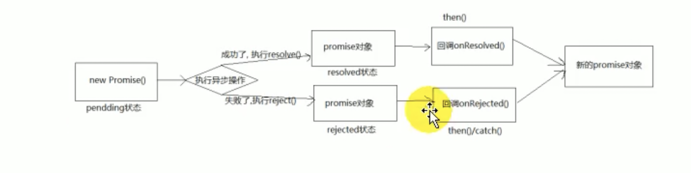

# promise

### 从入门到精通

### 常觉的内置错误

1. ##### 错误类型

- Error： 所有错误的父类型
- ReferenceError：引用的变量不存在
- TypeError： 数据类型不正确的错误
- RangeError：数据值不在其所允许的范围内
- SyntaxError： 语法错误

2. ##### 错误处理

- 捕获错误：try ...catch
- 抛出错误：throw error

3. ##### 错误对像

- message 属性：错误相关信息
- stack 属性：函数调用栈记录信息

### Promise 的理解

1. ##### Promise 是什么

- Promise 是 js 中进行异步编程的新的解决方案

2. ##### 具体表达

- 从语法上来说：Promise 是一个构造函数
- 从功能上来说：Promise 对像用来封装一个异步操作并可以获取其结果

3. ##### Promise 状态改变

- pending 变为 resolved
- pending 变为 rejected
  说明：只有这 2 种，且一个 promise 对像只能改变一次，无论变为成功还是失败，都会有一个结果数据
  成功的结果数据一搬称为 value,失败的结果数据一搬为 reason

4. ##### Promise 的基本流程



5. ##### Promise 的基本使用

```js
const p = new Promise((resolve, reject) => {
  setTimeout(() => {
    const time = Date.now();
    if (time % 2 == 0) {
      resolve('ok');
    } else {
      reject('error');
    }
  }, 1000);
});

p.then(
  (value) => {
    // 接收到成功的数据
    console.log('value', value);
  },
  (reson) => {
    // 接收到失败的数据
    console.log('reson', reson);
  },
);
```

### 为什么要用 Promise

- 指定回调函数的方法更加灵活
- 支持链式调用，可以解决回调地狱问题

```js
const p = new Promise((resolve, reject) => {
  console.log('执行excutor');
  setTimeout(() => {
    const time = Date.now();
    if (time % 2 === 0) {
      resolve('ok');
    } else {
      reject('error');
    }
  }, 1000);
});

setTimeout(() => {
  p.then(
    (value) => {
      console.log('value', value);
    },
    (reson) => {
      console.log('reson', reson);
    },
  );
}, 2000);

console.log('new Promise之后');
```

<!-- [last](https://www.bilibili.com/video/BV1MJ41197Eu/?p=4&spm_id_from=pageDriver&vd_source=10257e657caa8b54111087a9329462e8) -->
